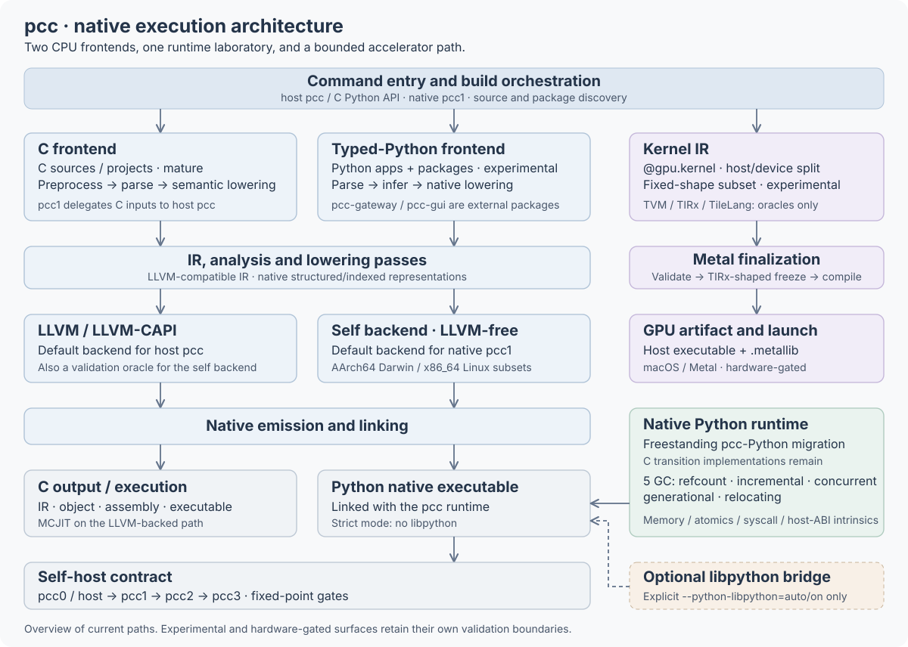

# pcc

[](https://pypi.org/project/python-cc/)
[](https://pypi.org/project/python-cc/)
[](LICENSE)

**`pcc` is a Python-authored compiler toolchain that makes execution *ownable*:
compiled, inspectable, self-hostable, and honest about every fallback.** Its
most mature path is a C frontend that lowers C to LLVM IR and runs real
third-party projects. It also contains an experimental typed-Python frontend, a
runtime being re-authored in pcc-Python, and an in-tree backend that emits
native code without LLVM.

This is a research compiler with practical integration tests — not a drop-in
replacement for Clang or CPython. Claims are mode-labeled: each states what it
proves and what it does not.

## Highlights

- **Runs real C code.** The production-quality C frontend compiles and runs
  Lua, SQLite, PostgreSQL `libpq`, zlib, lz4, zstd, PCRE, OpenSSL, readline, and
  nginx, and is validated against GCC/Clang-derived test suites.
- **Self-hosts with no libpython.** Recorded bootstrap gates compile pcc's source through a
  three-stage bootstrap `pcc1 → pcc2 → pcc3`; in the strict path
  (`--backend self --python-libpython=off`) `pcc2` and `pcc3` are byte-identical,
  the emitted IR has zero CPython-bridge calls, and the binaries link no
  `libpython`.
- **Five comparative GC backends.** One runtime, five collectors selectable at
  startup — refcount+cycle, incremental, concurrent, generational, and colored
  relocating — each mirroring a real reference implementation (CPython, Lua, Go,
  OCaml, ZGC), with recorded per-backend self-host gates. Current-source
  qualification is tracked separately from those historical results.
- **LLVM-free self backend.** An in-tree native emitter (AArch64 Darwin and
  x86_64 Linux subsets) validated against the LLVM-backed path. LLVM is an
  oracle, not a hard dependency.
- **Freestanding zero-libc direction.** The production runtime is being moved
  from hand-written C and vendored libc objects into freestanding pcc-Python.
  A bounded x86_64 Linux tracer already proves a static no-libpython/zero-libc
  process-entry path; full-runtime closure remains active work. Darwin retains
  explicitly named libSystem ABI calls and is never labeled zero-libc.
- **Native accelerator path.** A host/device-split Kernel IR lowers a small
  `@gpu.kernel` subset to Metal and launches real GPU kernels on-device
  (macOS/Metal, hardware-gated), with TVM/TIRx and TileLang used only as
  reference *oracles* — never imported, linked, or executed as runtime
  dependencies.
- **Experimental native GUI.** A pcc-Python GUI stack covers layout, controls,
  declarative components, scheduling, events, styling, commands, and app
  lifecycle. The macOS `mac_diff_app` canary (now in https://github.com/allstoalls/pcc-gui) compiles with pcc1/self/no-libpython
  and renders through an AppKit/Metal bridge, with explicitly bounded native
  interaction and pixel-correctness claims.
- **No-libpython by default.** Python inputs compile to native binaries that do
  not embed CPython; idioms outside the native subset fail loudly instead of
  silently bridging to CPython.
- **A runtime research lab.** Free-threaded (no GIL) under `PCC_WITH_THREADS`,
  an opt-in identity-free value model, a virtual-thread / effect track, and a
  long-running GC measurement harness (pause / RSS / throughput over time).
- **Generic ecosystem support.** Package / C-API-shim / extension-ABI work is
  reusable, never per-package special cases. Recorded NumPy 2.4.4 gates cover
  a narrow array runtime under strict pcc-native no-libpython across all five
  GC backends (import, version, `np.array(...) + scalar`); current-source
  package qualification is separate.

New here? Jump to [Install](#install) and [Quick Start](#quick-start).
Everything from [Status](#status) onward is reference and maturity detail for
contributors.

## Install

```bash
pip install python-cc
```

For repository development:

```bash
git clone https://github.com/allstoalls/pcc
cd pcc
uv sync
```

### First native installation after cloning (macOS arm64)

With Git, uv, make and the Xcode command line tools installed:

```bash
git clone https://github.com/allstoalls/pcc
cd pcc
env -u LC_ALL uv sync --locked
gtimeout 2100s env -u LC_ALL uv run python scripts/install_pcc1_toolchain.py --from-source .
export PATH="$HOME/.local/bin:$PATH"
pcc1 --help
```

`gtimeout` is provided by GNU coreutils on macOS. The installer also bounds
each build stage internally. It copies the source, builds a private runtime,
checks Stage1 and Stage2 in order, installs matching helper dependencies, and
runs a native function-bearing canary before creating `~/.local/bin/pcc1`.
Build logs and stage receipts remain under `~/.cache/pcc/installations/`.
The first source-install workflow is undergoing the current 0.1.8 qualification;
failure leaves the shared command unchanged and reports the failed stage.

If `pcc1` already exists, this initial installer refuses to overwrite it.
Keep using the installed version while a separate candidate is qualified.
Add `~/.local/bin` to your shell startup PATH once to use the command from
every project. This staged source installer currently requires macOS arm64;
it is not a Linux Python self-host claim.

Requires Python 3.13+. PyPI publishes a source distribution. Its wheel-build
hook builds and bundles both the runtime archive and native `pcc1`; either
build failing is fatal. The hook currently tries the self backend first and
can explicitly report a retry through LLVM/clang. Installing a source package
therefore does not itself prove a build without host compiler tools.
There is no separate
`python-cc[no-libpython]` extra — no-libpython is already the default.

### One installed compiler for multiple projects

`pcc-gateway` and `pcc-gui` use **`~/.local/bin/pcc1` through PATH**. This is the
stable installation entry; a core checkout's `build/bootstrap/pcc1` is a
development artifact and must not be used as the shared installation.

Versioned toolchains live under `~/.local/share/pcc/toolchains/`. Each candidate
contains its native compiler, matching runtime and helper sources, and
validation receipts. Build and test a candidate in its own directory; only
after qualification may the stable entry switch atomically. Keep the previous
toolchain for rollback. Rebuilding the core or another application must not
overwrite the installed toolchain in place.

Ensure `~/.local/bin` is in PATH, then use the same command in either checkout:

```bash
command -v pcc1                     # ~/.local/bin/pcc1
pcc1 app.py -o app
./app
```

The current local installation is the **v84 historical baseline**, with
matching successful Stage1/Stage2 receipts and a freshly executed installed
canary; see the [installation receipt](docs/knowledge/2026-09-06-release-0.1.8-handoff.md).
It is not the 0.1.8 release candidate. Initial installation is reproducible with
`scripts/install_pcc1_toolchain.py`; initial installation refuses to replace an
existing entry. Use `--stage-only` to prepare a later candidate. The same tool's
`--qualify`, `--promote` and `--rollback` commands bind validation receipts to a
versioned installation and preserve the previous version during atomic
switching; `--help` documents the receipt protocol. Qualification requires the
default and integration suites, fresh pcc1/bootstrap checks and clean package
installation. New application features may need that newer compiler.

Use `pcc1 --help` to inspect the command. Invoking `pcc1` without arguments
requests an interactive REPL, which currently fails with an explicit
unsupported-capability diagnostic.

### Install application packages into one environment

The compiler installation and third-party packages have different lifetimes.
Use the same package command for local framework checkouts and registry
packages; manually copying folders into site-packages is not the normal
installation workflow:

```bash
pcc1 env info --json
pcc1 -m pip install /path/to/pcc-gateway
pcc1 -m pip install /path/to/pcc-gui
pcc1 -m pip install numpy
```

All three commands select packages with the same rules:

| Environment | Package installation and import location |
|---|---|
| Ordinary shell, no virtual environment | `~/.local/share/pcc/environments/<compatibility-tag>/site-packages` |
| Active `VIRTUAL_ENV` | That virtual environment's pcc overlay; inspect `selected_site_packages` with `pcc1 env info --json`. |
| Explicit `PCC_ENVIRONMENT` / data-root override | The explicitly selected pcc environment, reported by `env info`. |

Run installation and compilation in the same environment. `uv run` or an
activated Python virtual environment can change `VIRTUAL_ENV`, so it can
select a different pcc package site. Local-directory installation and registry
installation must obey this equally. `PCC_PACKAGE_SITE` is an explicit extra
source-search override for development, not a separate package manager.

The default native environment is identified by pcc's ABI and target platform,
without a Python version in the directory name. For example,
`pcc_native_v1-arm64_apple_darwin-pcc_native` means:

| Component | Meaning |
|---|---|
| `pcc_native_v1` | Version 1 of pcc's native runtime ABI |
| `arm64_apple_darwin` | macOS on arm64 |
| `pcc_native` | Native package ABI mode |

The 0.1.8 candidate targets **Python 3.15**; that target is reported separately
as compatibility metadata and its qualification is still in progress. A later
Python target such as 3.16 can retain the native package path when pcc's ABI
and platform remain compatible. Python-dependent lock selections are refreshed
when the target changes. Explicit CPython compatibility modes keep versioned
environment identities because their extension ABI is version-sensitive.

The build host's Python version is separate. Users normally use pcc's default;
`PCC_PACKAGE_TARGET_PYTHON` is an explicit package-selection override, not a
switch that implements another Python runtime. Existing `py311` environments
remain untouched and can be selected explicitly with `PCC_ENVIRONMENT`; use
the same `pcc1 -m pip install` commands for the new default environment.
A target version does not claim that
every Python feature or CPython extension ABI is implemented.

`pcc1 env info` is authoritative for the actual path. Current GUI/gateway
source-install and NumPy native integration are being checked together for
0.1.8. Installation success alone does not prove application execution or full
NumPy compatibility; see their separate validation boundaries below.

## Quick Start

### Compile C

```bash
pcc hello.c                                  # compile and run
pcc hello.c -o hello                         # write the binary, don't run
pcc hello.c -- arg1 arg2                      # pass argv to the program
pcc myproject/                               # merged-directory build
pcc --separate-tus myproject/                # one translation unit per file
pcc --sources-from-make lua projects/lua-5.5.0
pcc --system-link --link-arg=-lm mathprog.c
pcc --emit-llvm out.ll hello.c
pcc --emit-obj out.o --target x86_64-unknown-linux-gnu hello.c
```

### Compile Python

Use the installed native compiler for ordinary application builds:

```bash
pcc1 hello.py -o hello
./hello
```

`pcc1` defaults to `--backend self --python-libpython off --ir-scaffold on`.
`pcc` is the host-Python command and keeps LLVM as its default backend:

```bash
pcc hello.py                    # compile (strict no-libpython) and run
pcc hello.py -o hello           # write the binary, don't run
pcc hello.py --emit-llvm        # stop after IR generation
pcc hello.py --backend self     # use the LLVM-free self backend
pcc hello.py --python-libpython=auto   # experimental CPython fallback bridge
pcc kernels.py --gpu-backend=metal     # lower @gpu.kernel functions to Metal
```

Python inputs default to the strict no-libpython path
(`--python-libpython=off --ir-scaffold=on`). The most important controls:

| Option | Meaning |
|---|---|
| `--python-libpython=off` | Default. Hard error if the program would need a CPython fallback. |
| `--python-libpython=auto` | Link `libpython` only if codegen needed a CPython fallback. |
| `--python-libpython=on` | Always allow/link the CPython fallback surface. |
| `--ir-scaffold=on` | Default. Closed-world lowering used by the strict self-host work. |
| `--ir-scaffold=off` | Compatibility escape hatch for the older Python lowering path. |
| `--backend {llvm,llvm_capi,self}` | Host `pcc` defaults to `llvm`; native `pcc1` defaults to `self`. |

`ir-scaffold` names a lowering path, not a level of Python completeness, and
for an ordinary application it changes nothing at all: its three effects are
about compiling pcc's *own* IR-builder code (treating
`from pcc.llvm_capi.compat import ir` as a compile-time scaffold so
`compat.py`/`binding.py` stay out of the link, the matching libpython
decision, and native lowering of `ir.*` builder calls). `auto` resolves to
`on`, `off` is an older diagnostic path, and no application ever needs to pass
it. Unsupported native capabilities must produce a diagnostic. These options
do not establish full CPython compatibility.

An application also finds its own project's packages with no configuration:
import resolution starts at the entry file's directory and walks up to the
first directory holding a project-root marker (`pcc-package.json`,
`pyproject.toml`, `setup.py`, `.git`), so `examples/probe/app.py` importing
`mypkg` from the repository root just works. The walk stops at that root, so a
package above it never enters the program's closure. `PCC_PACKAGE_SITE` and
the installed package site remain for packages outside the project.

### Use pcc from Python

The public Python API is for C compilation.

```python
from pcc.evaluater.c_evaluator import CEvaluator

ev = CEvaluator()
print(ev.evaluate("int add(int a, int b) { return a + b; }", entry="add", args=[3, 7]))
```

```python
from pcc import build, module

artifact = build(["src/main.c", "src/util.c"], include_dirs=["include"])
print(artifact.output_path)

m = module("arith.c")
print(m.add(3, 4))
```

### NumPy on pcc1 (repository example)

The default `auto` acquisition mode uses pcc's owned Simple Repository/HTTPS
path, verifies the repository SHA-256, and evaluates `Requires-Python` against
the configured target. Explicit `--acquire=host` selects the labeled host
acquisition mode. Acquisition, extension building and native import are
separate validation boundaries.

Historical Python 3.11 target checks selected NumPy 2.4.x. They do not qualify
the newer artifacts eligible for the Python 3.15 target. Current 0.1.8
acquisition/build/import qualification remains in progress; unsupported syntax
or ABI surfaces must produce an explicit diagnostic.

Install and import use one first-class package environment. An active
`VIRTUAL_ENV` owns a private compatibility-tagged overlay below
`$VIRTUAL_ENV/.pcc`; otherwise pcc uses a durable per-user data environment.
`pcc1 env info` shows the exact root and selection reason. No
`PCC_PACKAGE_SITE` or `--target` is needed in the normal workflow. Bare pcc1
Python inputs also resolve to the self backend, no-libpython, and the strict IR
scaffold; LLVM remains an explicit oracle through `--backend llvm`.

```python
# np_demo.py
import numpy as np

print(np.__version__)
a = np.array([1, 2, 3])
print([int(x) for x in a + 1])
```

```bash
# Use the verified compiler from the stable installation.
command -v pcc1

# 2. Acquire and install NumPy from the network (cached afterwards)
pcc1 -m pip install numpy

# 3. Compile and run
pcc1 np_demo.py -o np_demo

./np_demo
# 2.4.x
# [2, 3, 4]
```

The CLI also has a compile-and-run form, `pcc1 np_demo.py`. That path is under
renewed qualification for 0.1.8 after a reported hang; use explicit `-o` and
execute the result while that boundary remains open.

`otool -L np_demo` shows no libpython, and `PCC_GC_BACKEND=0..4` all print the
same result. Scope today is import/version, array construction, scalar add, and
element access — not the full array runtime (ufuncs, reductions, dtypes,
broadcasting). Acquisition supports a deliberately strict requirement subset;
it does not claim a general dependency resolver or PEP 517 build isolation.
For a pinned offline/reproducibility gate, the repository also retains
`scripts/numpy_head_gate.py`. Gates:
[`tests/integration/test_numpy_l4_pcc1_gate.py`](tests/integration/test_numpy_l4_pcc1_gate.py),
[`test_numpy_l5_pcc1_gate.py`](tests/integration/test_numpy_l5_pcc1_gate.py), and
[`test_pcc1_default_package_environment.py`](tests/integration/test_pcc1_default_package_environment.py).

## Status

**2026-09-06:** `0.1.8` is undergoing current-source qualification. Historical
bootstrap/GC/package receipts below do not establish that today's worktree or
an arbitrary local `pcc1` passes. Publication and shared-toolchain promotion
remain gated on the new results.

| Area | Current state |
|---|---|
| C frontend | Mature relative to the rest of the repo; validated through C tests, GCC/Clang-derived suites, and real projects (Lua, SQLite, PostgreSQL `libpq`, zlib, lz4, zstd, PCRE, OpenSSL, readline, nginx). |
| Python frontend | Experimental. Typed code can lower to native IR; unsupported idioms fail by default and only route through the CPython bridge when `--python-libpython=auto/on` is explicit. |
| Runtime | Active migration from C runtime sources to pcc-Python modules under `pcc/py_runtime/py/`, using `pcc.unsafe` and `pcc.extern` for low-level operations. |
| Libc ownership | In progress. A host-pcc0, self-backend, no-libpython x86_64 Linux tracer is proven statically linked with no `PT_INTERP`, `DT_NEEDED`, undefined symbols, hand-written C startup, or libc object. This is not yet the full runtime/five-GC closure. Darwin intentionally retains an enumerated libSystem ABI boundary and is not a zero-libc target. |
| Self backend | Experimental LLVM-free emission for AArch64 Darwin and x86_64 Linux subsets; used by bootstrap/build gates. Host `pcc` defaults to LLVM; native `pcc1` defaults to self. |
| Bootstrap | macOS arm64 three-stage `pcc1 → pcc2 → pcc3` completes in both the default and strict self-backend paths; strict-path `pcc2`/`pcc3` IR is byte-identical with 0 `py_cpy_*` calls and no `libpython`. Issue 1 closed 2026-05-01. |
| GC | Five backends (0..4), with historical three-stage bootstrap evidence. Fresh matrix qualification is required for the release candidate. Backend #0 is the default/rollback reference. |
| NumPy | Historical Python 3.11-target / NumPy 2.4.x gates cover owned acquisition/install and strict self/no-libpython import, construction and scalar addition across GC0..4. These are narrow gates; they do not qualify the newer artifacts selected for the 3.15 target, general resolver/build isolation, all ufuncs, reductions, dtypes or broadcasting. CPython-ABI artifacts remain rejected in pcc-native mode (`PCC-PKG-004`). |
| GUI | External [pcc-gui](https://github.com/allstoalls/pcc-gui) package, compiled into applications. The core retains the generic Metal render surface. Native interaction, pixel correctness, full text metrics and portability have separate acceptance boundaries. |
| Gateway / web framework | Moved to https://github.com/allstoalls/pcc-gateway (experimental; imported as an ordinary pcc package and compiled by pcc1 with the application). The runtime keeps only the generic process-control substrate it used. |
| GPU kernel IR | Experimental, macOS/Metal only. Kernel-only IR with TIRx-style freeze and `.metallib` finalization; evidence is claim-leveled (`GPU_LEVEL_0`..`GPU_LEVEL_6`). Toolchain/device absence reports `SKIPPED_WITH_REASON`, never success. |
| Distributed | Metadata-only first slice (`pcc.dist`): single process, CPU-only, no sockets. Every network mode reports `SKIPPED_WITH_REASON`. |

The authoritative machine-readable state is
[`tests/bootstrap_gate_baseline.json`](tests/bootstrap_gate_baseline.json)
(bootstrap) and [`tests/fallback_baseline.json`](tests/fallback_baseline.json)
(no-libpython). Active work is tracked as
[GitHub issues](https://github.com/allstoalls/pcc/issues); what has already
been measured and disproved is in
[`docs/knowledge/denied-experiments.md`](docs/knowledge/denied-experiments.md).

## Architecture

The complete overview fits the page width by default. Click the diagram to
open the scalable image. The CPU frontends share an IR/backend layer; the
accelerator lane remains a separate, bounded path. The dashed link is the
explicitly enabled libpython compatibility bridge.

[](docs/architecture/pcc-overview.svg)

See the [detailed pipeline and repository map](docs/architecture/01-overview.md)
for the implementation behind each layer.

| Layer | Main paths | Role |
|---|---|---|
| CLI | `pcc/cli_core.py`, `pcc/pcc.py`, `pcc/cli_bootstrap.py` | User command line, bootstrap CLI, option routing. |
| Public API | `pcc/api.py`, `pcc/evaluater/c_evaluator.py` | Embeddable C build/evaluate/module APIs. |
| Project collection | `pcc/project.py` | Directory scanning, make-derived source sets, dependency projects, TU setup. |
| C frontend | `pcc/lex/`, `pcc/parse/`, `pcc/codegen/`, `pcc/evaluater/` | C preprocessing, parsing, semantic lowering, execution/emission. |
| Python frontend | `pcc/py_frontend/`, `pcc/parse/py_*` | Python parse/lift, type inference, native lowering, CPython fallback decisions. |
| Runtime | `pcc/py_runtime/`, `pcc/extern/`, `pcc/unsafe/` | Runtime objects, extern-C bridge, low-level intrinsics. |
| Backends | `pcc/llvm_capi/`, `pcc/backend/` | LLVM compatibility layer and experimental self backend. |

See [AGENTS.md](AGENTS.md) for the full repository map and maintainer workflow.

## Capabilities

### C frontend

The production-quality part of the repository. It supports C99-oriented parsing
and semantic lowering; scalars, pointers, arrays, structs, unions, enums,
typedefs, function pointers, control flow, casts, arithmetic, bitwise/shift ops,
and variadics; preprocessing with macro expansion and conditional compilation;
merged-directory builds, separate translation units, make-derived source
selection, dependency projects, compile caching, and host linking; LLVM IR /
object / assembly / MCJIT / executable workflows; and explicit signedness
tracking on top of LLVM integer types (compile-time constant evaluation and
runtime lowering as separate semantic paths).

```bash
env -u LC_ALL uv run pcc \
  --cpp-arg=-DLUA_USE_JUMPTABLE=0 --cpp-arg=-DLUA_NOBUILTIN \
  projects/lua-5.5.0/onelua.c -- projects/lua-5.5.0/testes/math.lua

env -u LC_ALL uv run pcc \
  --cpp-arg=-DHAVE_CONFIG_H \
  --depends-on projects/pcre-8.45=libpcre.la \
  projects/test_pcre_main.c
```

### Python frontend

Intentionally experimental — useful for typed-native programs, runtime-authoring
work, and the self-host track, but it does not implement the full Python data
model. The core limitation is not parsing; it is preserving Python semantics
without falling back to CPython.

Supported or actively exercised: typed functions and locals lowered to native
IR; native `int`, `bool`, `float`, `str`, `list`, `tuple`, `dict`, `set`, class,
exception, dunder, and selected stdlib/runtime paths in the corpus; direct C
interop via `pcc.extern`; low-level runtime authoring via `pcc.unsafe`; explicit
CPython fallback (`--python-libpython=auto/on`); and multi-file/bootstrap
compilation via `scripts/pcc_multi.py` and `pcc/cli_bootstrap.py`.

The self-host path is stricter than ordinary user Python: pcc's own source must
avoid or isolate runtime `getattr`/`setattr`, string-keyed method dispatch,
broad `dict[str, Any]` plumbing, generators, runtime-effect decorators, deep
closure capture, and dynamic imports. That restriction is a real current
bootstrap limitation. The compatibility/specialization roadmap is
[docs/plans/python-compat-specialization-strategy.md](docs/plans/python-compat-specialization-strategy.md);
NumPy work (both extension-ABI and library compatibility) is
[docs/plans/numpy_plan.md](docs/plans/numpy_plan.md), with the intentional
CPython-ABI extension rejection gated by
[`tests/python/test_package_extension_abi.py`](tests/python/test_package_extension_abi.py).

For C inputs, `pcc1` today is a driver/delegation shell — `.c` files, C
directories, and C-only flags are forwarded to the host `pcc` — not yet `pcc1`
natively executing the C frontend closure with `--python-libpython=off`.

### Self backend

The in-tree LLVM-free emitter targets selected AArch64 Darwin and x86_64 Linux
IR shapes, validated against LLVM-backed output. It is the default in the macOS
arm64 bootstrap script and the runtime wheel-build hook, but not yet the
universal public default. Use it explicitly:

```bash
pcc --backend self hello.c
pcc --backend self --target x86_64-unknown-linux-gnu --emit-obj out.o hello.c
pcc hello.py --backend self
```

The x86_64 Linux subset is gated by a cheap assemble-only check in every default
pytest pass and a Docker harness that builds and runs binaries on emulated Linux
(C-frontend subset + self-backend smoke; not Linux Python self-host). The self
backend and pass framework were developed with AI assistance from LLVM's
published behavior and IR semantics and are tested against — not ported from —
the LLVM path.

### Freestanding runtime and libc ownership (in progress)

`--python-libpython=off` means the emitted program does not embed or bridge to
CPython. It does **not** by itself mean that the program is libc-free. pcc's
stronger ownership target is to compile allocation, object headers, atomics,
syscalls, threads, safepoints, stack maps, all five GC implementations, dynamic
loading, and extension ABI entrypoints from freestanding pcc-Python. Raw memory,
atomic, syscall, and host-ABI operations remain compiler-owned machine
intrinsics; existing C and vendored libc implementations remain differential
oracles rather than the intended production runtime.

The currently proven zero-libc artifact is deliberately narrow: in host-pcc0
Python-frontend, x86_64 Linux self-backend, no-libpython mode,
`freestanding_linux_start.py` produces a static ELF process-entry tracer with a
pcc-Python `_start`, raw `write`, and raw `exit_group`. Its gate observes no
`PT_INTERP`, no `DT_NEEDED`, no undefined symbols, and no hand-written C,
assembly, or libc runtime object. This does not yet prove the complete Python
runtime, five-GC matrix, C frontend, or a pcc1 Linux cross-compile. See the
[bounded evidence](https://github.com/allstoalls/pcc/blob/2574f5857e89ed177b1b704409d6f05d577c15da/docs/goal/evidence/2026-08-03-linux-zero-libc-python-start.md)
and the [remaining runtime-closure investigation](docs/investigations/freestanding-runtime-final-no-c-closure.md).

The final platform claims are intentionally different: the supported Linux
static closure targets zero C/libc runtime dependencies, while Darwin may call
an explicitly enumerated libSystem ABI and must not be described as zero-libc.

### GPU kernels (Metal, experimental)

macOS/Metal only, requiring the Xcode Metal toolchain; a missing toolchain or
device is an explicit skip, never silent success.

Annotate a kernel with `@gpu.kernel` and select the Metal backend; compilation
emits the host executable plus a `.metallib` sidecar. The supported subset is
small (elementwise vector-add-shaped kernels) and lowers through the canonical
route `Kernel IR → validate_kernel() → TIRx-compatible freeze → Metal finalize →
launch package`, not ad-hoc AST-to-Metal translation.

```python
# vec_add.py
from pcc import gpu

@gpu.kernel
def add(a: gpu.ptr_f32, b: gpu.ptr_f32, out: gpu.ptr_f32, n: gpu.u32):
    i = gpu.thread_id_x()
    if i < n:
        out[i] = a[i] + b[i]
```

```bash
pcc --gpu-backend=metal vec_add.py -o vec_add
```

The `pcc.kernel_ir` library API builds kernel modules directly for shapes the
decorator subset does not cover (tiled/simdgroup GEMM, split-K with atomics,
transposed operands, edge tails). **TVM / TIRx / TileLang are semantic
references, never runtime dependencies** — pcc does not import, link, or execute
TVM, TileLang, or torch anywhere on this route (the same "oracle, not owner"
rule the self backend applies to LLVM). Usable seams: `import_tilelang_source()`
parses a strict TileLang Python-DSL subset into Kernel IR (unknown constructs
fail closed); `lower_to_plain_tir()` freezes tile primitives to a TIRx-shaped
plain-TIR form; `project_to_tir_shape()` is a golden comparison oracle with no
TVM import. GPU evidence is claim-leveled (`GPU_LEVEL_0`..`GPU_LEVEL_6`); the
route contract and level definitions are in
[docs/design/pcc-gpu-next-work.md](docs/design/pcc-gpu-next-work.md).

```bash
gtimeout 600s env -u LC_ALL uv run pytest tests/kernel -vv -x -n0        # IR/oracle/finalize/package
gtimeout 600s env -u LC_ALL uv run pytest tests/gpu_hardware -vv -x -n0  # real Metal launch: Level 4/5/6 gates
```

### Native GUI (macOS, experimental)

The declarative GUI framework (layout, elements and controls, window events,
binding, text and images, theme/animation, composition-tree kernel, components,
keyed render/commit, compiled style utilities, typed commands, application
lifecycle) and its macOS canary, a dual-pane file comparison app, now live in
https://github.com/allstoalls/pcc-gui. It is an ordinary pcc package: an
application does `import pcc_gui` and `pcc1` compiles the framework into the
program (`PCC_PACKAGE_SITE=/path/to/pcc-gui pcc1 ... app.py -o app`). The core
keeps only the generic Metal render surface (`pcc/kernel_ir/metal_render_surface.py`)
that the framework's window bridge is generated from. The GUI still uses AppKit,
Metal, libSystem and a clang-built Objective-C bridge dylib, so **no-libpython
GUI does not mean zero-libc GUI**.

## Bootstrap

```text
CPython runs pcc -> pcc1
pcc1 compiles pcc -> pcc2
pcc2 compiles pcc -> pcc3
compare pcc2 and pcc3 after Mach-O signature normalization
```

```bash
scripts/bootstrap.sh                 # default (self backend on macOS arm64)
scripts/bootstrap.sh --backend llvm
scripts/bootstrap.sh --stage 1
```

A stage1 binary also provides a native pytest subset driver:

```bash
./build/bootstrap/pcc1 --pytest tests -q -x -n0
```

This subset is a separate capability from the full host-driven pytest suites;
it does not replace default/integration release qualification.

The strict no-libpython path (verified as of 2026-05-01, Issue 1 closure)
produces `pcc2`/`pcc3` with 0 `py_cpy_*` calls, no `libpython` in `otool -L`,
byte-identical emitted IR, and byte-identical binaries after Mach-O signature
removal — frozen in
[`tests/bootstrap_gate_baseline.json`](tests/bootstrap_gate_baseline.json) and
enforced by `tests/python/test_bootstrap_gate_baseline.py`. The three-stage gate
also runs per GC backend
([`tests/python/gc/test_pcc_bootstrap_full_gc{0..4}.py`](tests/python/gc/)); all
five have historical passing receipts; rerun them for the exact compiler and
runtime source being qualified.

## Garbage collection

pcc ships **five GC backend slots**, each mirroring a real reference
implementation kept in tree under
[docs/refs_docs/gc-research/](docs/refs_docs/gc-research/) so the algorithm reads
alongside pcc's port. Select one at process start with `PCC_GC_BACKEND=0..4`.
Backend #0 is the default and rollback reference.

| Slot | Algorithm | Reference | Status |
|---|---|---|---|
| **#0** | refcount + STW cycle | CPython | Production / default. Broadest coverage; rollback path for all other backend work. |
| **#1** | incremental tricolor mark-sweep | Lua 5.4 | Selectable and gated. Remaining: pacer/debt tuning, finalizer/resurrection audit, broader workloads. |
| **#2** | concurrent mark-sweep | Go (greentea) | Selectable and gated for the threaded subset. Remaining: fuller work-buffer/drain model, concurrent sweep policy. |
| **#3** | generational young/old | OCaml | Selectable, production-facing on focused gates. Remaining: cross-domain/threaded object-graph proof, workload perf data. |
| **#4** | colored relocating / GenZGC | ZGC (OpenJDK) | Selectable and gated through full self-host bootstrap. 2026-06 relocation overhaul (count-on-NEW accounting, remap phase, per-owner payload chains) made three-stage bootstrap and long-run workloads pass crash-free. Remaining: retention tuning, full young/old policy, fragmentation policy. |

The per-backend bootstrap matrix checks all five against the selected source.
The runtime also
ships a long-running measurement surface — pause count/sum/max + histogram, RSS
and allocator heap bridges, and four steady-state workloads under
[benchmarks/python/](benchmarks/python/) — because the north-star obligation is
efficiency **over time**, not single-shot speed. This harness caught both the
frontend ownership leaks and the backend-#4 defects fixed in 2026-06.

**Threading:** free-threaded under `PCC_WITH_THREADS=1`, using `__atomic_*`
refcounts rather than a GIL, so multiple pthreads run pcc-compiled Python on
separate cores. The [threading shim](pcc/py_stdlib/threading.py) is backed by
`pthread_*`, and [`boc.py`](pcc/py_stdlib/boc.py) provides behavior-oriented
concurrency (`Cown` + a `locked` context manager that acquires cowns in
canonical order — deadlock-free by construction). A 4-pthread CPU-bound proof
lands ~3.5× speedup on a macOS arm64 host.

**Compatibility beyond bootstrap:** finalizers, resurrection, weakrefs,
suspended coroutine frames, native handles and threaded object graphs have
their own backend-specific gates under `tests/python/` and
`tests/python/gc_production_contract/`. A compiler fixed point is not proof of
all those application behaviors. Keep C-runtime and pcc-Python-runtime results,
and single-threaded and `PCC_WITH_THREADS=1` results, separately labeled.

## Virtual threads, effects, and proof checks

An active track to make suspended continuations, scheduler queues, timer/IO
waitsets, and GC roots explicit enough that every park/resume path can be checked
against the runtime contract. Today: continuation and scheduler queues are
GC-visible roots across all five backends, with an O(1) opaque-handle register
API and bounded ready/waiter/timer/IO node pools. A
[2026-07-16 C-runtime gate](https://github.com/allstoalls/pcc/blob/2574f5857e89ed177b1b704409d6f05d577c15da/docs/goal/evidence/2026-07-16-vthread-1m-production-runtime.md)
completed one million virtual-thread objects across GC0..4 on macOS arm64,
including timers and 1,000 waiters on one pipe. That receipt does not prove a
million sockets, the pcc-Python runtime's equality, or arbitrary application
suspension. Current plain-`def` may-park call sites and external gateway
execution remain under correctness investigation.

A small executable category/effect/proof checker (`pcc/category.py`,
`pcc/runtime_effects.py`) models runtime composition and classifies ABI calls
(GC barriers, frame/continuation roots, park/resume, GPU boundaries) as effect
events. It supports scoped proof-carrying claims but is not a dependent-type
proof system and does not prove the compiler correct. Remaining work is tracked
as [GitHub issues](https://github.com/allstoalls/pcc/issues) labelled
`task-board` (the migrated `T-P0-VTHREAD-*` and `R-P1-*` rows).

## Testing

Use `uv run ...`; all examples use `env -u LC_ALL` (required for Codex locale
handling, harmless elsewhere).

```bash
gtimeout 120s env -u LC_ALL uv run pytest tests/c/test_lua.py -q -x -n0
gtimeout 120s env -u LC_ALL uv run pytest tests/integration/test_sqlite.py -q -x -n0
```

```bash
# Final qualification only: first freeze sources, pass focused gates and
# provision matching bootstrap artifacts. Use a measured timeout per shard.
gtimeout 1200s env -u LC_ALL uv run pytest -vv -x --tb=short \
  -p scripts.pytest_live_report --pcc-live-report build/default-report.jsonl
gtimeout 1800s env -u LC_ALL uv run pytest -vv -x --tb=short -m integration \
  -p scripts.pytest_live_report --pcc-live-report build/integration-report.jsonl
```

The default worker configuration is six workers with `--dist=loadgroup`.
Integration markers occur throughout `tests/`; testing only
`tests/integration/` is not the complete integration suite. Use fresh report
paths for each run. Reports retain failures as they arrive, but only a final
successful pytest summary counts as a passed gate. Hardware/opt-in
deselections must be listed in the qualification receipt. If a suite cannot
fit its measured budget, shard it and account for every selected node.

## Benchmarks

Tooling lives under `benchmarks/`. Measure the compiled self-host compiler with
`bench_pcc1.py` against an existing `pcc1` (it rejects a `pcc1` that links
`libpython` unless `--allow-libpython-pcc1` is passed):

```bash
env -u LC_ALL uv run python benchmarks/bench_pcc1.py --pcc1 build/bootstrap/pcc1
env -u LC_ALL uv run python benchmarks/bench_pcc1.py --pcc1 build/bootstrap/pcc1 --include-self-compile
```

Measure a program compiled by `pcc` against CPython with
`benchmarks/bench_py_runtime.py`. Current Python-frontend runtime speed is not
yet a CPython replacement; this bench guards the unboxed-loop and startup work.
Performance claims should be scoped to a benchmarked workload class and record
correctness, fallback mode, allocation behavior, timing, and whether the binary
linked `libpython`.

## Repository map

| Path | Role |
|---|---|
| `pcc/cli_core.py`, `pcc/pcc.py` | Installed `pcc` CLI + compatibility wrapper. |
| `pcc/api.py`, `pcc/project.py` | C build/module APIs and source collection. |
| `pcc/evaluater/c_evaluator.py`, `pcc/codegen/c_codegen.py` | C compile/evaluate/link and main C lowering. |
| `pcc/py_frontend/` | Python type inference and native lowering. |
| `pcc/py_runtime/` | Runtime archive sources (C) and pcc-Python ports. |
| GUI framework | Moved to https://github.com/allstoalls/pcc-gui (`import pcc_gui`, compiled by pcc1 with the application). |
| `pcc/backend/`, `pcc/llvm_capi/` | Experimental self backend and in-repo LLVM-C path. |
| `pcc/kernel_ir/`, `pcc/gpu_gc/`, `pcc/dist/` | GPU kernel IR, GPU-GC seam, local-only distributed oracles. |
| `pcc/extern/`, `pcc/unsafe/` | Python→C extern decls and low-level intrinsics. |
| `utils/fake_libc_include/` | Fake libc headers used by the C frontend. |
| `mac_diff_app`, `harness` | GUI examples, now under `examples/` in https://github.com/allstoalls/pcc-gui. |
| `tests/`, `projects/`, `benchmarks/` | Regression/corpus/integration tests, stress targets, perf tooling. |

## Environment controls

CLI flags are preferred where an option has both CLI and environment forms.

General compiler:

| Variable | Values | Effect |
|---|---|---|
| `PCC_BACKEND` | `llvm`, `llvm_capi`, `self` | Default backend when `--backend` is unset. |
| `PCC_PYTHON_LIBPYTHON` | `auto`, `on`, `off` | Default Python fallback policy; unset means `off`. |
| `PCC_IR_SCAFFOLD` | `off`, `on`, `auto` | Default for the closed-world Python IR scaffold; unset means `on`. |
| `PCC_COMPILE_CACHE_DIR` / `PCC_DISABLE_COMPILE_CACHE` | path / truthy | Override or disable the TU compile cache. |
| `PCC_USE_PLY_C_PARSER` | `1` | Use the legacy PLY C parser instead of the native one. |

Runtime, GC, and bootstrap:

| Variable | Values | Effect |
|---|---|---|
| `PCC_GC_BACKEND` | `0`..`4` | Select the GC backend at startup: 0 refcount+cycle (default), 1 incremental, 2 concurrent, 3 generational, 4 colored-relocating. |
| `PCC_WITH_THREADS` | `1` | Build free-threaded (atomic refcounts + pthread threading); unset builds non-atomic single-thread. |
| `PCC_RUNTIME_CC` | `pcc`, `cc` | Build Python runtime archives with pcc or the host C compiler. |
| `PCC_RUNTIME_HIGH` | `py`, `c` | Use pcc-Python or C implementations for high-level runtime modules. |
| `PCC_HOST_PYTHON` | command | Host Python for subprocess boundaries (e.g. self-backend emission). |
| `PCC_WITH_LIBPYTHON` | `1` | Runtime Makefile toggle for libpython-compatible archives. |
| `PCC_BOOTSTRAP_OUT_DIR` | path | `scripts/bootstrap.sh` output directory. |

LLVM/pass and diagnostic controls (`PCC_USE_LLVMLITE*`, `PCC_LIBLLVM_PATH`,
`PCC_DISABLE_PASSES`, `PCC_LLVM_PIPELINE`, `PCC_DUMP_BAD_IR`,
`PCC_DEBUG_*`, `PCC_PROBE_*`, …) are documented in [AGENTS.md](AGENTS.md).

## Documentation

Current work is tracked as
[GitHub issues](https://github.com/allstoalls/pcc/issues). Read
[`docs/knowledge/`](docs/knowledge/README.md) before changing the compiler: it
holds the denied experiments, the confirmed root causes and the symptom routing
distilled from [`docs/investigations/`](docs/investigations/INDEX.md). The
retired goal protocol is archived under
[`docs/archive/goal/`](docs/archive/goal/); see
[`docs/goal/README.md`](docs/goal/README.md) for what moved where.

| Topic | Path |
|---|---|
| Architecture background | [docs/system-architecture.md](docs/system-architecture.md) |
| Python tutorial / how-to / limitations | [docs/python-tutorial.md](docs/python-tutorial.md), [docs/python-howto.md](docs/python-howto.md), [docs/python-limitations.md](docs/python-limitations.md) |
| Python compat / NumPy plans | [docs/plans/python-compat-specialization-strategy.md](docs/plans/python-compat-specialization-strategy.md), [docs/plans/numpy_plan.md](docs/plans/numpy_plan.md) |
| Freestanding runtime / libc ownership | [docs/investigations/freestanding-runtime-final-no-c-closure.md](docs/investigations/freestanding-runtime-final-no-c-closure.md), [Linux zero-libc tracer evidence](https://github.com/allstoalls/pcc/blob/2574f5857e89ed177b1b704409d6f05d577c15da/docs/goal/evidence/2026-08-03-linux-zero-libc-python-start.md) |
| Declarative GUI and macOS canary | https://github.com/allstoalls/pcc-gui (`docs/gui-declarative-absorption.md` there) |
| GPU route contract and Kernel IR | [docs/design/pcc-gpu-next-work.md](docs/design/pcc-gpu-next-work.md), [docs/design/pcc-kernel-ir.md](docs/design/pcc-kernel-ir.md) |
| Investigation reports | [docs/investigations/](docs/investigations/) |
| Contributor / agent notes | [AGENTS.md](AGENTS.md) |

The design and implementation are also written up as a book (Chinese and
English, 18 chapters + appendices) under [books/](books/).

## Development

Requires Python 3.13+ and [uv](https://docs.astral.sh/uv/).

```bash
uv sync
gtimeout 1200s env -u LC_ALL uv run pytest -vv -x --tb=short \
  -p scripts.pytest_live_report --pcc-live-report build/development-report.jsonl
```

Compiler changes should include a minimized regression test and, when relevant,
a real-project confirmation. Read [AGENTS.md](AGENTS.md) before making semantic
frontend or codegen changes — it documents the debugging workflow and testing
policy.

## License

MIT. See [LICENSE](LICENSE).
