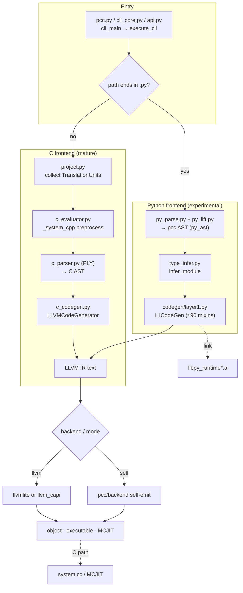
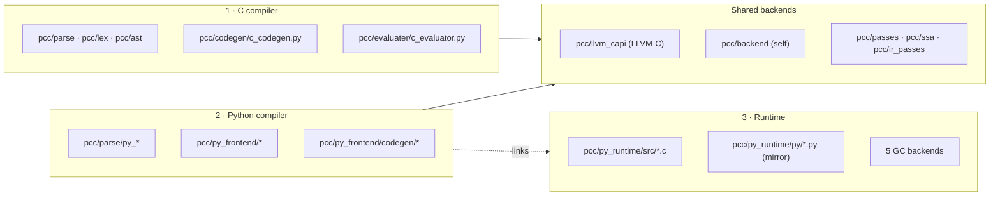

# 01 · System Overview

pcc turns C **or** Python source into native code. The two frontends are separate subsystems that converge on a common backend layer.

## End-to-end data flow

## Three subsystems, one repo

## The five layers

| Layer | Primary paths | Responsibility |
|---|---|---|
| Entry surfaces | `pcc/pcc.py`, `pcc/cli_core.py`, `pcc/cli_launcher.py`, `pcc/api.py`, `pcc/cli_bootstrap.py` | CLI UX, Python API, bootstrap-stage CLI |
| Build orchestration | `pcc/project.py` | collect files, infer source sets, make-driven builds, TranslationUnits |
| Frontends | `pcc/evaluater/`, `pcc/codegen/`, `pcc/py_frontend/`, `pcc/parse/` | parse + lower C / Python to LLVM IR |
| Optimization / lowering | `pcc/passes/`, `pcc/ssa/`, `pcc/ir_passes/` | High/Mid/Low/Backend passes; SSA mid-tier |
| Backends + runtime | `pcc/llvm_capi/`, `pcc/backend/`, `pcc/py_runtime/` | emit native code; runtime objects + GC |

## Entry & dispatch (where it all starts)

- `pcc/cli_launcher.py:11` `main()` → `cli_main(argv)`.
- `pcc/cli_core.py:1111` `cli_main()` parses args; `execute_cli()` decides **C vs Python** by checking whether the input path ends in `.py` (`cli_core.py:905`).
- `pcc/cli_bootstrap.py:11` is a separate **Python-only** CLI used by the self-hosted `pcc1/pcc2/pcc3` binaries; it delegates C/project inputs back to a host `pcc` (`PCC_HOST_PCC`) and adds `-m <module>` (pip/pytest) support.

## Repo map (orientation)

| Path | What it is |
|---|---|
| `pcc/pcc.py`, `pcc/cli_core.py` | CLI entrypoints |
| `pcc/api.py` | `build(...)` / `module(...)` Python API (C) |
| `pcc/project.py` | source collection, TU selection, make-driven builds |
| `pcc/evaluater/c_evaluator.py` | C preprocess / parse / IR / optimize / execute coordinator |
| `pcc/codegen/c_codegen.py` | core C semantic lowering (most C bugs live here) |
| `pcc/parse/`, `pcc/lex/`, `pcc/ast/`, `pcc/ply/` | C parser pieces (PLY) |
| `pcc/parse/py_parse.py`, `pcc/parse/py_lift.py` | native Python parser + lift to pcc AST |
| `pcc/py_frontend/` | Python frontend (type infer, pipeline, codegen) |
| `pcc/py_frontend/codegen/` | ≈90 lowering mixins + native module lowering |
| `pcc/py_runtime/src/*.c`, `pcc/py_runtime/py/*.py` | runtime (C + pcc-Python mirror) |
| `pcc/llvm_capi/` | in-repo LLVM-C IR builder (llvmlite fallback) |
| `pcc/backend/` | LLVM-free self-backend |
| `pcc/package/`, `pcc/package_compat.py` | package install / extension-ABI gating |
| `utils/fake_libc_include/` | fake libc + `Python.h` shim headers |
| `tests/`, `projects/`, `benchmarks/` | regression, real-project, perf |

See the per-subsystem docs for the internals of each box above.
