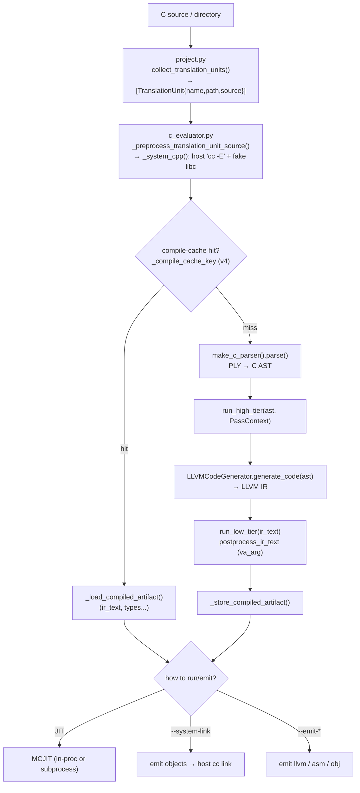
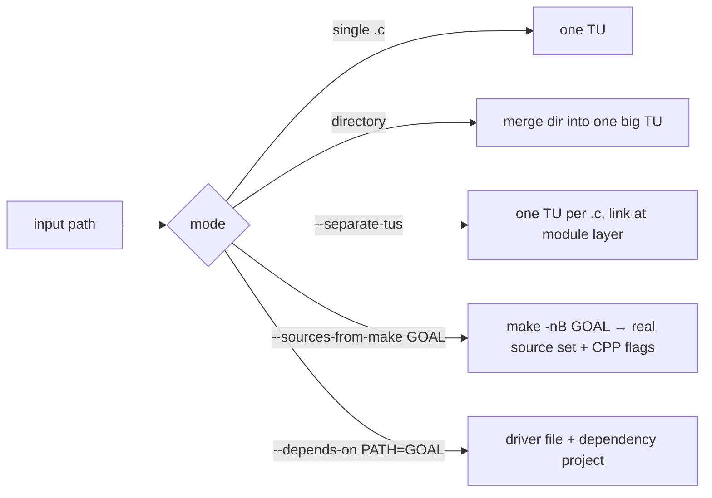
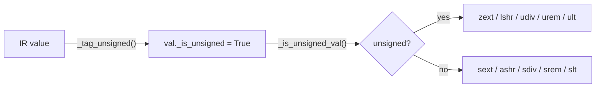
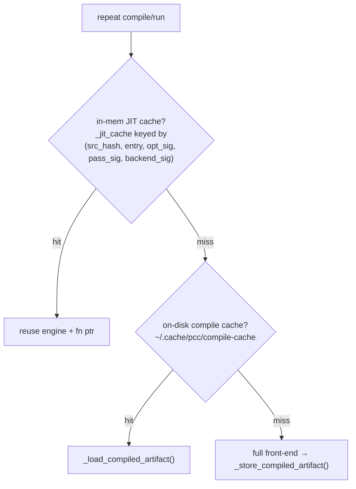

# 02 · C Frontend

The C path is the **most mature** part of pcc — it builds and runs real projects unmodified (Lua, SQLite, PostgreSQL `libpq`, zlib, lz4, zstd, PCRE, OpenSSL, readline, nginx). It is a conventional preprocess → parse → semantic-lowering → LLVM pipeline, coordinated by `CEvaluator`.

## Pipeline

Stage-by-stage with anchors:

| # | Stage | Where |
|---|---|---|
| 1 | Dispatch to C mode | `cli_core.py:905` (`.py` check), `:856` |
| 2 | Collect TranslationUnits | `project.py:89` `collect_translation_units()`, struct at `project.py:23` |
| 3 | Preprocess (host `cc -E` + fake libc) | `c_evaluator.py:1135` `_preprocess_translation_unit_source()` → `:2340` `_system_cpp()` (fake libc at `utils/fake_libc_include/`) |
| 4 | Compile-cache check | `c_evaluator.py:535` `_compile_cache_key()` (version `_COMPILE_CACHE_VERSION="v4"` at `:100`), `:660` load / `:678` store |
| 5 | Parse (PLY) | `c_parser.py:72` `CParser`, `:191` `parse()`; AST `pcc/ast/c_ast.py` |
| 6 | High-tier passes | `c_evaluator.py:1186` |
| 7 | Codegen → IR | `c_codegen.py:921` `LLVMCodeGenerator`, invoked `c_evaluator.py:1198` |
| 8 | Low-tier passes / IR text | `c_evaluator.py:1203`; `postprocess_ir_text` at `c_codegen.py:653` |
| 9 | Execute / emit | MCJIT `c_evaluator.py:1352`; system-link `:2024`; emit `:2103` |

## Source-collection modes (`project.py`)

The TU model is a frozen `TranslationUnit{name, path, source}` (`project.py:23`), which decouples the rest of the pipeline from filesystem scanning.

## The semantic core: `LLVMCodeGenerator` (`c_codegen.py`)

This is where most real C bugs live. Two things make it more than a textbook lowerer:

### 1. Signedness is tracked *beside* LLVM types

pcc lowers both `int` and `unsigned int` to LLVM `i32` — LLVM integer types carry no signedness, so pcc tracks signed/unsigned **intent** itself. Losing that tag means a later `%`, `/`, `>>`, or comparison silently picks the signed opcode (`sdiv`/`srem`/`ashr`) — correct bits now, wrong result downstream.

Helpers (all in `c_codegen.py`): `_tag_unsigned` (`:2558`), `_tag_unsigned_pointee` (`:2574`), `_tag_unsigned_return` (`:2584`), `_is_unsigned_val` (`:2468`), `_convert_int_value` (`:2612`). State lives in `_unsigned_bindings` (`:953`), `_unsigned_pointee_bindings` (`:954`), `_unsigned_return_bindings` (`:955`).

### 2. Compile-time evaluation is its own semantic engine

`_eval_const_expr()` (`c_codegen.py:10642`) folds enum/macro constants and casts, returning a `ConstIntValue` (`:93`) that carries its own `width` + `is_unsigned`. A bug here (e.g. `((size_t)(~(size_t)0))` folding to `-1`) makes a real program compile against the wrong constant and fail far away — independent of the runtime IR path.

## Backend / execution (`c_evaluator.py`)

| Mode | How | Best for | Anchor |
|---|---|---|---|
| MCJIT in-process | parse IR, run directly | evaluator, small programs | `:1352` |
| MCJIT subprocess | isolate Darwin teardown crashes | multi-TU on macOS | `:1850` |
| `--system-link` | emit `.o`, link with host `cc`, run | real projects (libpq, nginx) | `:2024` `run_compiled_translation_units_with_system_cc()` |
| `--emit-llvm/asm/obj` | write artifact | inspection, cross-compile | `:2103` `emit_compiled_units()` |

## Caching (two layers)

In-memory JIT cache: `c_evaluator.py:1443`. On-disk artifact cache: `:660`/`:678`, dir at `:132`.

## Key files

| Path | Role |
|---|---|
| `pcc/project.py` | source collection, TU model, make-driven builds |
| `pcc/evaluater/c_evaluator.py` | preprocess, parse orchestration, cache, optimize, execute/emit |
| `pcc/codegen/c_codegen.py` | `LLVMCodeGenerator` — semantic lowering, signedness, const-eval |
| `pcc/parse/c_parser.py` | PLY parser (`CParser`); bump cache version on grammar changes |
| `pcc/lex/`, `pcc/ast/`, `pcc/ply/` | lexer, AST nodes, vendored PLY |
| `utils/fake_libc_include/` | fake libc headers that keep the host preprocessor pycparser-friendly |
