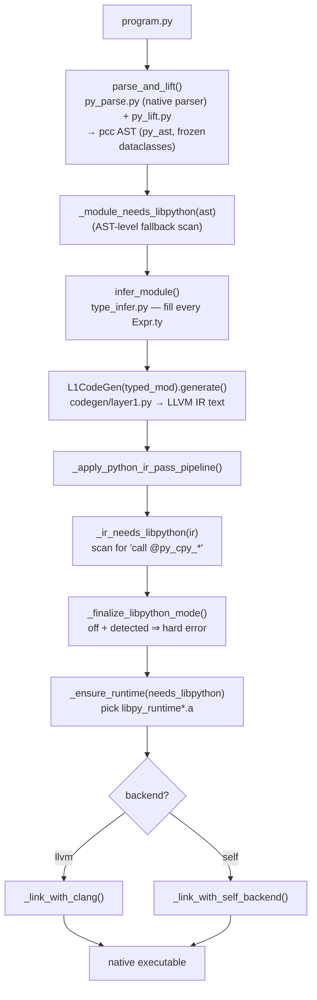
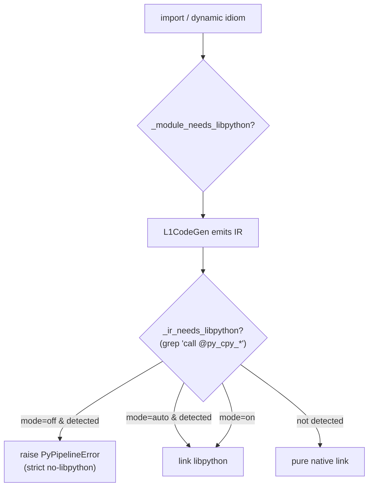
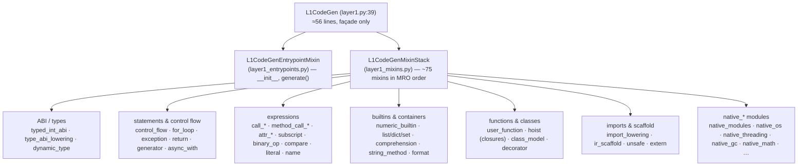

# 03 · Python Frontend

This is the **experimental** half — and the part most of the recent work went into. It lifts typed Python into pcc's own AST, infers types, and lowers to LLVM IR through a large family of "lowering mixins", then links against the native runtime. Unsupported dynamic idioms **fail loudly** by default rather than silently falling back to CPython.

## Pipeline (Python source → native executable)

Top-level entry: `pipeline.py:7075` `compile_python(src_path, out_path, …, libpython_mode, ir_scaffold_mode, backend)`.

| # | Stage | Where |
|---|---|---|
| 1 | parse + lift → pcc AST | `parse_and_lift()` `py_lift.py:1265`; native parser `pcc/parse/py_parse.py`; AST model `py_frontend/py_ast.py` |
| 2 | AST-level libpython gate | `pipeline.py:6805` `_module_needs_libpython()` |
| 3 | type inference | `type_infer.py:3562` `infer_module()` |
| 4 | codegen → IR | `codegen/layer1.py:39` `L1CodeGen`, `.generate()` → `layer1_entrypoints.py:31` → `generation_lowering.py` |
| 5 | IR pass pipeline | `pipeline.py` `_apply_python_ir_pass_pipeline()` (→ `py_frontend/ir_pass_pipeline.py:407`) |
| 6 | IR-level libpython gate | `pipeline.py:7035` `_ir_needs_libpython()`, finalize `:733` |
| 7 | pick runtime archive | `pipeline.py:4345` `_ensure_runtime()` |
| 8 | link | clang `pipeline.py:5603`; self-backend `:6248` / IR-texts `:6473`; dispatch `:6687` |

## The mode gate (why "no-libpython" is a real claim)

pcc decides **twice** whether a program needs CPython fallback — once on the AST (imports outside the native allowlist) and once on the emitted IR (any `call @py_cpy_*`). In the default `off` mode, a positive detection is a **hard error**, not a silent link:

`_finalize_libpython_mode()` (`pipeline.py:733`): `on` → always link; `off` + detected → raise; otherwise follow detection. This gate is exactly what the self-host fixed point asserts: **0 `py_cpy_*` calls** in the bootstrap IR.

## Codegen: the `L1CodeGen` mixin architecture

The old monolithic `layer1.py` was split into a **thin façade + ~90 mixin modules**. `L1CodeGen` (`layer1.py:39`) is assembled by multiple inheritance from two stacks:

The semantic type of `self` inside every mixin is `L1CodeGen` (they are *contextual mixins*, not standalone). New lowering goes in the **narrowest** existing mixin or a `native_*` module — never back into `layer1.py`. A gate enforces this: `scripts/check_layer1_ownership.py` keeps `layer1.py` ≤ ~200 lines and forbids `_emit_*` / `py_gc_*` bodies there. See [python-frontend-codegen-split.md](python-frontend-codegen-split.md) and [layer1-ownership.md](layer1-ownership.md).

### The heavy hitters (where the real complexity is)

| Mixin / module | ~lines | Owns |
|---|---:|---|
| `hoist_lowering.py` | 3048 | nested-function hoisting, closure capture, scope mechanics |
| `native_modules.py` | 2524 | native module alias + import-from dispatch (central) |
| `user_function_lowering.py` | 1934 | user-function bodies + direct calls |
| `call_expression_lowering.py` | 1867 | call lowering, argument marshalling |
| `ir_scaffold_lowering.py` | 1722 | closed-world `ir.*` / llvm-builder lowering for self-host |
| `method_call_expression_lowering.py` | 1681 | `obj.method()` lowering |
| `attr_load_lowering.py` | 1360 | `obj.attr` loads |
| `for_loop_lowering.py` | 1330 | iterator protocol, unpacking, break/continue |
| `numeric_builtin_lowering.py` | 1327 | `len/sum/min/max/abs/...` |
| `assignment_statement_lowering.py` | 1246 | `=`, `+=`, unpacking stores |

`native_*` modules (one per stdlib surface lowered natively): `native_modules`, `native_os`, `native_threading`, `native_system`, `native_text_modules` (json/re), `native_gc`, `native_math`, `native_files`, `native_asyncio`, `native_dataclasses`, `native_weakref`, `native_virtual_thread`.

### `runtime_abi.py` — the bridge to the runtime

Generated IR calls into the runtime by name. `runtime_abi.py` (`:945` lines) holds `RUNTIME_SIGNATURES` (return type, params, vararg) for every runtime symbol and declares them as external IR functions via `declare_runtime()` (`:848`) / `declare_runtime_global()` (`:923`). These prototypes mirror `pcc/py_runtime/include/py_runtime.h` — see [04-runtime-and-gc.md](04-runtime-and-gc.md).

## Type model (`py_ast.py` / `type_infer.py`)

- AST nodes are **frozen dataclasses**; expressions carry a `ty` field defaulting to `DynType("dyn")`.
- Type classes: `IntType`, `FloatType`, `BoolType`, `NoneType`, `StrType`, `BytesType`, `ListType(elem)`, `DictType(key,value)`, `TupleType(elems)`, `FuncType`, `ClassType`, `ValueClassType` (opt-in identity-free value model), `DynType` (untyped fallback).
- `infer_module()` (`type_infer.py:3562`) never mutates — it rebuilds nodes with `dataclasses.replace()`, filling every `Expr.ty` from annotations + literal/`BinOp`/`Call` inference.

## Mode flags (threaded through `compile_python`)

| Flag | Default | Resolved at | Effect |
|---|---|---|---|
| `--python-libpython` | `off` | `pipeline.py:691` | `off` errors on fallback; `auto` links only if needed; `on` always links |
| `--ir-scaffold` | `on` | `pipeline.py:709` | `on` = closed-world native lowering (self-host); `off` = legacy escape hatch |
| `--backend` | `llvm` | `pipeline.py:667` | `llvm`/`llvm_capi` vs LLVM-free `self` |

## Key files

| Path | Role |
|---|---|
| `pcc/parse/py_parse.py`, `pcc/parse/py_lift.py` | native Python parser + lift to pcc AST |
| `pcc/py_frontend/py_ast.py` | frozen-dataclass AST + type classes |
| `pcc/py_frontend/type_infer.py` | `infer_module()` type inference |
| `pcc/py_frontend/pipeline.py` | `compile_python()` orchestration, mode gates, link |
| `pcc/py_frontend/codegen/layer1.py` | `L1CodeGen` façade |
| `pcc/py_frontend/codegen/*_lowering.py` | ~78 lowering mixins |
| `pcc/py_frontend/codegen/native_*.py` | native stdlib-surface lowering |
| `pcc/py_frontend/codegen/runtime_abi.py` | runtime symbol prototypes (mirrors `py_runtime.h`) |
| `scripts/check_layer1_ownership.py` | façade ownership gate |
