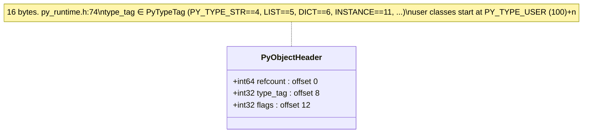
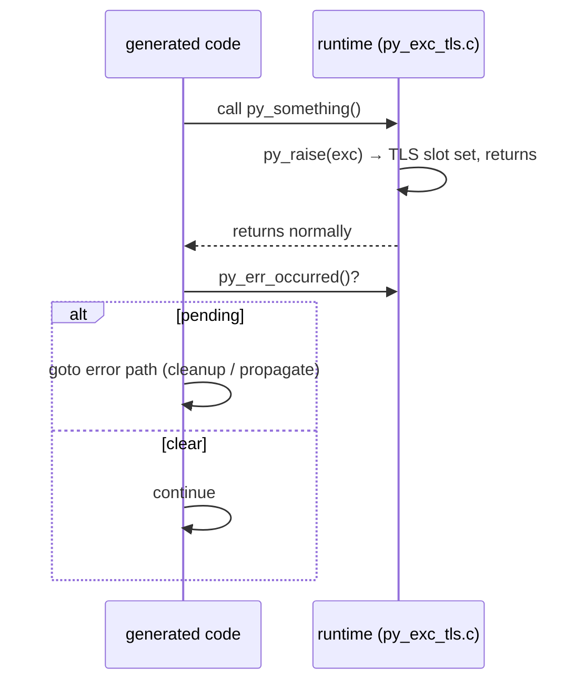
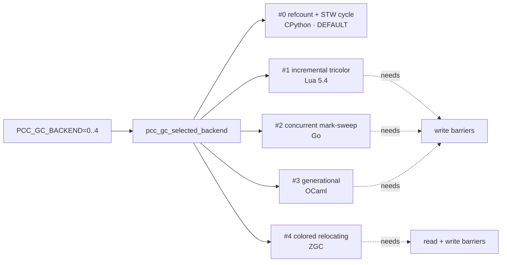
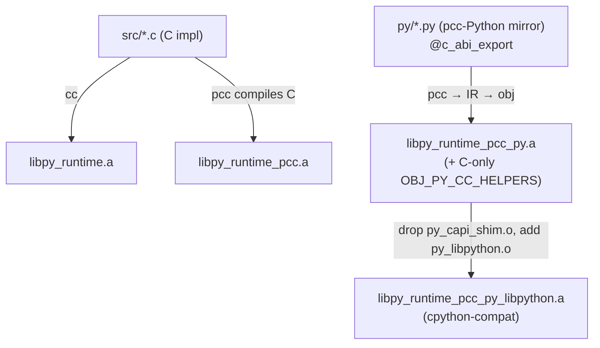

# 04 · Runtime Object Model & GC

The runtime is what pcc-compiled Python links against. It lives twice: a C implementation under `pcc/py_runtime/src/*.c`, and a **pcc-Python mirror** under `pcc/py_runtime/py/*.py` that pcc compiles itself (this is what makes the runtime part of the self-host story). The two must stay in sync.

## Object header (every heap object)

- Header layout: `py_runtime.h:74`. Type tags `enum PyTypeTag`: `py_runtime.h:14` (`NONE=0, BOOL=1, INT=2, FLOAT=3, STR=4, LIST=5, DICT=6, TUPLE=7, SET=8, FUNC=9, CLASS=10, INSTANCE=11, EXC=12, …, VALUEBOX=200`; user classes `PY_TYPE_USER=100 + n`).
- Flags `py_internal.h:13` — `IMMORTAL`, `GC_TRACKED`, `FINALIZED`, plus per-backend GC color/age bits (`GC_WHITE/GRAY/BLACK`, `GC_YOUNG/OLD/REMEMBERED`, `GC_RELOCATION_*`, `GC_ZPAGE_ALLOC`). Under `PCC_WITH_THREADS=1` these go through atomic accessors (`py_internal.h:34`); default build is non-atomic.

## Class & instance layout

`PyClassObject` is **120 bytes** (`py_internal.h:406`), mirrored exactly in `py/py_class.py`. Layout drift between the two is a recurring bug class, so the offsets are pinned:

| offset | field | offset | field |
|---:|---|---:|---|
| 0 | header (16B) | 64 | `methods` |
| 16 | `name` | 80 | `field_names` |
| 32 | `bases` | 88 | `instance_size` |
| 48 | `mro` (C3) | 96 | **`del_method`** |
| 56 | `n_methods` | 104 | **`attrs`** |
| 92 | `type_tag_alloc` | 112 | **`metaclass`** |

Built `pcc_gc_alloc(sizeof(PyClassObject), PY_TYPE_CLASS, 0)` at `py_class.c:351`; MRO via C3 linearization.

## Exception model — return-code, **no stack unwinding**

There is no Itanium-style unwinding. `py_raise(exc)` stashes the exception in a thread-local slot and **returns normally**; generated code must check `py_err_occurred()` after any call that can raise and branch to its error path. Missing that check turns into "compiled fine, produced no output".

- `py_raise()` `py_exc_tls.c:114` (normalizes, sets `__context__` chaining, stores in TLS); `py_err_occurred()` `:152`; `py_current_exception()` `:157`; `py_clear_exception()` `:162`.
- `PyExceptionObject` carries `exc_class`, `message`, `cause`, `context`, growable `traceback` (`py_internal.h:720`). Builtin exception tags at `py_runtime.h:51` (`VALUEERROR=2, TYPEERROR=3, KEYERROR=4, …`).

## Refcount + GC barriers

Slots that hold object pointers must be read/written through barriers, not raw `obj->slot = x`. This is what lets moving/generational backends relocate safely.

- `pcc_gc_load_ptr(owner, slot)` (`py_runtime.h:107`) — read barrier (returns relocated ptr for #3/#4).
- `pcc_gc_store_ptr(owner, slot, value)` (`:108`) — write barrier (cross-generation / cross-thread notify).
- `pcc_gc_store_root(slot, value)` (`:109`) — store to a global/static root.
- Refcount kinds (`py_runtime.h:395`): `NONATOMIC` (default), `ATOMIC`, `BIASED`, `DEFERRED`. Atomic only under `PCC_WITH_THREADS=1`.

## The five GC backends

Selected at runtime by `PCC_GC_BACKEND` (0..4, read in `py_gc_backend.c:447`; default 0 hardcoded `:21`). Each slot mirrors a **real reference implementation** kept in-tree under `docs/refs_docs/gc-research/<lang>/` — the port is meant to be read alongside the upstream, not re-derived.

| # | Algorithm | Reference | Status |
|---|---|---|---|
| **0** | refcount + stop-the-world cycle | CPython | **production / default**; broadest coverage; rollback reference |
| 1 | incremental tricolor mark-sweep | Lua 5.4 | selectable & gated |
| 2 | concurrent mark-sweep | Go | selectable & gated (threaded subset) |
| 3 | generational young/old | OCaml | selectable & production-facing on focused gates |
| 4 | colored relocating (GenZGC-style) | ZGC | selectable; forwarding/read barriers, relocation |

Backend #0 is the reference: a new backend must never regress it. Cycle collection (`py_obj_gc.c::py_gc_collect`) runs on `gc.collect()`; thresholds exist for `gc.get/set_threshold` API compatibility but are **not yet wired to auto-trigger** allocation-debt collection.

Implementation: `py_obj.c:256` dispatches stores on `pcc_gc_backend()`; backend #1–#4 logic in `py_gc_backend.c`; telemetry in `py_gc_telemetry.c`.

## Threading

Built with `PCC_WITH_THREADS=1`, refcounts use `__atomic_*` (`ldaddal` on aarch64) instead of a GIL, so compiled Python runs on multiple cores. Lock/Event/Condition/Thread back onto `pthread_*` (`py_threading.c`). A behavior-oriented-concurrency helper (`pcc/py_stdlib/boc.py`) provides cowns + canonical lock ordering (deadlock-free by construction).

## C ⇄ pcc-Python mirror & the runtime archives

- The Makefile's `PY_MODULES` list (`Makefile:61`) names the modules now authored in pcc-Python (`py_obj`, `py_dict`, `py_list`, `py_str`, `py_class`, `py_obj_gc`, `py_gc_backend`, exceptions, ints, …); the rest stay C-only helpers (`OBJ_PY_CC_HELPERS`).
- The **default** no-libpython build links the pcc-Python ports (`libpy_runtime_pcc_py.a`). A runtime fix in a C source that has a `py/` mirror only takes effect once the mirror is updated too.
- The `_libpython` variant drops `py_capi_shim.o` (so real libpython's C-API wins) and adds `py_libpython.o` — this is the `cpython-compat` path used to import real CPython C-extensions.

## Key files

| Path | Role |
|---|---|
| `pcc/py_runtime/include/py_runtime.h` | public header: object header, type tags, GC ABI, refcount/GC kinds |
| `pcc/py_runtime/src/py_internal.h` | internal layouts (`PyClassObject`, `PyExceptionObject`, flag macros) |
| `pcc/py_runtime/src/py_obj.c` | refcount, store-barrier dispatch, dealloc trigger |
| `pcc/py_runtime/src/py_obj_gc.c` | refcount + cycle collector (backend #0) |
| `pcc/py_runtime/src/py_gc_backend.c` | backend selector + backends #1–#4 |
| `pcc/py_runtime/src/py_exc_tls.c` | `py_raise` / `py_err_occurred` / TLS |
| `pcc/py_runtime/src/py_class.c` | class object, C3 MRO, method/field lookup |
| `pcc/py_runtime/py/*.py` | pcc-Python mirror (must match the C layouts) |
| `pcc/py_runtime/Makefile` | builds the 4–5 archive variants |
| `docs/refs_docs/gc-research/<lang>/` | upstream reference impls for each GC backend |
