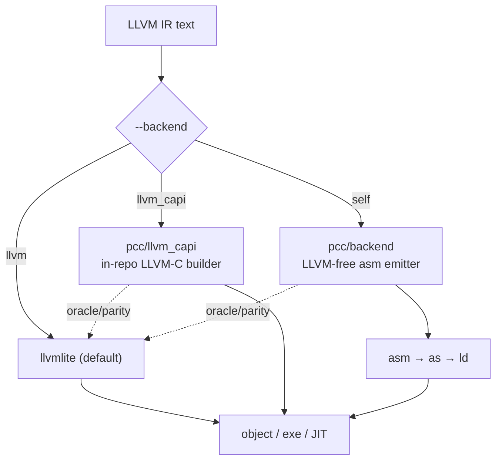
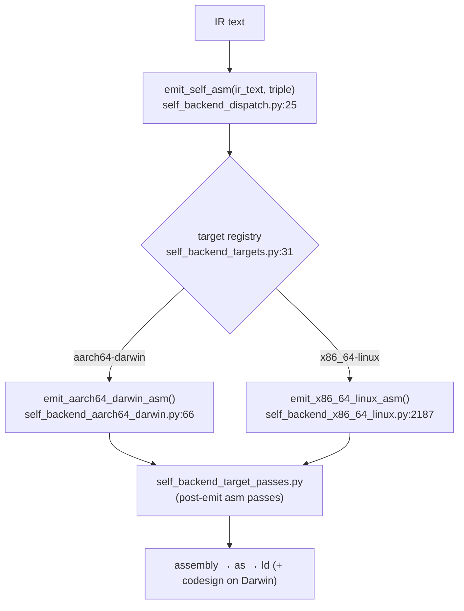
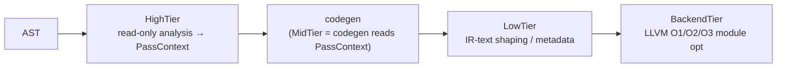

# 05 · Backends, SSA Mid-Tier & Passes

Both frontends converge on a common IR layer. pcc can emit native code through **three** backend routes, and treats LLVM as an *oracle* (a correctness reference) rather than a hard runtime dependency.



## `pcc/llvm_capi` — the LLVM-C IR builder

A text-first IR builder that is a drop-in for `llvmlite.ir`, so the codegen can build IR without depending on the `llvmlite` Python package. The Python codegen imports it indirectly:

```python
from pcc.llvm_capi.compat import ir   # → ir_py by default; llvmlite.ir if PCC_USE_LLVMLITE_C=1
```

- `pcc/llvm_capi/ir.py` — the text IR builder (drop-in `llvmlite.ir`).
- `pcc/llvm_capi/binding.py`, `__init__.py` — ctypes LLVM-C FFI (`LLVMContextCreate`, `LLVMBuild*`, …).
- `pcc/llvm_capi/compat.py:50` — per-subsystem fallback gates `USE_LLVMLITE_PY` / `USE_LLVMLITE_C` / `USE_LLVMLITE_PASSES`, read once at import. This is the seam that lets `llvmlite` act as an **oracle**: run the same repro with `PCC_USE_LLVMLITE_C=1` and diff IR / results to localize a builder bug.

## `pcc/backend` — the LLVM-free self-backend

Lowers LLVM **IR text directly to native assembly**, no LLVM linked. This is the execution root for the strict self-host path.



- Entry: `self_backend_dispatch.py:25` `emit_self_asm()`; target registry `self_backend_targets.py:31`.
- Targets: **AArch64 Darwin** (`self_backend_aarch64_darwin.py` + ~14 `self_backend_aarch64_darwin_*.py` submodules for abi/calls/regs/prologue/…) and **x86_64 Linux** (`self_backend_x86_64_linux.py`).
- Invoked from the Python pipeline via `_emit_self_asm_via_host_python()` (`pipeline.py:5856`), which runs the emitter in a host-Python subprocess on the IR file. LLVM is **not** used at runtime on this path — only as a parity oracle during development.
- Design note (from `AGENTS.md`): the self-backend and pass framework were developed against LLVM's published IR semantics; they are validated against the LLVM-backed path, not a source port of LLVM.

## SSA mid-tier (`pcc/ssa`)

A small SSA IR + analysis layer used for mid-tier reasoning:

- `pcc/ssa/ir.py` — `SSAValue`, `SSAParam`, `SSAConstant`, `SSABinaryOp`, `SSACall`, `SSAPhi`, `SSABlock`, `SSAFunction`.
- `pcc/ssa/builder.py` — `SSABuilder` constructs minimal SSA from function bodies.
- Analyses: ADCE, GVN, SCCP, loop-phi (`SSAADCEAnalyzer`, `SSAGVNAnalyzer`, `SSASCCPAnalyzer`, `SSALoopPhiAnalyzer`).

## Pass framework (`pcc/passes`) and the Python IR pass pipeline



- Tiers defined in `pcc/passes/base.py:86` — `run_high_tier(ast, ctx)` (`:101`), `run_low_tier(ir_text, ctx)` (`:102`). MidTier is not a pass set; it's codegen consuming `PassContext`.
- The **Python** IR pass pipeline: `pcc/py_frontend/ir_pass_pipeline.py:407` `run_python_ir_pass_pipeline()`, applied from `pipeline.py` via `_apply_python_ir_pass_pipeline()` (runs in a host-Python subprocess).
- `pcc/ir_passes/` holds the individual Python-IR pass implementations.

## IR-text rewriting policy

Semantic bugs belong in parser/codegen logic, **not** in text rewrites. The only sanctioned IR-text rewrite is the `va_arg` lowering:

- `c_codegen.py:653` `postprocess_ir_text()` → `pcc/codegen/c_varargs.py:53` rewrites `__pcc_va_arg_*()` helper calls to real `va_arg` IR (a gap the builder can't express directly). Anything else (CFG, type, signedness) must be fixed at the source level.

## Key files

| Path | Role |
|---|---|
| `pcc/llvm_capi/ir.py` | in-repo LLVM-C text IR builder (drop-in `llvmlite.ir`) |
| `pcc/llvm_capi/compat.py` | `ir`/`ir_c`/`ir_passes` selection + llvmlite fallback gates |
| `pcc/backend/self_backend_dispatch.py` | `emit_self_asm()` target dispatch |
| `pcc/backend/self_backend_targets.py` | target registry (aarch64-darwin, x86_64-linux) |
| `pcc/backend/self_backend_aarch64_darwin*.py` | AArch64/Darwin emitter + submodules |
| `pcc/backend/self_backend_x86_64_linux*.py` | x86_64/Linux emitter |
| `pcc/ssa/` | SSA IR, builder, ADCE/GVN/SCCP analyses |
| `pcc/passes/base.py` | High/Mid/Low/Backend tier framework |
| `pcc/py_frontend/ir_pass_pipeline.py` | Python IR pass pipeline runner |
| `pcc/ir_passes/` | individual Python-IR passes |
| `pcc/codegen/c_varargs.py` | the one sanctioned IR-text rewrite (`va_arg`) |
