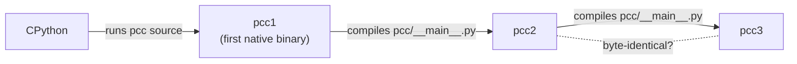
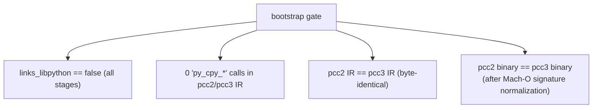
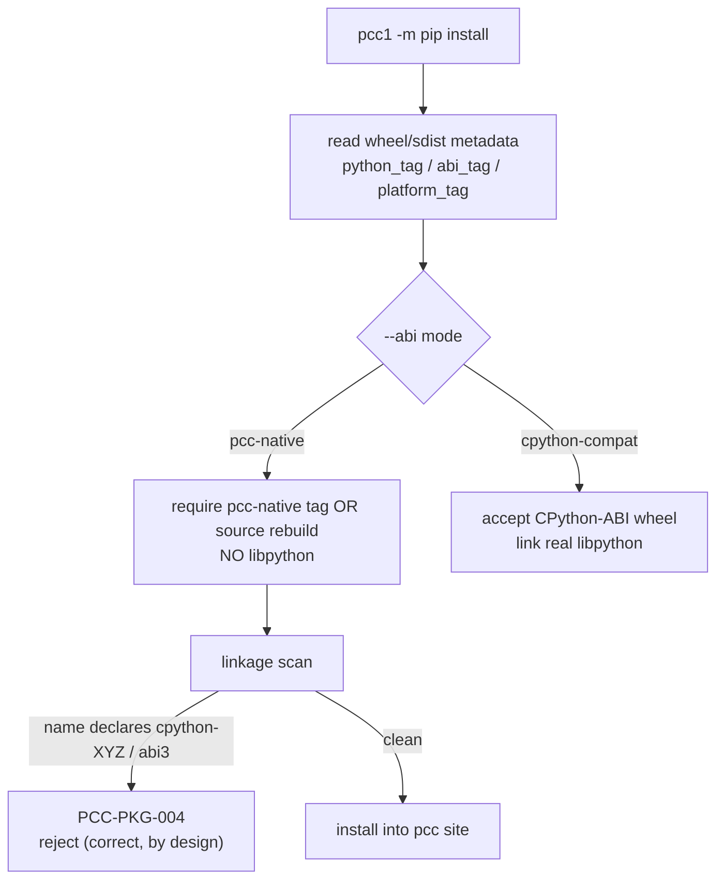
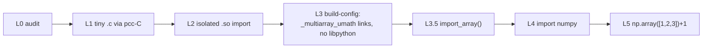

# 06 · Self-Host Bootstrap & Packages

This is pcc's headline property and its hardest real-world frontier: the compiler **reproduces itself** as a native binary with no libpython, and it has a disciplined story for **installing/importing real packages**.

## The self-host fixed point



| Stage | What it is |
|---|---|
| **pcc0** | host CPython running the repository source |
| **pcc1** | first native compiler binary produced by pcc0 |
| **pcc2** | compiler binary produced by pcc1 |
| **pcc3** | compiler binary produced by pcc2 |

The fixed point is reached when `pcc2` and `pcc3` are byte-identical — evidence that pcc's semantics, runtime, codegen, object model, and backend are coherent enough to reproduce themselves. Stage definitions: `scripts/bootstrap.sh:8`; execution `:306`.

### Strict no-libpython invocation

```bash
pcc --backend self --python-libpython=off --ir-scaffold=on pcc/__main__.py -o pcc1
./pcc1 --backend self --python-libpython=off --ir-scaffold=on pcc/__main__.py -o pcc2
./pcc2 --backend self --python-libpython=off --ir-scaffold=on pcc/__main__.py -o pcc3
```

The fixed-point gate asserts all of:



Authoritative, frozen evidence (these JSON baselines are the source of truth, not prose):

- `tests/bootstrap_gate_baseline.json` — strict no-libpython fixed point (captured 2026-05-01); `links_libpython:false` for stage1/2/3, `byte_identical_pcc2_pcc3:true`.
- `tests/fallback_baseline.json` — no-libpython fallback ratchet (closure metrics, 0 multi-file `py_cpy_*` fallbacks).
- Gate test: `tests/python/test_pcc_bootstrap_full.py:29`. Verification (byte compare + signature normalize): `scripts/bootstrap.sh:329`.

### Two CLIs

- **Normal CLI** (`pcc/__main__.py` → `cli_core.py`): full C + Python + project dispatcher.
- **Bootstrap CLI** (`pcc/cli_bootstrap.py:11`): Python-only entry baked into `pcc1/2/3`. It delegates C/project inputs back to a host `pcc` (`PCC_HOST_PCC`) and adds `-m <module>` (pip/pytest) support. The long-term goal is for `pcc1` to natively execute the C-frontend closure too; today that path delegates.
- Multi-file/closure builds go through `scripts/pcc_multi.py` (wraps `compile_python_multi`); each input is a `path` or `path=module.name` (needed for `__init__.py` / relative imports).

Runtime archive used by the strict path: `libpy_runtime_pcc_py.a` (the pcc-Python ports). See [04-runtime-and-gc.md](04-runtime-and-gc.md).

## Packages, C-API & the NumPy ladder

Installing/importing a real package is gated by **ABI mode** — this is where "does pcc support NumPy?" really means "in which mode, and at which rung?".



- **PCC-PKG-004**: in `pcc-native` mode, a wheel whose artifact name declares a CPython extension ABI (`cpython-\d+`, `cp\d+-cp\d+`, `abi3`) is **rejected** so a CPython-ABI artifact is never misreported as native support. Raised in `pcc/package/linkage.py:64` (regex `:27`); also surfaced in `cli_bootstrap.py`. This rejection is a *feature*, not a failure.
- **Compatibility levels** (`pcc/package_compat.py:6`): `LEVEL_COMPAT_PYTHON` (pure-py test deps) · `LEVEL_NOLIBPYTHON_PYTHON` (pure-py, no libpython) · `LEVEL_C_EXTENSION_ABI` (needs C-API/ABI — **numpy, cffi, pybind11**) · `LEVEL_PCC_COMPILED_EXTENSION` (future) · `LEVEL_ACCELERATED_EXTENSION` (future). `numpy` is mapped to `LEVEL_C_EXTENSION_ABI`.

### The NumPy L-ladder (multi-month program)

NumPy is treated as the generic extension-ABI integration target (never an `if package=="numpy"` special case). Documented in `docs/plans/numpy_plan.md`:



Current frontier (per `docs/current-goal-state.md`, hard data 2026-05-29): in `pcc-native` mode numpy's **entire C core compiles and `_multiarray_umath.so` links**, and the `--abi pcc-native` meson build returns 0 — but the artifacts target the **system CPython 3.14 ABI** (meson used the real `python3.14` headers; 0 uses of pcc's headers), so PCC-PKG-004 correctly rejects them. The L3 next step is **build-config**: point numpy's meson at pcc's `Python.h` shim + a pcc EXT_SUFFIX + link pcc's runtime, then extend the shim until it compiles. `import numpy` (L4) and `np.array+1` (L5) remain **months away**. Separately, in `cpython-compat` mode (linking real libpython) numpy calls route through CPython's C-API — that is "link CPython", **not** native support.

### The shim headers (pcc-native build path)

- `utils/fake_libc_include/Python.h` — wraps `py_runtime.h`, defines `struct PyObject` over pcc's 16-byte header, maps the CPython C-API onto pcc's runtime.
- `utils/fake_libc_include/numpy/arrayobject.h` (+ `ufuncobject.h`) — minimal NumPy type/capsule stubs so an extension's C compiles; the real symbol table is provided at runtime via the pcc native extension loader (`py_extension_loader.c`).

## Key files

| Path | Role |
|---|---|
| `scripts/bootstrap.sh` | three-stage bootstrap (`--backend self/llvm`, `--stage N`) |
| `pcc/cli_bootstrap.py` | bootstrap-stage CLI for `pcc1/2/3` |
| `scripts/pcc_multi.py` | multi-file / closure compile entry |
| `tests/bootstrap_gate_baseline.json` | authoritative fixed-point evidence |
| `tests/fallback_baseline.json` | authoritative no-libpython fallback ratchet |
| `tests/python/test_pcc_bootstrap_full.py` | full stage1→2→3 gate |
| `pcc/package/linkage.py` | linkage scan + PCC-PKG-004 |
| `pcc/package/extension_abi.py`, `metadata.py`, `wheel_repo.py` | extension-ABI planning, wheel metadata/repo |
| `pcc/package_compat.py` | per-package compatibility levels |
| `docs/plans/numpy_plan.md` | the L0..L5 ladder |
