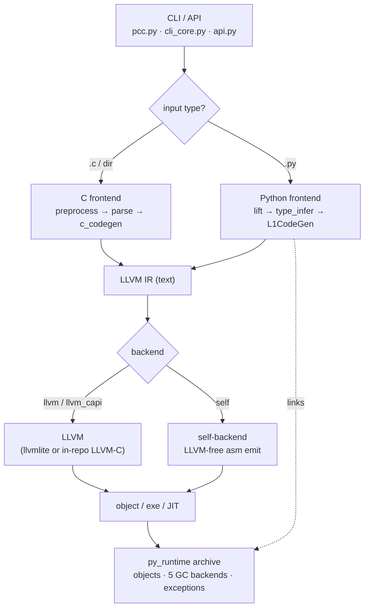

# pcc Architecture Guide

This directory is a **navigable, diagram-first map of how pcc actually works** — written so you can read it end-to-end and understand what the system does, then jump straight into the code via the `file:line` anchors in each doc.

> **Note on anchors.** Line numbers were captured from a code sweep and are *approximate* — they drift as files change. Treat them as "open this file, look near here". Symbol names (functions/classes) are the durable anchor; grep for those if a line number is stale.

## What pcc is, in one diagram

pcc is **two compilers and one runtime** in a single repo: a mature **C frontend** and an experimental **typed-Python frontend**, both lowering to LLVM IR, plus a **Python runtime** (C + pcc-Python mirror) with five pluggable GC backends and an LLVM-free "self" backend.

## The single most important idea: **modes**

Almost every confusing question about pcc ("does it support X?") is really "**in which mode?**". A claim is only meaningful with its mode label (this is enforced project-wide — see `AGENTS.md` → *Project Intent* → obligation 1):

| Axis | Options | Meaning |
|---|---|---|
| **Driver** | host `pcc` ·  `pcc1/2/3` | the Python-hosted compiler vs. a native self-hosted binary |
| **libpython** | `off` · `auto` · `on` | `off` = pure native, no CPython linked; `on` = link real libpython |
| **ABI** | `pcc-native` · `cpython-compat` | native pcc object model vs. CPython C-API compatibility |
| **Backend** | `llvm` · `llvm_capi` · `self` | LLVM (oracle) vs. in-repo LLVM-C vs. LLVM-free self-backend |
| **IR scaffold** | `on` · `off` | closed-world native lowering (self-host) vs. legacy escape hatch |

The strict self-host target is the corner `pcc1` + `--python-libpython=off` + `--backend self` + `--ir-scaffold=on`: **a native compiler that links no libpython and reproduces itself byte-for-byte.**

## Reading order

| # | Doc | Read it to understand… |
|---|---|---|
| 1 | [01-overview.md](01-overview.md) | the whole pipeline end-to-end, the repo map, and where to start |
| 2 | [02-c-frontend.md](02-c-frontend.md) | the mature C path: preprocess → PLY parse → `c_codegen` → LLVM |
| 3 | [03-python-frontend.md](03-python-frontend.md) | the Python path: lift → type infer → `L1CodeGen` mixins → link |
| 4 | [04-runtime-and-gc.md](04-runtime-and-gc.md) | the runtime object model, exception model, and 5 GC backends |
| 5 | [05-backends.md](05-backends.md) | `llvm_capi`, the LLVM-free self-backend, SSA mid-tier & passes |
| 6 | [06-bootstrap-and-packages.md](06-bootstrap-and-packages.md) | the `pcc1→pcc2→pcc3` fixed point and the package / C-API / NumPy ladder |

Pre-existing focused notes that this guide builds on:
- [python-frontend-codegen-split.md](python-frontend-codegen-split.md) — the `L1CodeGen` mixin contract
- [layer1-ownership.md](layer1-ownership.md) — the `layer1.py` façade ownership rule

## How this was produced

This guide was assembled by mapping each subsystem directly from source (entry points, data flow, key types, invariants) and is intentionally **honest about boundaries** — where the C path is production-grade and where the Python path is experimental, what is `pcc-native` vs `cpython-compat`, and what is proven vs. in-progress. For the long-form debugging record of *how* specific bugs were diagnosed, see [`docs/investigations/INDEX.md`](../investigations/INDEX.md); for the active goal and claim-hygiene rules, see [`AGENTS.md`](../../AGENTS.md) and [`docs/current-goal-state.md`](../current-goal-state.md).
