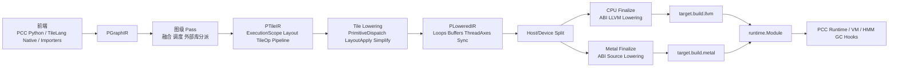
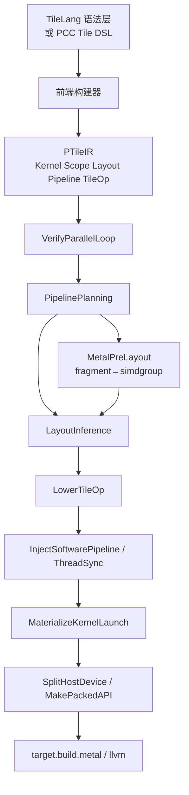
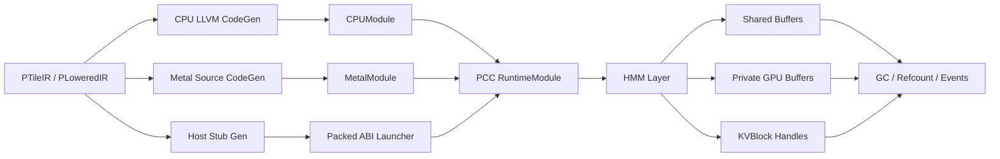
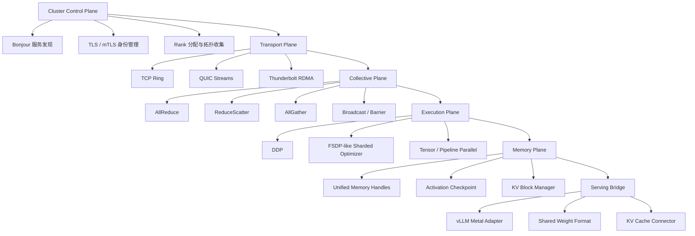
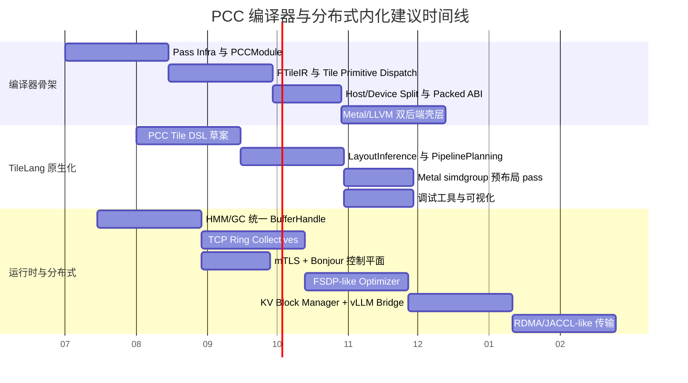

# PCC 内化 TVM 式 Lowering、TileLang 原生支持与多 Mac 分布式训练路线图研究报告

## 执行摘要

这份报告的核心结论是：如果 PCC 想在 PCC1 完成后，真正走向“像 LLVM 一样自举、可扩展、可承载前沿 kernel 与分布式训练”的方向，那么最应该内化的不是 TVM 的全部实现，而是它的**边界设计**：统一 `IRModule`、层级化 pass manager、`target.build.<kind>` 式目标注册、host/device split、`runtime.Module` 抽象，以及像 TIRx 那样把**执行域、张量布局、tile primitive dispatch**暴露给编译器，而把流水线结构、同步、角色分工、后端 intrinsic 留在硬件原生源里。TIRx 官方文档明确把这三件事视为其核心编译边界；Lowering 流水线则把 tile primitive、`TileLayout`、execution-scope id 一步步降到普通 TIR，再分裂 host/device 并进入目标代码生成。对 PCC 来说，这意味着最稳妥的路线不是“把 TVM 塞进 PCC”，而是“让 PCC 自己长出一套 TIRx 风格的 tile lowering 骨架，再提供兼容导入层”。citeturn23view0turn23view3turn4view0turn29view3turn27view0

TileLang 方面，最值得内化进入 PCC 的也不是 Python 语法糖本身，而是它已经证明有效的一组语义：`T.Kernel` 的 target-neutral launch nest、`alloc_shared/local/fragment/global` 的显式内存域、`T.copy/T.async_copy/T.gemm/T.reduce` 这类 tile op、`T.Pipelined` 与软件流水线标注、`Fragment`/layout inference、warp specialization，以及 backend-specific pre-layout 变换。TileLang 文档直接显示，编译链围绕 `PipelinePlanning`、`LayoutInference`、`LowerTileOp`、`InjectSoftwarePipeline`、`ThreadSync`、`SplitHostDevice`、`MakePackedAPI`、`LowerIntrin` 等 pass 组织；而 Metal 后端还单独在 pipelining 之后、LayoutInference 之前做 `local.fragment → metal.simdgroup` 改写。这说明如果 PCC 要把 TileLang “内化成原生支持”，就必须把**布局、流水线和 tile op**升级为 PCC IR 的一等公民，而不是把 TileLang 当成外部 DSL 文本预处理器。citeturn30view0turn8view0turn6view1turn24view3turn24view4turn24view0turn8view1

在异构代码生成上，建议 PCC 采用与 TVM 相似的双族后端：CPU 走 LLVM-family 路线，GPU 尤其 Metal 走 Source-family 路线。TVM 文档明确把 Metal 归类到 source family，即 “TIR → source string → external compiler”；而 Apple 的 Metal 文档又说明在 Apple silicon 上默认资源模式是 `MTLStorageMode.shared`，CPU/GPU 可共享系统内存，同时设备还能提供 `hasUnifiedMemory` 能力查询。因此 PCC 的 HMM/GC 不应继续只把 GPU buffer 看成“外设上孤立的显存对象”，而应该把它们抽象成**统一内存句柄 + 设备驻留策略 + GC pin/ref + kernel 生命周期事件**。这对于后续把 vLLM 风格的 paged KV cache、prefix cache、CPU/GPU 分层缓存接入 PCC 尤其关键。citeturn29view1turn14search2turn14search3turn14search4turn14search14turn21view1turn1view3

在分布式多 Mac 训练上，建议 PCC 不直接照搬 CUDA 生态，而是采用**三层可替换架构**：控制平面、传输平面、collective 平面。控制平面优先建立在 Apple Network/Bonjour/TLS 之上；传输平面第一阶段使用 TCP ring，第二阶段增加 QUIC 或自定义大报文传输，第三阶段再接入 Thunderbolt RDMA/JACCL 类高速后端。MLX 官方分布式文档已经给出 Apple Silicon 集群上的现实边界：RING 后端基于 TCP sockets；JACCL 提供基于 Thunderbolt 的 RDMA，文档还明确说它是 tensor parallel 一类低延迟场景所必需，但要求 fully-connected 拓扑，且当前启用 RDMA 还需要在 macOS Recovery 中手动开启。对 PCC 来说，这意味着“先 TCP、后 RDMA”的分层路线，比一开始就设计一套假定有 IB/RoCE 的 datacenter 栈更现实。citeturn19view0turn14search5turn17search0turn17search1turn17search7

最后，vLLM Metal 与 KV cache 应被视为 PCC 分布式阶段的重要上层约束，而不是训练完成后的附属品。vLLM 文档显示它已经支持 Apple Silicon，并把 paged KV cache 组织成 block table、全局 hash 表、引用计数与 LRU/最长前缀优先淘汰策略；同时它还支持 gRPC 与多种分布式推理并行方式。这为 PCC 提供了两个直接方向：第一，把 PCC HMM/GC 设计成能原生托管 **KV block** 的对象系统；第二，把 PCC 分布式运行时的 RPC/collective 设计成未来可以同时服务训练与 vLLM Metal 推理，而不是做两套平行系统。citeturn1view3turn21view1turn21view2turn15search11

## 研究边界与假设

本报告以公开主源为主：TVM 官方文档与 TIRx 文档、TileLang 官方文档与仓库 README、vLLM 官方文档、Apple Developer 文档、MLX 官方文档，以及少量官方/准官方分布式训练资料。由于你给出的 PCC 仓库 URL 未指定，本报告**不对 PCC 当前代码库做逐文件事实性断言**，而是把已有的 PCC1、Metal、HMM/GC、vLLM Metal 相关能力视为你们正在推进或已有雏形的内部前提，并据此给出架构与工程路线建议。这个边界很重要：下面所有“应增加”“建议内化”“优先级高”的内容，都是在**仓库未直接核验**条件下的严谨设计建议，而非对当前 PCC 代码状态的事实报告。citeturn1view3turn27view1turn8view0

我进一步采用如下工程假设：PCC1 完成时至少已有基本前端、基础中间表示、CPU/Metal 执行能力、基础运行时对象模型，以及可容纳 HMM/GC 扩展的资源管理接口；团队规模按 4–6 名编译器/运行时工程师、1 名基础设施或测试工程师估算；目标平台以 Apple Silicon Mac 为主，同时保留 CPU fallback。若其中任一前提不成立，下面路线图需要整体向前回退一个阶段。这个“回退机制”与 TVM/TileLang 的公共经验是一致的：它们都把 pipeline 设计为可组合、可裁剪、可在不同阶段替换实现，而不是把所有能力一次性焊死在 monolithic build path 里。citeturn27view0turn27view1turn26view1

从方法论上，这份报告优先提炼五个原始模式。其一，TVM 的 pass infra 与 target dispatch 模式；其二，TIRx 的 tile-level lowering 边界；其三，TileLang 的 layout/pipeline/tile-op 组织方式；其四，Apple Silicon 的 unified memory 与 Network/QUIC/TLS 基础；其五，MLX/vLLM 在 Apple Silicon 分布式与 KV cache 上已经公开验证过的机制。这五个模式相互拼合，足以构成 PCC 下一阶段“编译器内核 + 运行时内核”的蓝图。citeturn27view0turn4view0turn30view0turn14search3turn14search5turn19view0turn21view1

## 将 TVM 式 Lowering 内化进 PCC

TIRx 给 PCC 的最大启发，不是某一个具体 pass，而是**如何定义“编译器应该懂什么，不应该替你隐藏什么”**。官方文档把 TIRx 的设计边界表述得非常清楚：kernel 中那些经常需要专家控制的部分——pipeline structure、synchronization、role assignment、memory placement、backend intrinsics——保留在硬件原生源码里；而 recurring tile-level structure 通过 execution scope、tensor layout、tile primitive dispatch 暴露给编译器。对 PCC 来说，这个边界几乎正好回答了“PCC 要不要像 TVM 一样长成 self-hosted lowering 系统”这个核心问题：**要，但应该学 TIRx 的边界，而不是复制传统高层张量编译器那种过度抽象边界。**citeturn23view0turn23view2turn23view3

TIRx lowering pipeline 本身也很适合直接映射到 PCC。官方流水线显示，`tvm.compile(..., tir_pipeline="tirx")` 会先运行 `LowerTIRx`，再过 `UnifyThreadBinding`、`StmtSimplify`、`LowerTIRxOpaque`、`FlattenBuffer`、`BF16ComputeLegalize`、`NarrowDataType(32)`、`VectorizeLoop`、`UnrollLoop`、`CommonSubexprElim`、`VerifyMemory`、`AnnotateEntryFunc`、`SplitHostDevice`、`MakePackedAPI` 等步骤；其中 `LowerTIRx` 又先做 `TilePrimitiveDispatch`，再做 `LayoutApplier` 式 cleanup，把 `TileLayout` 访问、execution-scope id 等降成普通 TIR。这个序列直接告诉 PCC：需要先有**tile-aware IR**，再有**buffer/layout lowering**，再有**host/device ABI 化**，最后才是 target codegen。citeturn4view0turn29view3

更进一步，TVM 的 codegen 体系已经给出一个很适合 PCC 借鉴的后端框架。它把目标代码生成分成 LLVM family 与 Source family；GPU 场景下先做 host/device split，再通过 `codegen::Build()` 按 `target.build.<kind>` 进行目标派发，最终产出 `runtime.Module`。Metal 在 TVM 中属于 Source family，路径是 `TIR → source string → external compiler`；CPU 则更适合 LLVM family，路径是 `TIR → LLVM IR → machine code`。这意味着 PCC 非常适合形成如下双通路：**CPU 走 LLVM、Metal 走源代码生成与外部编译器**，而共享统一的前半段 lowering 与模块链接逻辑。citeturn29view0turn29view1turn29view2turn29view3

对 PCC 来说，建议把 TVM 式 lowering 内化成四层 IR，而不是两层。第一层是 `PGraphIR`，面向模型、算子图、外部库调度与未来训练图；第二层是 `PTileIR`，面向 TileLang/native-kernel 语义，包含 execution scope、layout、tile op 和 pipeline region；第三层是 `PLoweredIR`，只保留普通循环、buffer、线程轴、同步原语与 target-neutral intrinsic；第四层是 `PExecIR`，完成 ABI、launch、runtime hook 和 module packaging。这个分层是对 TVM 的 Relax/TIRx/runtime 边界，以及 TileLang transform 阶段的综合推断：它既能容纳模型图优化，也能容纳 kernel-native 编译。citeturn22view1turn3view1turn30view0turn27view1

下面是建议中的 PCC lowering 主路径：



这个设计最关键的好处，是它允许 PCC 先以“桥接模式”实现，再逐步切到“原生模式”。桥接模式下，可以先提供 `TVM/TIRx/TileLang → PTileIR` 的 importer，快速获得已有 kernel 资产；原生模式下，再把 `PCC frontend → PTileIR` 变成首选路径。TVM BYOC 文档也显示，现代编译器完全可以在一个统一 pipeline 中同时支持“自家 lowering”与“外部后端/外部 codegen”并存，因此 PCC 不必在“彻底重写”与“永远依赖外部”之间二选一。citeturn3view3turn27view0turn27view1

下面这张表给出建议优先吸收进 PCC 的 TIRx/TVM 组件。

| TVM/TIRx 组件 | 在官方体系中的角色 | PCC 对应建议 | 紧迫度 | 备注 |
|---|---|---|---|---|
| `IRModule` | 统一承载不同层 IR 与函数变体 | `PCCModule` 同时容纳 Graph/Tile/Extern/Runtime stubs | 高 | 这是 pass infra、module linking、serialization 的基础。citeturn3view1turn27view1 |
| `PassInfo` / `PassContext` / `Sequential` | 管理 pass 顺序、依赖、禁用、调试与 instrumentation | `PCCPassInfo`、`PCCPassContext`、`PCCSequential` | 高 | 文档明确说明 TVM 设计受 LLVM 层级 pass manager 启发。citeturn27view0turn26search2 |
| `execution scope` | 描述 primitive invocation 的参与者与作用域 | `PCCScope` | 高 | Tile/warp/thread/block 语义必须 first-class。citeturn23view0turn23view2 |
| `tensor layout` | storage-first 的逻辑到物理资源映射 | `PCCLayout` | 高 | 是 TileLang fragment/layout inference 的落点。citeturn23view2turn24view4 |
| `tile primitive dispatch` | 按 primitive + scope + layout + target 选实现 | `PCCTileOpDispatch` | 高 | 是让 TileLang 原生化的核心。citeturn23view1turn4view0 |
| `SplitHostDevice` / `MakePackedAPI` | GPU 调度 ABI 化 | `PCCSplitHostDevice` / `PCCPackedABI` | 高 | 对 CPU/Metal 共存尤其关键。citeturn4view0turn29view3 |
| `target.build.<kind>` | 按目标后端注册构建器 | `pcc.target.build.<kind>` | 高 | 有助于做到“内核统一，后端插拔”。citeturn3view2turn29view3 |
| `runtime.Module` | 打包可调用代码与导入模块 | `PCCRuntimeModule` | 中高 | 也是后续分布式装载、序列化与缓存的基础。citeturn29view2 |
| `Disco` / `SocketSession` | 多设备/多节点分布式执行骨架 | `PCCDistSession` | 中 | 不必现在照抄，但接口层最好提前预留。citeturn22view1turn22view0 |

基于上面这套抽象，我建议 PCC 直接提供如下编译 API 草图。它基本复用了 TVM pass infra 的可组合思想，但把 tile lowering 明确提到了公共接口层：

```python
with pcc.PassContext(
    opt_level=3,
    disabled_pass={"VectorizeLoop"},
    config={
        "pcc.target": "metal",
        "pcc.tile.enable_layout_inference": True,
        "pcc.gc.trace_kernel_liveness": True,
    },
):
    mod = pcc.import_model(model_or_kernel)
    mod = pcc.pipeline.graph_default()(mod)
    mod = pcc.pipeline.tile_default()(mod)
    exe = pcc.build(mod, target="metal")
```

```python
@pcc.module_pass(name="LowerTileIR", opt_level=1, required=["VerifyParallelLoop"])
def lower_tile_ir(mod: PCCModule, ctx: PassContext) -> PCCModule:
    return pcc.transform.Sequential([
        pcc.transform.TilePrimitiveDispatch(),
        pcc.transform.LayoutApply(),
        pcc.transform.Simplify(),
        pcc.transform.FlattenBuffer(),
        pcc.transform.SplitHostDevice(),
        pcc.transform.MakePackedAPI(),
    ])(mod)
```

这些 API 草图的目的，是让 PCC 从一开始就具备“可替换、可打印、可插桩、可 shadow-run 的 lowering pipeline”，而不是只能通过一个巨大的 `compile()` 黑箱前进。TVM 文档把这类可组合 pipeline 视作其基本原则，这一点很值得 PCC 直接吸收。citeturn27view1turn27view0turn26view1

## 将 TileLang 内化为 PCC 原生能力

TileLang 的公开资料已经清楚展示出，它并不是普通的“kernel 语法层”，而是一套围绕**显式内存域、tile op、layout inference、软件流水线、target-neutral launch**组织起来的 DSL/编译器系统。README 说明它建立在 TVM 之上，目标是高性能 GPU/CPU/Accelerator kernel；支持的典型算子包括 GEMM、Dequant GEMM、FlashAttention、LinearAttention 等；到 2026 年中仓库最新 release 为 v0.1.11，而 README 也专门记录了 Metal 支持与 CuTeDSL backend 等演进。这些信息共同说明：TileLang 已经不只是“写 CUDA 的方便语法”，而是一条对 PCC 非常有参考价值的、**跨后端且对硬件细节友好的 kernel 表达路径**。citeturn1view2turn6view2

TileLang 的编译流也和 PCC 想要的方向高度一致。官方概览把路径描述为：Tile Program → 可选 Tile Library / Thread Primitives → IRModule → Source Code Generation → Hardware-specific Executable/Runtime；同时它把用户能力分成三个层级，并把中间层定位在“像 Triton 一样写 tile-level operation，由编译器做 layout inference、pipelining 等”。这说明如果 PCC 只是把 TileLang 作为“导入一个已经 lower 完成的外部 kernel 源码”，那么真正有价值的那一层——layout/pipeline/tile dispatch——根本没有进入 PCC。citeturn8view0turn6view3

对 PCC 的最优做法，是把 TileLang 的关键语义拆成**前端语义、IR 语义、运行时语义**三部分来原生吸收。前端语义对应 `T.Kernel`、`T.alloc_shared`、`T.alloc_fragment`、`T.copy`、`T.async_copy`、`T.gemm`、`T.Pipelined`、`T.Parallel`、`T.ws/WarpSpecialize` 等构造；IR 语义对应 `PCCScope`、`PCCLayout`、`PCCTileOp`、`PCCPipelineRegion`、`PCCParallelLoop`、`PCCWarpGroupRegion`；运行时语义则对应 packed ABI、target-neutral launch、同步语义、buffer scope、以及 backend-specific lowering hooks。TileLang 文档把这些能力分别落在 language、layout、transform 与 backend pipeline 中，结构上非常适合作为 PCC 的内化模板。citeturn6view0turn24view3turn24view0turn6view1turn30view0

下面给出 TileLang→PCC 的功能映射建议。

| TileLang 特性 | 公开语义 | PCC 中应落在哪一层 | 必要扩展 |
|---|---|---|---|
| `@T.prim_func` | 生成 TIR/TIRx 风格 kernel 函数 | `PCCKernelFunc` | 要允许 kernel 独立进入模块。citeturn6view0 |
| `T.Kernel(...)` | 生成 target-neutral launch nest | `PCCLaunchRegion` | CPU/Metal 需要共用，再在后端 materialize。citeturn30view0 |
| `alloc_shared/local/fragment/global` | 显式内存域分配 | `PCCBuffer(scope=...)` | scope 必须一等化，不能只靠字符串注释。citeturn24view3 |
| `alloc_tmem/descriptor/barrier` | 高级硬件资源与同步对象 | `PCCSpecialBuffer` / `PCCSyncObj` | 为未来 Metal simdgroup / 新硬件预留。citeturn24view3 |
| `T.copy` / `T.async_copy` | 同步与显式异步 copy 语义 | `PCCCopyOp(async=...)` | 要区分语义，不可偷偷 fallback。citeturn6view1 |
| `T.gemm` / `reduce` | tile primitive | `PCCTileOp("gemm"/"reduce")` | 接入 dispatch registry。citeturn6view3turn30view0 |
| `T.Pipelined` | 软件流水线表达 | `PCCPipelineRegion` | 需要自动与手动标注双模。citeturn6view3turn25search4 |
| `T.Parallel` + `loop_layout` | 并行循环与 layout annotation | `PCCParallelLoop` + `PCCLayout` | 缺 layout 时应编译失败，而非静默退化。citeturn24view1 |
| `Fragment` / layout inference | 线程到数据的映射 | `PCCFragmentLayout` | 要支持可视化与调试输出。citeturn24view4turn6view5 |
| `WarpSpecialize` | warp-group 条件区域 | `PCCWarpGroupRegion` | 对 Metal 可映射到 simdgroup，对 CPU 则消解。citeturn24view0 |
| Metal `fragment→simdgroup` pass | backend-specific pre-layout rewrite | `PCCMetalPreLayoutPass` | Metal 专属，高优先级。citeturn8view1 |

TileLang 官方 transform 索引对 PCC 尤其有价值，因为它几乎已经给出了一份“PCC Tile pass 清单”的雏形：`PipelinePlanning`、`LayoutInference`、`LowerTileOp`、`InjectSoftwarePipeline`、`VerifyParallelLoop`、`ThreadSync`、`LowerAccessPtr`、`MakePackedAPI`、`MaterializeKernelLaunch`、`SplitHostDevice`、`FlattenBuffer`、`StorageRewrite`、`LowerThreadAllreduce`、`LowerIntrin`、`LowerDeviceKernelLaunch` 等。这些 pass 的存在本身说明：**TileLang 的原生支持需求并不止于 parser**，而是需要完整的 lowering/memory/sync/backend pass 体系。citeturn30view0

这里最重要的一点，是不要把 layout inference 当作“方便优化”，而要当作**语义闭包**。TileLang 文档明确说它在编译期间用 Layout Inference Pass 推导 `T.Fragment`，决定 fragment/register file 如何分配给线程；并且并行循环的 layout annotation 还有严格约束：最外层并行 nest 必须带 layout，`InputDim` 必须匹配 nest 深度，违例会导致编译错误。对 PCC 而言，这意味着如果要把 TileLang 真正原生化，就应该让 `PCCLayout` 进入类型系统和验证器，而不是作为普通分析结果挂在 side table 里。citeturn8view0turn24view1turn24view4

下面是我建议的“TileLang 原生支持”路径图：



在 API 层，我建议 PCC 采用“表面上像 TileLang，但类型与 lowering 完全归 PCC 所有”的方案。这样既能保持迁移友好，也不把 PCC 锁在外部实现细节上。下面的 API 草图体现的就是这个思路：

```python
import pcc.tile as P

@P.kernel
def flash_mla(
    q: P.Tensor(("B", "H", "Tq", "D"), "float16"),
    k: P.Tensor(("B", "H", "Tk", "D"), "float16"),
    v: P.Tensor(("B", "H", "Tk", "Dv"), "float16"),
    o: P.Tensor(("B", "H", "Tq", "Dv"), "float16"),
):
    with P.Kernel(grid=("B", "H"), threads=256) as (b, h):
        q_s = P.alloc_shared(("TQ_TILE", "D"), "float16")
        k_s = P.alloc_shared(("TK_TILE", "D"), "float16")
        v_s = P.alloc_shared(("TK_TILE", "DV"), "float16")
        acc = P.alloc_fragment(("TQ_TILE", "DV"), "float32")

        for ko in P.Pipelined("Tk_tiles", stages=3):
            P.copy(q[b, h], q_s)
            P.async_copy(k[b, h, ko], k_s)
            P.async_copy(v[b, h, ko], v_s)
            P.wait_async()
            P.gemm(q_s, k_s, acc, trans_b=True)
            P.reduce_softmax(acc)
            P.gemm(acc, v_s, o[b, h])
```

这类 API 设计有两个好处。第一，它让 PCC 前端可以直接产出 `PTileIR`，而不是先生成 TileLang 再回头导入；第二，它为将来加入 PCC 专属语义——比如 HMM-aware allocation、GC pinning hints、KV cache block affinity——预留了语言级位置，而不必去修改外部 DSL 的词法和语义。TileLang 目前已经有 pass diff、layout visualization、`T.print`、post-processing callback 等调试能力，PCC 也应该把这些当成一等工程特性同步建设。citeturn6view5turn7search20

## 面向 Metal 与 CPU 的异构代码生成以及与 HMM/GC 的耦合

在 Apple Silicon 上做异构代码生成，PCC 最需要避免的一个误区，是把 Metal 看成“跟 CUDA 一样，有一块独立显存、CPU 侧只做 launch”的后端。Apple Metal 文档明确写出：对 Apple silicon GPU，默认资源模式是 `MTLStorageMode.shared`；`hasUnifiedMemory` 能告诉你 CPU 与 GPU 是否共享全部内存；`shared` 模式下资源分配在系统内存中，CPU/GPU 都可访问。与此同时，Apple 也保留 `private` 这类 GPU-only 资源模式与 heap 配置。这意味着 PCC 的 HMM/GC 不应是“有没有 unified memory 的开关”，而应是**基于统一地址空间、显式驻留策略、同步边界与对象生命周期的资源模型**。citeturn14search2turn14search3turn14search4turn14search10turn14search14turn14search27

从代码生成角度看，PCC 可以直接采用 TVM 那种 CPU/Metal 双族后端设计：CPU 由 LLVM family 生产高质量本地代码；Metal 由 source family 生成 MSL，再交由外部编译路径成为可装载的 device module。TileLang 的 target 文档同样表明它把 `metal` 与 `llvm` 视为并列目标；而 `MaterializeKernelLaunch` 文档又说明 target-neutral kernel launch nest 在 SIMT backend（CUDA/ROCm/Metal）与 CPU backend 上的消解方式不同：前者 lower 成 thread-binding 语义，后者则把 block loop 变成普通串行 loop，并把 thread loop pin 到 0。对 PCC 而言，这恰好说明 launch IR 必须位于**后端无关层**，不能在 parser 阶段就硬编码成 Metal 专属结构。citeturn29view1turn6view2turn30view0

真正需要和 HMM/GC 耦合的，是运行时对象模型，而不是 parser。推荐 PCC 设计一个统一的 `PCCTensorHandle`/`PCCBufferHandle`，同时保存 host 可见指针、Metal buffer 或设备资源句柄、逻辑布局、驻留策略、引用计数、pin 信息、事件依赖和 GC finalizer。对于 Apple Silicon，shared buffer 可以作为默认策略，但高吞吐 kernel、临时 tile buffer、KV cache hot blocks、Metal 专用 scratch 等仍应允许切到 private/heaped 资源，以避免 CPU/GPU 同时访问导致的额外干扰。这个推断同时受 Apple 资源模式文档、TVM runtime.Module 模型，以及 TileLang 显式 buffer scope 设计支持。citeturn14search2turn14search4turn29view2turn24view3

我建议 PCC 的对象头至少包含下面这些字段：

```c
typedef enum {
    PCC_STORAGE_SHARED,
    PCC_STORAGE_PRIVATE,
    PCC_STORAGE_HEAP_SHARED,
    PCC_STORAGE_HEAP_PRIVATE
} PCCStorageMode;

typedef struct {
    void* host_ptr;              // unified/shared 时可用
    void* metal_buffer;          // MTLBuffer / backend handle
    uint64_t bytes;
    PCCStorageMode storage_mode;
    uint32_t refcnt;
    uint32_t gc_flags;           // pinned / kv_block / external / borrowed
    uint64_t last_gpu_use_epoch;
    uint64_t last_cpu_use_epoch;
    uint32_t layout_id;
    uint32_t residency_policy;   // hot / warm / cold / stream_local
} PCCBufferHandle;
```

这个对象模型一旦建立，PCC 就能把编译器和运行时真正连起来。比如 `PCCLayout` 可以直接指向 `layout_id`；`SplitHostDevice` 之后生成的 host stub 可以自动决定 buffer 是 shared 还是 private；GC 则可以根据 `last_gpu_use_epoch`、refcnt、KV pin 标记与 stream event 来决定是否真的回收。这里最重要的不是“做一个更复杂的 GC”，而是把**kernel 生命周期与对象生命周期统一在 runtime 中表达**。TVM 的 `runtime.Module` 与 host/device split、TileLang 的 packed API、Apple 的 shared/private 模式，都在为这种统一对象模型提供支撑。citeturn29view3turn29view2turn30view0turn14search14

这一层与 vLLM 的关系尤其紧密。vLLM 文档说明，PagedAttention 把每个请求的 KV cache 切成 fixed-size KV block，并允许这些 block 存在于非连续物理内存中；自动 prefix caching 则用 `hash(prefix + block_tokens) <-> KV Block` 的映射来共享块，并在缓存满时优先驱逐 refcount 为 0 的块，再按 LRU 与最长前缀末端优先淘汰。PCC 如果未来要支持 vLLM Metal 或者自己的高并发推理，最自然的做法就是把 KV block 直接做成 GC/HMM 的特殊对象类型，而不是把它塞进普通 tensor allocator 里。citeturn21view1turn21view0

因此我建议在 PCC 运行时中直接增加 `KVBlockHandle` 和 `BlockTable` 两类对象。前者带 refcnt、prefix-hash、layout/class-of-storage、pinned 状态与最近访问时间；后者由请求上下文持有并连接到调度器。这样做有三个直接收益。第一，training 侧如果要做 teacher forcing、speculative decoding、serving/training 混合 cache，可重用同一块管理层；第二，GC 可以按 block 粒度回收，而不是整 tensor 大对象回收；第三，distributed runtime 将来可以在 block 粒度上做跨结点传递或失效，而无需整体搬迁序列缓存。以上方向直接受 vLLM block 管理模式启发。citeturn21view1turn21view2turn21view3

下面是异构 codegen 与 HMM/GC 的建议形态：



## 分布式多 Mac 训练内化方案

如果 PCC 要在 PCC1 之后把“分布式多 Mac 训练”真正内化，那它需要的是一个**像 TVM Disco 那样的分布式运行时外壳**，再叠加一个 Apple Silicon 友好的集体通信与安全体系，而不是单纯把一套 Python 训练脚本通过 SSH 派发到多台机器。TVM 的分布式运行时 Disco 给出的抽象很值得借鉴：模型编译期用 `relax.distributed` 标注张量如何在 device mesh 上放置与分片；运行期则由 `Session` 管理 workers，用 `DRef` 表达每个 worker 上的对象引用，并提供 allreduce、allgather、broadcast、scatter 等 collective。更重要的是，TVM 还区分了 `ThreadedSession`、`ProcessSession`、`SocketSession`，这恰好对应 PCC 后续的单机、多进程、多节点三种部署形态。citeturn22view1turn22view0

Apple 平台上的传输与服务发现，也不需要 PCC 自己从 socket 原语开始发明。Apple 官方文档明确推荐 Network framework 作为 TCP、UDP、QUIC、TLS 等自定义协议的基础；Bonjour 用于本地网络服务发现；TLS/本地网络 TLS 身份创建文档则提供了局域网认证的可行路线。这意味着 PCC 的控制平面完全可以基于 Apple 原生网络栈建设，例如：Bonjour 发现节点、Network.framework 建立 QUIC/TCP 连接、TLS/mTLS 做设备与 rank 认证。相比之下，TVM RPC 文档还特别警告其 RPC server 默认假定 trusted network，并允许远程代码执行与任意文件写入，因此**PCC 不能照搬那种安全模型**。citeturn14search5turn14search1turn17search0turn17search1turn17search7turn22view2

在 Apple Silicon 多 Mac 传输层上，公开可验证的现实路径主要有两条。第一条是像 MLX RING backend 那样用 TCP sockets 做 ring all-reduce / all-gather；MLX 文档说它总是可用，而且通常比 MPI 更快。第二条是像 MLX JACCL backend 那样走 Thunderbolt 上的 RDMA；同一文档还写明它是 tensor parallel 这类低延迟场景所必需，并且要求 fully-connected 拓扑，当前还需要在 macOS Recovery 中开启 RDMA。对 PCC 来说，这意味着**RING/TCP 应成为默认基线后端，RDMA/JACCL-like 应成为可选高性能后端**，而不是默认依赖。citeturn19view0

从训练策略上看，我不建议 PCC 第一版就走 parameter server。TensorFlow 官方文档把 parameter server 描述为多机数据并行的常见方法，变量在 parameter servers 上，workers 独立读取与更新，默认是异步训练；而 PyTorch/MLX 公开资料则都在朝“梯度平均 + 参数/优化器状态分片”的方向发展。PyTorch FSDP 明确把参数、优化器状态与梯度分片到各 rank；MLX 也已经公开了 `fsdp_apply_gradients`、分布式通信后端以及分布式层。因此，对 Apple Silicon 小到中等规模多 Mac 集群而言，PCC 更适合优先内化 **sharded optimizer/FSDP-like**，parameter server 只保留给超大 embedding 或极异构网络条件下的特例模式。citeturn16search3turn16search7turn20search0turn28search0turn28search3turn28search1

这也与 vLLM 的推理并行经验相一致。vLLM 当前公开文档说明，它支持 tensor、pipeline、data、expert、context parallel 等分布式推理方式；并且 context parallel 讨论直接指出，prefill 与 decode 有不同特征，长上下文 decode 的核心问题是如何分片 KV cache。对 PCC 来说，这意味着训练与推理运行时不应该完全分家：分布式层应尽量统一 collective、sharding 与拓扑抽象，只把 optimizer step、activation/checkpoint、KV cache policy 作为上层模块化差异。citeturn1view3turn21view2turn21view3

下面是我建议的 PCC 分布式架构：



### 方案比较

下面这张表先比较控制平面/RPC 方案。

| 方案 | 优点 | 缺点 | 适合 PCC 的阶段 | 结论 |
|---|---|---|---|---|
| gRPC | 官方文档强调其基于 HTTP/2，支持双向流式 RPC；vLLM 也已有 gRPC API，可与推理生态对接 | 额外协议层与序列化开销；和 Apple 本地网络栈整合度不如自定义 Network protocol | 早期控制平面、跨平台工具链 | 适合做**控制平面与外部服务接口**。citeturn16search0turn16search12turn15search11 |
| Apple Network 自定义 RPC | 原生支持 TCP/UDP/QUIC/TLS；更易做 Bonjour、本地身份与 Apple 平台网络调优 | 工程量更大，需要自己定义消息 framing 与版本兼容 | 中后期控制平面/轻量数据平面 | 适合做**PCC 原生控制平面**。citeturn14search5turn17search0turn17search1turn14search1 |
| TVM RPC 式轻量远程执行 | 简单，适合 remote test 和 cross compile | 官方文档明确要求 trusted network，并有强远程执行风险 | 仅限内网测试与设备实验 | 不建议直接作为生产级 PCC 分布式基础。citeturn22view2turn22view3 |

再比较 collective 方向。

| 方案 | 通信特征 | Apple Silicon 适配性 | 训练建议 |
|---|---|---|---|
| 简单 Ring AllReduce | 实现直接；NCCL 文档给出 allreduce 语义，MLX RING 说明其基于 TCP ring | 很高，几乎所有多 Mac 网络都能跑 | 作为 PCC 第一阶段默认后端。citeturn16search2turn19view0 |
| NCCL-like 抽象层 | 不是指 NCCL 本身，而是“collective API + backend 插拔”的设计 | 很高，因为可同时容纳 TCP/QUIC/RDMA | 应成为 PCC 长期方向。TVM Disco 也说明 session 可由不同后端承载 collective。citeturn22view1turn16search2 |
| RDMA/JACCL-like | 低延迟，MLX 说明对 tensor parallel 很关键 | 高，但受 Thunderbolt 拓扑、系统配置限制 | 第二阶段引入，优先服务 tensor/context parallel。citeturn19view0 |

再比较训练状态同步模式。

| 模式 | 优点 | 缺点 | PCC 建议 |
|---|---|---|---|
| Parameter Server | TensorFlow 文档说明其适合多机数据并行、支持异步更新；大表/稀疏参数有优势 | 一致性与收敛控制更复杂，控制热点更集中 | 仅做可选模式，特别用于超大 embedding 或异步实验。citeturn28search0turn28search3turn28search1 |
| DDP | 心智简单，梯度 allreduce 路径成熟 | 参数与优化器状态整体复制，内存压力大 | 可作为最早可用版。citeturn16search7 |
| FSDP-like / Sharded Optimizer | PyTorch 与 MLX 都已公开采用分片参数/状态/梯度路线 | 实现复杂，需要更强的 runtime/collective 支撑 | 应成为 PCC 默认长期训练模式。citeturn16search3turn16search7turn20search0 |

在 API 形态上，建议 PCC 把分布式层直接做成 runtime 公共层，而不是框架插件。下面是一个适合 PCC 的 API 草图：

```python
world = pcc.dist.init(
    backend="ring",          # ring | quic | jaccl
    discovery="bonjour",
    security="mtls",
)

mesh = pcc.dist.mesh(
    ranks=world.ranks,
    topo="1d"                # later: 2d, hybrid_tp_dp, pipeline
)

with pcc.train.sharded(world=world, mesh=mesh, optimizer="adamw"):
    loss = model(batch)
    loss.backward()
    pcc.dist.reduce_scatter_grads(model.grad_buckets())
    optimizer.step()
    pcc.dist.all_gather_params(model.param_shards())
```

```python
kv_mgr = pcc.kv.BlockManager(
    block_tokens=128,
    eviction="refcnt_lru_prefix",
    transport="ring",
    storage_policy="shared_then_private",
)
```

这些 API 的目标，是让“训练分布式”和“推理分布式”共享同一套 world/mesh/collective/KV runtime，而不是在训练侧用一套 `dist`，在 vLLM Metal 适配侧再发明另一套 `kv connector`。vLLM 主页与相关文档已经表明它本身支持 gRPC、分布式并行和层级化 KV cache，这为 PCC 未来统一 serving/training runtime 提供了现实参照。citeturn1view3turn21view1turn21view2

## 工程路线图、API、测试与风险

在工程实施上，我建议把工作拆成“三阶段双轨道”：一条是**编译器轨道**，把 TVM/TIRx/TileLang 的关键 lowering 与 IR 能力内化进 PCC；另一条是**运行时轨道**，把 HMM/GC、collective、RPC、安全与 KV block lifecycle 一起建立起来。编译器与运行时必须并行推进，因为 TileLang 原生化与分布式训练都不是单边工作：前者需要 runtime ABI 和 memory object，后者需要 compiler 产出的 shard-aware layout 与 launch schedule。TVM 的 pass infra、TileLang 的 transform 栈、TVM Disco 的运行时分层都表明这种“双轨并行”比“先编译器后运行时”的串行法更实际。citeturn27view0turn30view0turn22view1

### 阶段性里程碑

| 阶段 | 目标 | 主要交付 | 预计工作量 |
|---|---|---|---|
| 桥接阶段 | 把外部能力接进 PCC，而不要求完全原生 | `PCCModule`、pass infra、`PTileIR`、TVM/TileLang importer、host/device split、Metal/LLVM 双后端壳层 | 高 |
| 原生阶段 | 让 PCC 直接表达 tile kernel 与 layout/pipeline 语义 | PCC Tile DSL、`PCCLayout`、`PCCTileOpDispatch`、layout inference、software pipeline、Metal simdgroup pass | 高 |
| 分布式阶段 | 让 PCC 内部具备多 Mac 训练与 serving bridge | `PCCDistSession`、TCP ring collectives、mTLS control plane、FSDP-like optimizer、KV block manager、vLLM Metal adapter | 高 |

下面用甘特图给出一个更具体的排期建议。假设团队如前述假设所示，这个排期更像“优先级顺序”，而不是死板日历。



### 必要 API 列表

为了减少“先写代码、后补接口”的返工，建议 PCC 先冻结下面几组 API 轮廓。它们一旦稳定，团队就能并行开发：

| 模块 | 建议 API | 作用 |
|---|---|---|
| 编译器核心 | `pcc.build(mod, target=...)`、`pcc.pipeline.*`、`PassContext` | 统一编译入口与可配置 pipeline |
| Tile 前端 | `pcc.tile.kernel`、`alloc_shared`、`alloc_fragment`、`copy`、`gemm`、`Pipelined` | 原生 tile DSL |
| 目标后端 | `pcc.target.build.llvm`、`pcc.target.build.metal` | 目标派发 |
| 运行时对象 | `PCCBufferHandle`、`PCCRuntimeModule`、`PCCEvent` | HMM/GC 与 ABI 基础 |
| 分布式 | `pcc.dist.init/mesh/allreduce/reduce_scatter/all_gather/barrier` | 多 Mac 训练/推理统一通信层 |
| KV 管理 | `pcc.kv.BlockManager`、`pin/unpin/evict/serialize` | 与 vLLM Metal 和 serving bridge 对接 |

### 测试矩阵

PCC 在这个阶段最容易失败的地方，不是“编不过”，而是**编得过但语义悄悄漂移**。因此建议测试按语义边界组织：

| 测试类目 | 用例 | 通过标准 |
|---|---|---|
| IR 结构测试 | `PTileIR` 构建、layout/type round-trip、pass 前后打印 | 结构稳定、打印可比对 |
| Lowering 正确性 | `copy/gemm/reduce/async_copy` 从 Tile DSL 到 Metal/CPU | 数值与 reference 一致 |
| ABI 测试 | `SplitHostDevice`、packed API、多参数/多输出/动态 shape | host stub 与 device kernel 正确对接 |
| HMM/GC 测试 | shared/private buffer、跨 stream 生命周期、GC pin/unpin | 无 use-after-free，无错回收 |
| Metal 专项测试 | fragment→simdgroup、shared/private 切换、fallback 到 CPU | 正确且性能不回退过大 |
| 分布式正确性 | ring allreduce、reduce-scatter、参数分片恢复 | 多 rank 结果对齐 |
| 故障注入 | 节点掉线、证书过期、慢节点、重复 rank 加入 | 明确报错与恢复策略 |
| KV cache 测试 | block hash、refcnt、LRU、prefix sharing、跨进程传输 | 无错命中、无错驱逐 |
| 性能回归 | matmul、attention、FlashMLA、训练 step 时间 | 基线可量化提升或持平 |

### 关键风险与应对

最大的风险，是“PCC 同时想做 TVM、TileLang、vLLM、MLX 全部能力”，结果落入过度铺摊子。公开资料已经说明这些项目各自都依赖一套深 pass 栈与运行时基础设施，因此 PCC 必须明确主线：**先统一 IR 与运行时对象模型，再谈多后端与多节点扩展**。如果顺序反过来，后面每新增一个 backend 或 transport 都会要求改 ABI、改 GC、改调度器。citeturn27view0turn30view0turn22view1

第二个风险，是把 TileLang 原生化误解为“把 Python DSL 语法搬进 PCC”。TileLang 的公开 transform 栈、layout inference、Metal simdgroup 改写都说明，真正难的是 lowering 与验证，不是 parser。应对办法是：先让 `PTileIR` 成熟，再给它多个前端表面。换句话说，**先做 IR，再做 DSL**。citeturn30view0turn8view1turn24view1

第三个风险，是在分布式层过早赌注 RDMA。MLX 文档已经明确给出 JACCL 的现实前提：Thunderbolt、fully-connected、Recovery 启用 RDMA。这非常适合高性能实验集群，但不适合作为第一天就假设存在的 universal transport。应对办法是：collective API 先统一，默认 transport 先 TCP ring，再增量提供 QUIC 与 RDMA backend。citeturn19view0turn17search0turn14search5

第四个风险，是安全模型不足。TVM RPC 文档明确警告其 RPC 只适合 trusted network；而 PCC 一旦进入多 Mac 训练，尤其如果涉及本地网络自动发现、跨用户机器或实验室共享环境，就必须从第一天就引入 TLS/mTLS、证书轮换、rank admission control 与签名 manifest。Apple 的 Network/TLS/Bonjour 文档为这件事提供了现成基础，不应后补。citeturn22view2turn17search1turn17search7turn14search1

综合来看，我对路线优先级的最终判断是：**先把 PCC 做成一个拥有 TVM/LLVM 级 pass infra 和 target registry 的编译器；再把 TileLang 的 layout/pipeline/tile-op 语义内化成 PCC 原生 kernel 语言；最后以统一的 HMM/GC 与 collective runtime 为基础，把多 Mac 训练和 vLLM Metal/KV cache 一起内收。**这样做，PCC 才不会变成“有很多功能点的项目”，而会逐步长成“有自己编译内核与运行时内核的系统”。这一路线与 TIRx 的边界设计、TileLang 的变换结构、Apple Silicon 的内存与网络现实、MLX 的多 Mac 实践，以及 vLLM 的 KV/cache/runtime 经验是相互一致的。citeturn23view3turn4view0turn30view0turn14search3turn19view0turn21view1turn21view2