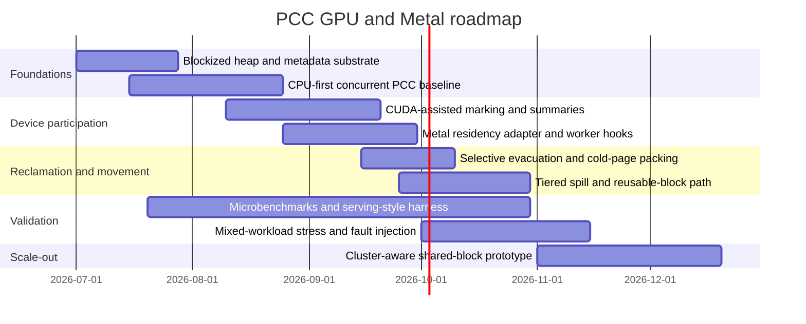

# GPU-Participating Garbage Collection and PCC Directions for vLLM Metal

## Executive summary

Because the referenced “Deep Research” repository URL/name was not provided, I could not anchor the analysis to one exact private code submission. I therefore treated the closest public code trail as the combination of the upstream `vllm-project/vllm` repository, the public `vllm-metal` Apple Silicon plugin, and the recent Mooncake KV-cache work in the vLLM ecosystem. That substitution matters: the public record shows a clear shift during 2025–2026 from “please add Metal/MPS” requests in the main vLLM repo to a hardware-plugin model in which Apple Silicon GPU support lives in `vLLM-Metal`, while KV-cache management expands from local block recycling toward distributed, tiered, cross-instance reuse. citeturn11view4turn11view3turn37view0turn11view0turn28view4turn28view5

The strongest technical pattern since roughly 2022 is that most practical “GPU-participating GC” innovation is no longer classic tracing GC executed wholesale on the GPU. Instead, the field has moved toward managed heaps in unified memory, block/page allocators, virtual-memory decoupling, distributed cache pools, and compression/eviction schemes that reclaim memory without stopping GPU work. In managed runtimes, the clearest post-2022 advance is the 2023 Unified Shared Memory work for MaxineVM, which places the JVM heap in unified memory so the host GC and the accelerator can safely interoperate even when objects move. In LLM serving, the leading line runs from PagedAttention and vLLM, to vAttention, CachedAttention, Jenga, Mooncake Store, and Zipage. citeturn8view2turn9search2turn22view2turn24view1turn38view3turn37view2turn23view1

For a PCC collector targeting GPU and Metal environments, the safest architecture is a **partitioned, mostly non-moving, concurrent collector** with a **CPU-owned control plane** and **GPU-assisted data-plane kernels**. The CPU should keep responsibility for root snapshots, barriers, epoch transitions, and correctness-critical metadata. The GPU should accelerate regular, bandwidth-heavy subproblems such as bitmap scanning, card refinement, object-array tracing, liveness reduction, and optional compaction scoring on stable regions. This matches the lessons of unified-memory managed heaps, vAttention’s contiguous virtual memory design, Jenga’s heterogeneous block abstraction, and Mooncake’s content-addressable KV reuse. citeturn8view2turn22view2turn38view3turn37view2

For Metal specifically, the key implication is that a CUDA-style design should **not** be copied literally. vLLM’s Apple path is a separate hardware plugin built around MLX and Apple unified memory, with “true zero-copy operations” and only experimental paged attention. That makes a CUDA-VMM-first collector a poor fit. The better fit is a collector that treats memory as a **tiered residency problem** inside a unified address space: stable block identities, page/block age tracking, hot/cold partitioning, asynchronous spill/reload, and fallbacks that preserve correctness even when GPU-side participation is disabled. citeturn11view0turn37view0

## Assumptions and the public code trail

I am making two explicit assumptions. First, **PCC** is treated here as the project’s GC algorithm name; where a mnemonic is helpful, I use “partitioned concurrent collector” as the design lens. Second, because the repo name/URL was unspecified, the “since the GitHub Deep Research submission” comparison is necessarily approximate rather than exact. Those assumptions are necessary to avoid pretending a level of repository-specific certainty that the prompt does not provide.

The most relevant public code signals I found are summarized below.

| Date | Public signal | Why it matters |
|---|---|---|
| Jun 2025 | vLLM main repo had an open feature request for Metal support. citeturn11view4 | Shows Apple GPU support was not yet part of the mainline in-tree backends. |
| Aug 2025 | A second vLLM issue asked for Apple MPS support on macOS. citeturn11view3 | Confirms pressure for Apple GPU support persisted into late 2025. |
| Dec 2025 | `vllm-metal` recorded a push titled **“Add MPS attention backend and Metal worker.”** citeturn28view2 | Indicates the plugin was adding Apple-specific execution and attention plumbing rather than waiting for upstream parity. |
| Mar 2026 | `vllm-metal` recorded **“Add paged attention backend for MLA models.”** citeturn28view1 | Shows the Apple path was beginning to adopt the same memory-management abstractions that matter for KV-cache reclamation. |
| Mar 2026 | vLLM opened an RFC for **Mooncake Store Connector for Shared KV Cache Reuse**. citeturn28view4 | Strong signal that local recycling was evolving into distributed, content-addressed reuse. |
| May 2026 | vLLM installation docs list Apple Silicon GPU support **via `vLLM-Metal`**, and say hardware plugins live outside the main repo. citeturn37view0 | Architecturally important: Apple support is plugin-mediated, not just “another CUDA-like backend.” |
| May 2026 | vLLM docs published Mooncake connector and Mooncake store connector usage guides. citeturn37view1turn37view2 | Indicates production-facing support for P2P transfer, CPU/disk offload, and cross-instance prefix reuse. |
| Jun 2026 | vLLM opened a **Mooncake Store enrichment roadmap** tracking tiered storage, scheduler coordination, hybrid attention, and transfer-compute overlap. citeturn28view5 | This roadmap is effectively a next-generation reclamation and reuse plan for GPU-resident KV state. |
| Jun 2026 | `vllm-metal` showed an open PR for **dense encoder varlen attention primitive**. citeturn37view3 | Suggests attention/memory primitives are still actively moving on the Apple path, which raises integration risk for a collector that depends on kernel shape stability. |

The vLLM-Metal docs themselves are especially important. They state that `vllm-metal` runs on Apple Silicon using **MLX as the primary compute backend**, “unifies MLX and PyTorch under a single lowering path,” uses **unified memory** with “true zero-copy operations,” and currently marks **paged attention as experimental**. Those four statements strongly constrain what a PCC implementation should assume about layout, transfer cost, and stability of low-level primitives on Metal. citeturn11view0

## What changed in the technical landscape

The most useful way to read the literature is to separate **managed-runtime GC advances** from **LLM-serving memory-reclamation advances**. The former are closer to a traditional collector; the latter are not “GC” in the language-runtime sense, but they are where GPU-participating memory lifecycle techniques have advanced fastest since 2023.

In managed runtimes, the standout recent result is the **Unified Shared Memory** work from MPLR 2023. The paper argues that current Java-on-GPU frameworks often block the GC while native accelerator code runs, because object movement or reclamation can invalidate device execution. Its solution is to allocate the JVM heap in unified memory so that the runtime becomes aware of pointer movement and GC collections while pages migrate between host and accelerator. The authors report up to **12% worst-case / 2% average slowdown** when acceleration is not used, but up to **9.3× speedup** over a non-UM baseline on integrated GPUs when acceleration is used. That is not a fully GPU-executed collector, but it is a real step forward in host-GC/device interoperability. citeturn8view2

In contrast, direct GPU-offloaded tracing GC has not visibly re-emerged as a mainstream line of 2022–2026 work. The older Berkeley/Jikes RVM work is still useful as a cautionary baseline: GPU offload looked promising for mark-sweep tracing, but practical gains were constrained by memory bandwidth realities and atomic-operation costs. Relative to that earlier result, the modern literature has shifted toward **pointer-stable block/page management**, instead of trying to migrate the entire tracing algorithm onto the GPU. citeturn29search10turn8view2

In LLM serving, **PagedAttention** and vLLM established the now-standard idea of allocating KV-cache memory in blocks so that per-request cache growth does not require giant contiguous reservations. The original vLLM paper reports **2–4× throughput** gains at similar latency over earlier serving systems, driven largely by near-zero waste in KV-cache memory and efficient scheduling. citeturn9search2

The 2025 **vAttention** paper is arguably the clearest “GC-shaped” memory-management advance in this domain. It explicitly criticizes PagedAttention for changing virtual memory layout from contiguous to non-contiguous and for forcing the serving framework to implement its own memory manager. vAttention keeps the KV cache **contiguous in virtual memory** and decouples virtual from physical allocation using **CUDA virtual memory management APIs**. The design also overlaps allocation with compute, opportunistically allocates ahead of time, defers reclamation, and—crucially—adds **64 KB page support** to the open-source CUDA UVM driver to avoid 2 MB large-page fragmentation. The paper reports up to **1.23× end-to-end serving throughput improvement** versus paged variants, with Microsoft’s summary page also highlighting token generation up to **1.97× faster** and prompt processing up to **3.92× / 1.45× faster** than paged FlashAttention / FlashInfer variants in some cases. citeturn22view2turn22view1

Other 2024–2026 papers extend the same pattern in different directions. **CachedAttention** treats inactive session KV state as reclaimable-but-reusable data, moving it across HBM, host memory, and disk with layer-wise preloading, asynchronous saving, scheduler-aware fetch/evict policies, and positional-encoding decoupling to keep caches valid after truncation. The paper reports TTFT reductions up to **88%**, prompt-prefill throughput up to **8.2×**, end-to-end cost reductions up to **56%**, and for long-sequence inference TTFT reductions up to **95%** with prompt-prefill throughput up to **22×**. citeturn24view1

**Jenga** observes that newer LLMs break PagedAttention’s implicit assumptions of fixed-size embeddings and full-prefix dependency. It therefore introduces a **two-level allocator** plus layer-specific caching/eviction hooks for heterogeneous embeddings and dependencies. Implemented on top of vLLM, Jenga reports up to **79.6% higher GPU memory utilization** and up to **4.92× throughput improvement** on H100, without hurting latency on ordinary self-attention-only models. citeturn38view3turn38view0

**Zipage** goes further by capping per-request block occupancy and applying **token-wise KV eviction plus compaction** after decode steps. Its Compressed PagedAttention compresses retained KV entries into a fixed budget, leaving one block reserved for future decoding and releasing the remainder. The reported result is roughly **95% of Full-KV performance** on large-scale reasoning tasks while delivering **over 2.1× speedup**; the public repo also notes that the project is still an offline engine and still lists online serving, chunked prefilling, adaptive budgets, and more model support on its TODO list. citeturn23view1turn23view2

Distributed reuse is now equally important. vLLM’s **MooncakeConnector** uses GPUDirect RDMA for zero-copy KV transfer in prefiller/decoder disaggregation, and the newer **MooncakeStoreConnector** turns that into a **shared KV cache pool** with CPU/disk offload and prefix caching across instances. The vLLM team’s May 2026 Mooncake Store post frames the need clearly: on long agentic traces, local offload alone fails due to local-capacity limits and cross-instance misses. The post reports **94.2% cache hit rate**, **131:1 input-to-output ratio**, and large per-turn context growth on a 610-trace Codex/SWE-bench Pro dataset, then argues for a cluster-wide content-addressed KV pool. citeturn37view1turn37view2turn28view3

Two adjacent systems papers are especially relevant for PCC design. **GMLake** uses low-level GPU virtual memory stitching to reduce fragmentation, reporting average savings of **9.2 GB** GPU memory, up to **25 GB**, and **15% average / 33% peak fragmentation reduction** on A100-class LLM training workloads. **G10** unifies GPU memory, host memory, and flash into one migration-managed space and claims up to **1.75×** improvement over prior GPU-memory solutions, reaching **90.3%** of an ideal unlimited-memory system in simulation. They are not collectors, but they provide concrete evidence that virtual-memory manipulation and smart migration now carry more practical weight than classic moving-GC ideas in GPU systems. citeturn16search0turn16search1

### Comparative table

The table below concentrates on the highest-confidence systems that are directly relevant to PCC design. “Implementation complexity” is my engineering estimate based on the source descriptions.

| Approach | GPU role | Memory model | Pros | Cons | Reported throughput / latency | Implementation complexity | References |
|---|---|---|---|---|---|---|---|
| Unified Shared Memory on managed heaps | GPU sees the same managed heap; GC and accelerator interoperate via UM page migration | JVM heap allocated in unified memory; host GC remains primary | Lets GC move/reclaim objects without forcing “GC locked while GPU runs”; real managed-runtime relevance | Explicit synchronization still required; non-accelerated workloads can slow down | Up to **9.3×** speedup on integrated GPUs; up to **12%** worst-case and **2%** average slowdown without acceleration | High | citeturn8view2 |
| PagedAttention with vLLM | GPU consumes paged KV-cache blocks; CPU scheduler/manager coordinates | Fixed-size pages/blocks; non-contiguous virtual layout at KV level | Near-zero KV waste; became the de facto serving baseline; simple local reclamation model | Attention kernels must understand paging; framework owns custom memory management | vLLM reports **2–4×** throughput gains vs earlier systems | Medium | citeturn9search2turn20view0turn21view2 |
| G10 | GPU participates in demand-driven tensor migration; compiler predicts movement | Unified GPU/host/flash memory-storage space | Transparent scaling beyond HBM; migration scheduled ahead | Simulator-based evaluation; depends on predictability | Up to **1.75×** over prior memory solutions; **90.3%** of ideal unlimited-memory performance | Very high | citeturn16search1 |
| GMLake | GPU uses low-level virtual-memory stitching to reduce fragmentation | Virtual memory stitching over fragmented physical memory | Transparent defragmentation; strong memory savings | CUDA/VM-centric; aimed at training, not general GC | Average **9.2 GB** savings, up to **25 GB**; **15%** average and **33%** peak fragmentation reduction | High | citeturn16search0 |
| CachedAttention | GPU computes with reused KV blocks while CPU orchestrates hierarchical placement | HBM + host memory + disk; asynchronous load/save | Strong multi-turn reuse; explicit overlap of transfer with compute | Workload-sensitive; cross-tier scheduling is complex | TTFT down up to **88%**; prompt-prefill throughput up to **8.2×**; cost down up to **56%**; long-seq TTFT down up to **95%**, throughput up to **22×** | High | citeturn24view1 |
| vAttention | GPU runs unchanged attention kernels; runtime uses CUDA VMM for residency | Contiguous virtual memory, on-demand physical allocation | Removes explicit paging from kernel interface; strong fit for pointer-stable designs | CUDA-specific; needs OS/kernel round-trips; paper modified UVM driver for **64 KB** pages | End-to-end serving throughput up to **1.23×** better than paged variants; Microsoft summary highlights generation up to **1.97×** faster and prompt processing up to **3.92× / 1.45×** faster in some comparisons | Very high | citeturn22view2turn22view1 |
| Jenga | GPU serves heterogenous embeddings; allocator exploits layer-specific policies | Two-level allocator using LCM of embedding sizes; customizable layer-local reuse/eviction | Excellent fit for heterogenous models; practical vLLM integration | More metadata and policy complexity than plain paging | GPU memory utilization up to **79.6%** higher; throughput up to **4.92×** (**1.80×** average) | High | citeturn38view3turn38view0 |
| Mooncake Store in vLLM | GPU HBMs are pooled across nodes via GPUDirect RDMA; background threads move blocks | Shared content-addressed KV-store over DRAM/SSD with cross-instance reuse | Cross-instance prefix reuse; tiered capacity; no SM consumption for transfer path | Distributed metadata, eviction races, and failure handling become first-class issues | vLLM team reports **94.2%** hit rate on Codex/SWE-bench Pro traces; roadmap targets transfer-compute overlap and richer scheduler integration | Very high | citeturn28view3turn37view1turn37view2turn28view5 |
| Zipage | GPU runs compression kernels and compressed decoding path | Compressed PagedAttention with capped per-request block budget | Constant-ish per-request budget; strong concurrency story | Preprint and offline-engine status; roadmap gaps remain | About **95%** of Full-KV performance while delivering **>2.1×** speedup on reasoning workloads | High | citeturn23view1turn23view2 |

## What vLLM and vLLM-Metal imply for PCC

The current public vLLM architecture is already “GC-shaped.” The 2025 anatomy post describes a scheduler with `waiting` and `running` queues, a KV-cache manager, a `free_block_queue`, and a block-based indexing structure that maps tokens to KV-cache blocks. The design is explicit about reuse, touching, freeing, and eviction; the advanced feature docs show a preallocated block pool, doubly linked free queue, O(1) queue movement, cache-block touching, append-only block tables, and LRU-style eviction. That is not a language runtime collector, but it is exactly the kind of memory lifecycle substrate PCC needs to interface with if it targets vLLM-style engines. citeturn20view0turn21view2turn21view3

One especially important detail is vLLM’s **prefix caching** implementation. A new request hashes prompt-token blocks, looks up matching cached blocks, “touches” those blocks to increment reference count and remove them from the free queue, then allocates new blocks as needed. When requests finish, freed blocks go to the tail of the free queue in reverse order so that low-reuse blocks are evicted first. When a cached block reaches the head of the queue, eviction removes its block ID and block hash before reuse. This is close enough to a content-addressed, reference-count-aware page collector that PCC can borrow the same internal vocabulary: **stable block identity, touch on reuse, tail insertion on free, and metadata invalidation at eviction time**. citeturn20view3turn21view2turn21view3

The Apple path changes the engineering constraints more than the abstract goals. vLLM’s installation docs say Apple Silicon GPU support is **via `vLLM-Metal`**, not via a built-in main-repo backend, and the hardware-plugin model explicitly lives outside the main `vllm` repository. The vLLM-Metal docs then define the backend as **MLX-based**, with **unified memory**, **true zero-copy operations**, and only **experimental paged attention**. The implication is that PCC should not assume that CUDA-specific facilities such as VMM, UVM driver patching, CUDA graphs, or warp-level primitives are the portable center of the design. On Metal, the stable contract is higher-level: pluggable workers, unified addressability, MLX/Metal execution, and evolving attention primitives. citeturn37view0turn11view0

The public repository trail reinforces that conclusion. In late 2025 the Apple plugin was still adding an **MPS attention backend and Metal worker**; in early 2026 it was adding **paged attention backend support for MLA models**; in June 2026 an open PR was still introducing a **dense encoder variable-length attention primitive**. That sequence suggests the Apple stack is progressing quickly, but it also means a PCC implementation should attach to the most stable abstractions available—block pools, buffer managers, and explicit worker interfaces—rather than to a narrow set of current kernels. citeturn28view2turn28view1turn37view3

The Mooncake work adds a second implication: reclamation is becoming **cluster-scoped**, not purely process-local. The Mooncake Store RFC and docs extend vLLM from local prefix caching to shared content-addressed KV blocks across multiple instances, with CPU/disk offload and background transfer paths. The June 2026 roadmap then calls out **tiered storage**, **scheduler-level coordination**, **event propagation**, **recompute on get failure**, **hybrid attention support**, and **layer-wise transfer**. In other words, future “GC” for vLLM-like systems is no longer just “pick a local victim block”; it is increasingly “manage object residency, address stability, and recomputation contracts across tiers and nodes.” citeturn28view4turn37view2turn28view5

## Concrete development directions for PCC in GPU and Metal environments

The first design choice I would make is to treat PCC as a **two-plane collector**. The **control plane** stays on the CPU and owns root discovery, SATB or incremental-update barriers, region state transitions, final liveness decisions, and all invariants whose failure would corrupt memory. The **data plane** can run on the GPU and accelerates specific kernels over already-stabilized metadata: scan dirty-card bitmaps, expand mark frontiers over object arrays or homogeneous regions, compact per-region liveness summaries, rank evacuation candidates, and optionally copy or pack pointer-free payload segments. This split follows the practical lesson of recent systems: keep correctness on the host, offload bandwidth-heavy regular work to the device. citeturn8view2turn22view2turn33view0

The heap itself should become **blockized**. I would use fixed-size **regions** subdivided into **pages/blocks** that each carry a compact descriptor: region ID, page ID, object-layout class, pinned/movable bit, liveness bitmap pointer, remembered-set/card summary, last-touch epoch, device residency class, and an optional content hash for reusable immutable pages. This is directly compatible with the way vLLM manages KV blocks and with how Mooncake and prefix caching already reason about stable chunks of reusable state. On Metal, this matters even more because unified memory reduces the value of copying and increases the value of **stable identities plus residency metadata**. citeturn21view2turn21view3turn37view2

For **concurrency**, I would favor a **mostly non-moving collector** by default, with selective evacuation rather than global copying. GPU backends hate surprise pointer movement during long-running kernels; the 2023 Unified Shared Memory paper exists largely because ordinary managed heaps and GPU execution do not interoperate well when the collector may move data behind native execution. Similarly, vAttention’s core insight is to preserve **contiguous virtual memory** and vary physical residency instead. A PCC that routinely moves pages just to compact them will fight that trend. A better compromise is: non-moving old regions, short-lived nursery regions, and evacuation only at safe epochs or for pages that are provably cold/inactive. citeturn8view2turn22view2

For **GPU-side marking**, the practical target should be **regular regions**, not all objects. Good candidates are arrays, flat object vectors, pointer tables, immutable pages, and stable block tables. Poor candidates are arbitrary pointer-rich graphs with many tiny polymorphic objects and complex write-barrier interactions. I would therefore add a layout classifier that routes each page to one of three paths: **GPU-traceable**, **CPU-only**, or **GPU-assisted summary only**. The win is not theoretical elegance; it is avoiding the failure mode already visible in older GPU-GC work, where irregularity and atomics erase parallel advantage. citeturn29search10turn8view2

For **Metal**, the best analog to vAttention is not “port CUDA VMM.” vAttention depends on CUDA VMM APIs and even a modified CUDA unified virtual memory driver to gain 64 KB pages. The Apple path instead gives you unified memory and zero-copy semantics through MLX/Metal. So the right Metal-specific PCC strategy is: keep a single logical address space, annotate pages with residency and temperature, prefer **age-based reclamation and tier transitions** over hard remapping tricks, and expose collector actions as pluggable worker operations. In practice, that means the collector should know how to classify a block as “CPU-hot,” “GPU-hot,” “shared-hot,” or “spillable,” then let backend adapters decide whether the implementation is a CUDA remap, a Metal residency hint, a CPU-side retained buffer, or an SSD-backed spill record. citeturn11view0turn22view2

For **reclamation**, a promising PCC direction is to incorporate a **content-addressed reuse path** for immutable or restartable blocks. In vLLM, prompt-prefix blocks can be hashed and reused locally or via Mooncake Store; in a collector, the analogous opportunity is immutable metadata tables, frozen heaps, deduplicated serialized objects, or cacheable subgraphs whose identity can survive process/task boundaries. This should not replace ordinary GC, but it can reduce both allocation pressure and copy pressure. It also fits the long-term trend in vLLM toward distributed reuse rather than local-only reclamation. citeturn20view3turn28view4turn37view2

For **fallback behavior**, I would build explicit degradations from day one. If GPU marking pressure is high, if a page needs unsupported tracing logic, if Metal attention primitives change, or if a remote-store fetch fails, PCC should fall back to CPU concurrent scan or—in the worst case—a bounded stop-the-world path on just the affected partitions. The Mooncake roadmap’s “recompute on get failure” item is the right mental model here: a collector that cannot complete a fancy path must have a defined recomputation or local fallback path instead of entering an inconsistent state. citeturn28view5

## Prioritized roadmap, experiments, risks, and success criteria

The roadmap below is prioritized around what is most likely to survive backend churn while still producing measurable improvements.

### Recommended roadmap

| Priority | Milestone | Main deliverable | Estimated effort | Main risks |
|---|---|---|---|---|
| Highest | Blockized PCC substrate | Region/page descriptors, free queues, touch/free/evict metadata, per-page layout classes | 3–5 weeks | Metadata bugs; mismatch with current allocator assumptions |
| Highest | CPU-first concurrent PCC baseline | Correct SATB or incremental-update baseline with no GPU dependency | 4–6 weeks | Barrier overhead; regression risk if baseline is not already concurrent |
| High | GPU-assisted marking and summary kernels on CUDA | Bitmaps/cards/array-scan kernels for GPU-traceable pages only | 4–6 weeks | Atomic pressure; weak gains on irregular heaps |
| High | Metal backend adapter | Unified-memory residency classes, page temperature, CPU/GPU handoff hooks | 3–5 weeks | Lack of CUDA-like VM knobs; MLX/Metal API drift |
| Medium | Selective evacuation and packing | Cold-page copy/pack path at safe epochs; no global moving requirement | 3–4 weeks | Pointer-stability corner cases; fragmentation if underused |
| Medium | Tiered spill and reusable-block path | Local CPU/disk offload plus optional content-hash reuse for immutable pages | 4–6 weeks | Consistency and invalidation complexity |
| Medium | Cluster-aware extension | Mooncake-style shared block directory or an equivalent plug-in store | 6–10 weeks | Distributed failures, stale metadata, recompute semantics |
| Ongoing | Benchmarks and regression harness | Correctness stress tests, pause histograms, throughput and residency dashboards | 2–3 weeks to start, then continuous | Hidden heisenbugs under concurrency |

### Suggested experiments and benchmarks

I would validate PCC in three layers, not one.

The first layer is **collector microbenchmarks**: allocation throughput, mark bandwidth, dirty-card refinement rate, page-fault rate, deallocation latency, and pause distributions at P50/P95/P99/P99.9 under synthetic heaps that vary object size, pointer density, and mutation rate. These should be run in three modes: CPU-only baseline, CPU+CUDA assist, and CPU+Metal assist. The reason is simple: the literature repeatedly shows that the value of GPU help depends on how regular the memory access pattern is. citeturn29search10turn8view2turn22view2

The second layer is an **LLM-serving surrogate benchmark**, because that is where the recent state of the art is moving. Reproduce vLLM-like pressure using long prompts, continuous batching, prefix caching, multi-turn reuse, speculative decoding, and heterogeneous models. Measure peak effective capacity, free-block churn, reuse hit rate, recomputation rate, transfer overlap, and throughput under local-only mode versus tiered-offload mode. Jenga, CachedAttention, Mooncake Store, and Zipage all suggest that this benchmark family is where design errors in page granularity, eviction policy, or heterogeneity support show up fastest. citeturn38view3turn24view1turn37view2turn23view1

The third layer is a **mixed-workload stress benchmark**, similar in spirit to SIRIUS: concurrent inference-like and background-maintenance workloads competing for GPU memory. The goal is not to reproduce SIRIUS itself, but to test whether PCC can reclaim or hand over memory fast enough without collapse under bursty demand. In that mode, measure handover latency, stall time, rollback/fallback frequency, and the degree to which background collection steals useful GPU cycles from foreground kernels. SIRIUS is valuable here because it quantifies the cost of naive handover and shows that safe, explicit reclamation policy matters. citeturn33view0

### Measurable success criteria

These are the targets I would use for a first serious PCC iteration:

| Dimension | Initial success target |
|---|---|
| Correctness | Zero lost-object / double-free / stale-pointer failures in stress runs of at least 10^9 allocations and repeated fault-injection scenarios |
| Pause behavior | P99 pause time at least **20–30% lower** than the current PCC baseline on long-lived heaps; no pathological P99.9 regressions |
| Throughput | Net application throughput non-regressive on CPU-only mode; **5–15% gain** on CUDA-assisted mode for regular heaps; near-parity on Metal-assisted mode initially |
| Capacity | Effective memory capacity gain of **15%+** under tiered/offloaded workloads without correctness regressions |
| GPU interference | Foreground kernel throughput drop under device-assisted GC below **5–10%** on serving-style workloads |
| Portability | Same logical collector state machine and page metadata model works across CPU-only, CUDA, and Metal adapters |
| Operability | Reproducible telemetry for page age, hotness, residency, spill volume, mark queue depth, fallback counts, and reclaim latency |

### Timeline

## Open questions and limitations

The biggest limitation is repository specificity. Because the “Deep Research” repo itself was not identified, I could not compute a true “before vs. after your exact submission” delta. The code-trail section therefore uses the public vLLM / vLLM-Metal / Mooncake ecosystem as the closest observable proxy.

A second limitation is semantic ambiguity around **PCC**. I treated it as the project’s collector and used a partitioned-concurrent design lens, but I cannot guarantee that this matches the acronym’s internal meaning.

A third limitation is that the recent literature is asymmetric. There is solid evidence for **GPU-participating memory management** in unified-memory managed heaps and in LLM-serving allocators, but there is much less visible 2022–2026 evidence for a brand-new widely adopted **fully GPU-executed tracing garbage collector**. That is why this report emphasizes the design lesson that seems to dominate the recent record: make object identity stable, move residency and reuse policy into explicit metadata, and offload only the regular data-parallel parts of collection. citeturn8view2turn22view2turn38view3turn37view2