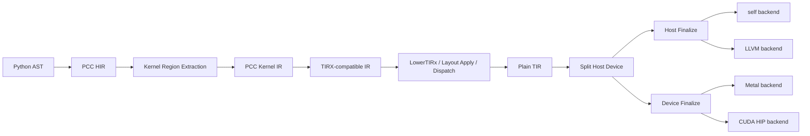

# PCC 引入 TIRX 与内化 TileLang 的深度研究报告

## 执行摘要

本报告的核心判断是：**PCC 不宜直接“整包吸收” TVM/TIRx 与 TileLang，而应采用“PCC 保留语言与运行时主权、TIRx 作为设备核 lowering 中层、TileLang 先做语义兼容层再逐步原生化”的路线**。原因有三点。其一，TIRx 公开文档显示其强项在于把 tile primitive、`TileLayout` 和 execution-scope 标识降低为普通 TIR，再做 host/device 拆分与 ABI 处理；这一段非常适合作为 PCC 的 device-kernel lowering 中层，但其文档化的最终设备侧 handoff 当前仍以 CUDA 为主，不宜原封不动直接成为 PCC 的总后端。其二，TileLang 已经高度建立在 TVM/TIRx、TVM FFI、DLPack 以及大量目标相关 pass 之上，且公开流水线中混合了 target-neutral 与显著 NVIDIA 定制的 pass；这意味着“全量内化”为 PCC 原生能力的成本很高，且对 Metal 首发并不友好。其三，PCC 还必须满足“五后端语义一致性”的硬约束，因此最安全的方案是只把**显式标注的 kernel 子语言**送入 TIRx-like lowering，而把 Python 对象语义、GC/HMM、host ABI 与资源生命周期继续保留在 PCC 控制面。基于这些事实，本报告推荐的架构是：**AST → PCC HIR → PCC Kernel IR → TIRx-compatible IR → Plain TIR → host/device split → host self/LLVM finalize + device Metal/LLVM/CUDA finalize**；TileLang 则先以“PCC Tile 前端兼容层”的方式接入，优先覆盖 `T.Kernel`、`T.Tensor`、`T.alloc_shared`、`T.alloc_fragment`、`T.copy`、`T.Pipelined`、`T.Parallel`、`T.gemm` 这组高价值构造，再视 Metal 路径成熟度决定是否继续深度原生化。citeturn4view0turn22view0turn16view0turn16view2turn9view0turn10view0turn16view4turn16view5turn22view2

## 2026-07-05 LLVM Infrastructure Reference Impact

The LLVM infrastructure article's relevant points for this route are now
internalized as design constraints: reusable library architecture, explicit
separation of concerns, language- and hardware-independent IR, flexible pass
pipeline, transparent runtime model, and derivative impact on MLIR/AI
compilers. The local source references used to turn those points into pcc tasks
are:

- `~/pcc_refs/llvm-project-20.1.8-full-depth1`
- `~/pcc_refs/apache-tvm-full-depth1`
- `~/tilelang` (`/Users/jiamo/tilelang`)
- `/Users/jiamo/tilelang/3rdparty/tvm`

The concrete impact on the GPU/TIRx/Metal task is five design constraints:

1. **Stabilize the IR before expanding targets.** GPU support must not mean
   whole-program GPU or whole-TVLM ownership. PCC should own Kernel IR and the
   TIRx/plain-TIR freeze first; Metal/CUDA/HIP are target finalizers after that
   boundary.
2. **Use a TargetMachine-style capability split.** Host `self`/`llvm`/`c` and
   device `metal` are separate finalize directions. Target-specific lowering
   must not leak into the target-neutral semantic front half.
3. **Make DataLayout/address spaces explicit.** `global`, `threadgroup`,
   `local`, and `fragment` must be IR-visible address spaces. Threadgroup
   scratch and fragment accumulators must not masquerade as host launch
   parameters.
4. **Prefer verifier/pass boundaries over silent fallback.** Host-object
   escapes, unknown symbols, CUDA-only attributes, and unimplemented
   fragment/GEMM Metal source lowering must fail fast instead of degrading into
   a different semantic path.
5. **Layer artifact claims.** `.metal` source, `.air/.metallib`, CPU host launch
   boundary, and runtime GPU launch are different evidence layers. The task
   board must label them separately instead of turning a source artifact into
   an executed-GPU claim.

This determines the current P0 order: close the TIR/TileLang
alloc/local/address-space loop into PCC `LocalBuffer`, TIR-style
`alloc_buffers`, and Metal threadgroup declarations first; then broaden through
bounded threadgroup reduction, GEMM/fragment lowering, real host launch,
TFLOPS, and whole-program package claims in that order.

## 目标与约束

这项工作的目标不是简单地“把 TVM 或 TileLang 嵌进去”，而是在**不破坏 PCC 五后端语义一致性**的前提下，引入一种更系统的 kernel lowering 与 backend 组织方式。依据 TIRx 官方资料，`tvm.compile(..., tir_pipeline="tirx")` 的职责是把高层 TIRx 模块经过一串有序 passes，先 lower 成 plain TIR，再拆成 host 和 device 函数，并分别做 finalization；TileLang 则把“tile program → IRModule → target-specific source → hardware executable/runtime”作为完整编译流，这两者都明显采用了“前端表达 / 中间 lowering / 后端 finalize”分层架构。citeturn3view0turn16view0

如果把这一思路引入 PCC，真正需要守住的约束有四条。第一，**PCC 的 host 语义必须仍由 PCC 掌控**。这意味着只能把显式声明为 kernel 的受限子语言送入 TIRx-like lowering，不能把普通 Python 对象图、异常流、弱引用、终结器、GC 屏障等直接推给外部 IR。第二，**后端必须是可插拔 TargetMachine 式，而不是“把某个 codegen 硬编码进 lowering”**。LLVM 的官方 backend 文档把 `TargetMachine`、calling convention、instruction selection、assembly printer、subtarget 支持等组织为一套分层能力表，这正是 PCC 需要借鉴的组织方法，而不是必须照抄 LLVM 的整套实现。citeturn21view0

第三，**TileLang 不能被简单视为“语法糖”**。公开资料显示 TileLang 既有高层 tile library，也有 thread-level primitive；它的语言面向 kernels，支持 `@T.prim_func`、`T.Kernel`、`T.Tensor`/`T.Buffer`、`T.alloc_shared`、`T.alloc_fragment`、`T.Parallel`、`T.Pipelined`、`T.copy`、`T.gemm` 等构造，并将其 lowering 到 TVM/TIRx/target-specific codegen。换句话说，若要把 TileLang“内化”为 PCC 原生支持，工作重心不是 parser，而是**语义映射、IR 边界、runtime ABI 和 target capability**。citeturn16view2turn24view0turn24view1turn24view2turn9view3turn9view4

第四，**未指定项必须明确标注**。本次公开检索能够核验 TVM/TIRx、TileLang、Metal 文档与 vLLM/PagedAttention 资料；但 PCC 当前内部源码结构、既有 self backend 实现边界、当前 GPU pipeline 入口名、现有 HMM handle 布局、以及是否允许把 TVM/TileLang 以 vendored 方式引入构建系统，均属于“未指定 / 仓库未覆盖”的范围。本报告凡涉及这些点，均以“建议方案”而非“已实现事实”表述。

## 技术分析

### TIRX 降低阶段与 PCC lowering 的对应关系

TIRx 的 lowering pipeline 已经把“规范化的 device-kernel lowering”拆得非常清楚：先 `LowerTIRx`，再做 `UnifyThreadBinding`、`StmtSimplify`、`LowerTIRxOpaque`、`FlattenBuffer`、bfloat16/float8 合法化、`NarrowDataType(32)`、`VectorizeLoop`、`UnrollLoop`、再次 `StmtSimplify`、`CommonSubexprElim`、`VerifyMemory`、`AnnotateEntryFunc`、`SplitHostDevice`、`MakePackedAPI`，最后对 host 与 device 分别 finalization。更关键的是，`LowerTIRx` 本身等于 `TilePrimitiveDispatch + LowerTIRxCleanup`：前者负责把 `TilePrimitiveCall` 选变体并展开成原生 IR，后者通过 `LayoutApplier` 解析 `TileLayout`、把 buffer access 变成具体地址计算、并把 execution-scope id 降成线程轴；在这一步之后，模块已经是 plain TIR。citeturn4view0turn8view0turn8view1turn8view2turn8view3

这对 PCC 非常重要，因为它意味着 PCC 并不需要在第一阶段就“吞下 TVM 全部后端”，而可以只拿走最有价值的一段：**Tile-like kernel 语义 → plain TIR**。TIRx 官方页甚至把 lowering 结果明确画成“authored TIRx → tirx pipeline → host func / device func → host finalize / device finalize”，并说明设备侧当前交给 CUDA code generator。对 PCC 而言，这既是机会，也是边界：机会在于 plain TIR 是很好的后端无关中间层；边界在于如果 PCC 要做 Metal 或 self backend，就不能直接把 TIRx 的“device finalize → CUDA”当成终态，而应在 **plain TIR 之后接入 PCC 自己的 device finalization**。citeturn3view0turn4view0

基于此，TIRx 与 PCC 的建议对应关系如下。

| TIRX 阶段 | 在 TIRX 中的职责 | PCC 建议对应层 | 结论 |
|---|---|---|---|
| BindTarget | 绑定 target/host 信息 | `PccTargetMachine` / `PccTargetCaps` | 必需保留；是 self/LLVM/Metal 共用入口。citeturn3view0turn21view0 |
| TilePrimitiveDispatch | 根据 scope、layout、target、hint 选 lowering 变体 | `PccTileDispatch` | 这是最值得复用的思想，应成为 PCC tile 后端分发中心。citeturn22view0turn4view0 |
| LowerTIRxCleanup | 解析 `TileLayout`、扁平化地址、lower scope id | `PccLayoutApply` + `PccThreadBindingLower` | 适合作为 PCC 内核 lowering 的“语义冻结点”。citeturn4view0turn17search3turn22view1 |
| Simplify / Narrow / Vectorize / Unroll / CSE | 常规中后端规范化与优化 | `PccKernelOptimize` | 应保留，但要能力表驱动，而不是默认全部打开。citeturn4view0 |
| VerifyMemory | 防止 host 直接解引用 device memory | `PccVerifyKernelABI` | 对 PCC 尤其关键，因为 host 仍由 GC/HMM 控制。citeturn4view0 |
| SplitHostDevice | 在 `launch_thread` 边界拆 launcher 与 kernel | `PccSplitHostDevice` | 应成为 PCC 引入 self/LLVM backend 的主铰链。citeturn4view0 |
| MakePackedAPI | 重写 host 函数为 packed ABI | `PccMakePackedAPI` / `PccMakeCABI` | 建议同时支持 PCC packed ABI 与 C ABI。citeturn4view0turn16view5 |
| Host / Device Finalize | host 走 builtin/intrin lowering，device 走目标 codegen | `PccHostFinalize` + `PccDeviceFinalize` | host 侧可接 self/LLVM；device 侧需独立支持 Metal，不能只依赖 CUDA finalize。citeturn4view0turn22view2 |

### 需要新增或替换的编译阶段

如果 PCC 采用上述映射，建议新增五个阶段，而不是用一个“大总管 pass”直接把 TileLang 或 TIRx 整体塞进来。

首先要新增 **PCC Kernel IR**。这是一个比 PCC 普通 HIR 更窄的子集，只容纳 kernel 可见的标量、buffer view、layout、thread/block 绑定、memory scope、copy/gemm/reduction/fence 等。其目标不是复刻 TVM，而是为 PCC 提供**一个可静态约束、可跨后端降低、并能与 GC/HMM 清晰隔离**的设备 IR 边界。之所以需要这层，是因为 TileLang 与 TIRx 的公开资料都表明，它们把 kernel 世界与一般 host 语言严格分离：TileLang kernels 来自 `@T.prim_func`，而 TIRx 则把 tile primitive 和 `TileLayout` 降至 plain TIR 后再进入 target-specific codegen。citeturn16view2turn4view0turn22view0

其次要新增 **PCC TIRX Adapter**。它可以有两种实现方式：一是直接生成 TIRx/TIR script；二是直接构造与 plain TIR 等价的内部 IR。短期更推荐第一种，因为 TIRx 已经帮你定义了 tile primitive 调度、layout 附着与 host/device split 之前的 canonical path。中长期再决定是否继续“去 TVM 化”。这一路线的工程优势在于，**TIRx 最有价值的部分是语义归一，而不是最终 codegen**。citeturn4view0turn22view0turn22view1

再次要新增 **PCC Host/Device Split**，并把它变成 backend 组织的根分界线。TileLang 的 `lower_to_host_device_ir`、`host_codegen(host_mod, target_host, target=None)` 与 TIRx 的 `SplitHostDevice`/`MakePackedAPI` 已经说明，这种拆分能把 host ABI、runtime checks、device launch 与 device module codegen 清晰隔离。对于 PCC，这一步更重要，因为 host 侧还承担 GC、HMM、buffer handle、fence token 与对象生命周期。citeturn16view4turn4view0turn16view5

还要替换 PCC 现有“后端选择”的组织方式为 **TargetMachine 式 backend registry**。LLVM 官方文档把 backend 工作拆成 `TargetMachine`、register info、instruction info、calling convention、assembly printer、subtarget 等部分；PCC 没必要照抄 LLVM 的类层次，但应该吸收这种**能力表 + 可插拔 finalize pipeline**的模式。这样做后，self backend、LLVM backend、Metal backend 才能共享同一 kernel lowering 前半段，只在后半段分歧。citeturn21view0

最后，建议显式加入 **PccVerifySemanticParity** 阶段。其作用不是做优化，而是在 host stub 与 launcher 生成前验证：kernel 参数是否只包含 POD scalar、tensor/buffer handle、layout metadata；是否混入了需要五后端协调的动态 Python 对象引用；是否存在逃逸到 GPU 的 GC-managed pointer。这个阶段没有现成 TVM/TileLang 等价物，但它是 PCC 比 TVM 更需要的保护层。

### IR 互操作与推荐 lowering 流程

推荐的互操作主线不是“AST 直接到 TIRx”，而是“**AST 到 PCC HIR，kernel 子图抽取到 PCC Kernel IR，再到 TIRx-compatible IR**”。这样做有两个好处。第一，PCC 仍保有语言级限制、类型检查、异常和 GC 一致性。第二，TileLang 兼容层和将来的 PCC 原生 tile DSL 可以共用同一 Kernel IR，不必把 TileLang parser 绑死为唯一入口。TileLang 自身文档就把其编译流描述为 tile program 经 tile library 与 thread primitives enrich 后降低到 IRModule，再生成 C/CUDA/HIP/LLVM 等目标代码；这说明“建立一个稳定的 kernel IR 中层”是它成功的前提之一。citeturn16view0turn22view2

建议的降低链如下：



在这条链中，**Plain TIR 是最关键的“中间冻结面”**。因为 TIRx 文档明确指出，在 `LowerTIRx` 之后，tile primitive、`TileLayout` 与 scope-id 都已消失，模块成为 plain TIR；此时继续走 `VectorizeLoop`、`UnrollLoop`、`VerifyMemory`、`SplitHostDevice` 等，就进入了更传统的中后端世界。对 PCC 来说，这正好把“tile 语义处理”与“backend 工程化”隔开。citeturn4view0

### 类型、内存与调用约定映射

类型映射方面，TileLang kernels 是 TIR 函数，参数通过 `T.Tensor` 或 `T.Buffer` 注解形状与 dtype；其 dtype 既可以用字符串，也可以用 TileLang dtype 对象，系统会做规范化。TIRx 则允许 buffer 携带 `TileLayout`；layout 不是装饰，而是影响后续 primitive dispatch 与地址生成的核心一等公民。PCC 若要兼容这套语义，建议把类型系统分成三层：**host object type、kernel scalar type、buffer/layout type**。也就是说，`PyTensorObject` 与 `PccBufferView<float16, shared>` 不能用同一种类型语言；后者必须是 kernel IR 内的静态类型。citeturn16view2turn22view1

内存模型方面，TileLang 的公开文档已经把主要 scope 摆出来了：global、shared、fragment/local/scalar，API 则包括 `alloc_shared`、`alloc_local`、`alloc_fragment`、`alloc_global`、`alloc_barrier`、`alloc_tmem` 等。其 `T.copy` 表面语义是同步的，但实际 lowering 可根据 target 变成普通 copy、`cp.async`、TMA 等不同机制；如果使用 `T.async_copy`，则是显式异步语义，要求手动等待或由后续同步 pass 注入 barrier。对于 PCC 而言，这说明**memory scope 与 synchronization 语义必须写入 Kernel IR，而不能到 codegen 才临时猜测**。citeturn11search6turn24view1turn16view3turn22view0

调用约定方面，TIRx 的 `MakePackedAPI` 与 TileLang 的 host-side checks 提供了非常实用的现实样板。TileLang 明确说明 host stub 基于 TVM FFI + DLPack，自动检查参数个数、pointer kind、dtype、shape、stride、device 等，目的是在保持 ABI 稳定的同时降低 Python 侧开销；其 `host_codegen` 还区分 `target_host` 为 `llvm` 或 `c`，并且在 device target 为 Metal 时插入 Metal/MPS 同步逻辑。对 PCC 来说，最合理的方案不是把 TVM FFI 照搬，而是定义一种**PCC Packed ABI**，其参数集与 DLPack/POD scalar/handle packet 对齐，从而让 self backend 与 LLVM backend 共享 launcher 接口。citeturn16view4turn16view5

### 优化通道、代码生成目标与构建影响

优化通道方面，TIRx 的公开 pipeline 包含 `VectorizeLoop`、`UnrollLoop`、`CommonSubexprElim`、dtype legalize 与 simplification，但文档列出的模块级 pass 中没有一个独立的“通用 fusion pass”；这意味着如果 PCC 想做算子融合、kernel fusion 或 request-specific fusion，更合理的位置仍在 **PCC HIR / Kernel IR 早期**，而不是指望 TIRx 中后段替你处理。TileLang 也类似：其 `LowerAndLegalize` 与 `OptimizeForTarget` 里强调的是 layout inference、pipeline planning、buffer allocation placement、shared allocation merge、vectorize、storage rewrite、loop unswitching、unroll、thread sync、launch lowering，而不是通用 host-graph fusion。citeturn4view0turn9view0turn9view1turn10view0

代码生成目标方面，TileLang 公开支持 `cuda`、`hip`、`metal`、`llvm`、`webgpu`、`c` 以及 `cutedsl`，并已公开宣布支持 Apple Metal device；但从其 lowering pipeline 看，存在大量显著的 NVIDIA/CUDA 特定 pass，如 `LowerBlackwell2SM`、`tilelang.cuda.transform.LowerL2Persistent`、`LowerHopperIntrin`、`PersistThreadblock`、`InjectTcgen05Fence` 等。这说明 TileLang 的“目标支持”与“前端语义支持”并不是同一件事：若 PCC 要把 TileLang 内化为原生前端，必须先把**target-neutral 的 tile/kernel 语义**与**CUDA-specific target refinement**切开。否则，Metal 路线很容易被 CUDA-specific pass 污染。citeturn22view2turn6view1turn9view1turn10view0

构建和工具链影响也不能低估。TileLang 的 `pyproject.toml` 显示它依赖 `apache-tvm-ffi`、`torch`、`z3-solver`，在 source/wheel 中打包 vendored TVM 源码、CUTLASS、Composable Kernel、HIP headers，并在不同平台上为 NVCC、NVRTC、Windows Ninja、macOS 额外依赖做适配。与此同时，Metal 官方工具链文档说明命令行工作流通常是 `.metal → .air → .metallib`；Metal libraries 默认先编译到 Metal IR，再生成可加载库。把这些全部无选择地引入 PCC，会明显增加构建复杂度、许可证审查、CI 体量和跨平台负担。citeturn6view0turn23search11turn23search9

基于以上分析，本报告建议：**PCC 的第一阶段只引入 TIRx lowering 语义与 TileLang 语义子集，不引入 TileLang 的完整打包/runtime/toolchain 生态**。也就是说，先学它的 lowering 组织和 kernel 语义，再谨慎决定哪些第三方依赖必须落到主仓。

## TileLang 内化方案

TileLang 的语言表面十分适合作为 PCC 的 kernel DSL 借鉴对象。公开文档表明，它把 kernel 定义为 `@T.prim_func` 产生的 TIR 函数；`with T.Kernel(...)` 建立 grid/thread 绑定；`T.Tensor`/`T.Buffer` 描述参数；`T.alloc_shared`、`T.alloc_fragment` 等表达 memory scope；`T.Parallel`、`T.Pipelined` 表达并行与软件流水；`T.copy`、`T.async_copy`、`T.gemm`、`T.clear` 作为 tile-level 算子；并可对不同 target 做代码生成。其设计目标是让人“在保留足够架构提示的同时，避免直接写原生 CUDA/HIP”。citeturn16view2turn24view0turn24view1turn24view2turn16view3turn16view0

但“内化”为 PCC 原生支持，并不意味着应直接拷贝 TileLang API 命名。更重要的是决定：**PCC 是把 TileLang 当作前端兼容层，还是当作独立中间层**。本报告的建议是：

- 短期把 TileLang 视为**前端兼容层**。也就是允许一部分 TileLang 风格语法直接映射到 PCC Kernel IR，但不以 TileLang runtime 为执行中枢。
- 中期把高价值语义沉淀为 **PCC 原生 Tile API**，让“TileLang 风格”成为 PCC 的一种表面语法，而不是实际依赖的外部运行时。
- 长期再决定是否保留一个“严格 TileLang compatibility mode”，面向代码迁移与生态互通。

这样做的原因很现实：TileLang 的公开流水线显示其底层与 TVM/TIRx 耦合很深，且 runtime、FFI、pass 生态很重；如果 PCC 一开始就把它当独立中间层，反而会在语言、运行时、打包三层被外部栈牵着走。citeturn9view0turn10view0turn16view4turn6view0

### TileLang 到 PCC 的关键语义映射表

下表给出一个建议性的“TileLang construct → PCC construct”对照。表中的 PCC construct 为建议命名，不代表现有实现已存在。

| TileLang construct | PCC construct | 备注 |
|---|---|---|
| `@T.prim_func` | `@pcc.kernel_func` 或 `PccKernelModule.func` | 只进入受限 kernel 子语言，不承载一般 Python/GC 语义。TileLang 将 kernel 明确建模为 TIR 函数。citeturn16view2 |
| `with T.Kernel(grid..., threads=...)` | `with pcc.launch(grid=..., block=...)` | 建立 block/thread 绑定，建议 lowering 到 `launch_thread` 等价表示。citeturn24view0 |
| `T.Tensor` / `T.Buffer` | `PccTensorView` / `PccBufferView` | 应与 host object type 分离，作为 Kernel IR 静态参数类型。citeturn16view2turn16view5 |
| `T.alloc_shared` | `pcc.alloc(scope="shared")` | 映射到 block-visible scratchpad。citeturn24view1turn11search6 |
| `T.alloc_fragment` | `pcc.alloc(scope="fragment")` | 映射到 per-thread fragment/register tile。citeturn24view1turn11search6 |
| `T.alloc_local` | `pcc.alloc(scope="local")` | thread-private storage。citeturn11search6 |
| `T.alloc_global` | `pcc.alloc(scope="global")` | workspace；建议受 target capability 限制。citeturn15search11 |
| `T.Parallel(...)` | `pcc.parallel(...)` | 适合映射为 structured parallel loop。citeturn24view2turn24view3 |
| `T.Pipelined(..., num_stages=N)` | `pcc.pipeline(stages=N)` | 映射为 software pipeline annotation，而非立即绑定某种 ISA。citeturn24view2turn16view1 |
| `T.copy(src, dst)` | `pcc.tile.copy(src, dst)` | 语义应保持“表面同步”，具体 lowering 由 target 决定。citeturn24view1turn16view3turn22view0 |
| `T.async_copy(src, dst)` | `pcc.tile.copy_async(src, dst)` | 必须伴随显式 wait/fence 模型；不能 silently fallback。citeturn16view3 |
| `T.gemm(A, B, C)` | `pcc.tile.gemm(A, B, C)` | 建议采用 tile primitive dispatch 模式，而不是直接把 ISA 名暴露给用户。citeturn16view1turn22view0 |
| `T.clear(buf)` | `pcc.tile.fill(buf, 0)` | 可统一进 fill/zero primitive。citeturn22view0 |
| `T.print(...)` | `pcc.debug.print(...)` | 建议仅在 debug lowering 保留。citeturn24view0 |

### 适合先原生化的子集

就工程收益而言，最值得先原生化的不是全量 API，而是下面这个最小高价值子集：

```text
kernel / tensor / buffer / shared / fragment / local
parallel / serial / unroll / pipelined
copy / copy_async / fill / gemm / reduce
layout annotation / launch binding / barrier / fence
```

原因是这组语义恰好覆盖了 TIRx 最看重的三类信息：**tile primitive、`TileLayout`、execution scope**；同时也覆盖了 TileLang 在其 Level 2/Level 3 编程模型里最核心的编排能力。反过来说，像 CuTeDSL backend、Blackwell 专属 tcgen05、Hopper TMA 深定制、某些 target-only intrinsic，并不适合在 PCC 初期原生化为稳定语言面。citeturn22view0turn22view1turn16view1turn9view1turn10view0

## 运行时与 GC 交互

把 TIRx lowering 和 TileLang 语义接入 PCC 后，最大的风险不在 parser，也不在 loop optimization，而在**运行时对象、buffer handle、command queue 和 GC/HMM 生命周期协同**。这是因为 TileLang 与 TVM 的典型执行模式本质上是“host launcher + packed ABI + device module”，而 PCC 除此之外还必须维护自己的对象语义与五后端一致性。TileLang 明确说明 host 侧会自动做参数检查，入口基于 TVM FFI + DLPack；Metal 文档则说明 command queue 是长生命周期对象、command buffer 是单次使用的瞬态对象，完成后通常通过 completed handler 或 `waitUntilCompleted` 才能确认 GPU 已结束执行。citeturn16view5turn16view4turn18view2turn14search6turn14search14

因此，PCC 集成后的运行时边界应当是：

- **GC 管 Python 对象与 launcher stub 的生死。**
- **HMM 管 buffer handle、device allocation、fence token、KV block 与 queue 资源。**
- **kernel IR 只看 handle 与 metadata，不看 `PyObject*`。**

这个边界必须是硬性的。Metal 官方资料指出 `MTLBuffer` 只能与创建它的 `MTLDevice` 配合使用；command queue 接收按顺序执行的 command buffer；command buffer 提交后只剩等待、状态查询、completed handler 等少数合法操作；使用 unretained references 时，若对象在执行完成前没有别的引用，结果将变得未定义。把这些约束映射到 PCC，就能得到一条很清楚的设计原则：**任何传入 device frontier 的对象都必须先转成稳定 handle，而不是把 host 对象的生命周期直接暴露给 GPU 执行流**。citeturn0search15turn18view2

这条原则在 vLLM/PagedAttention 场景里更重要。PagedAttention 论文与 vLLM 文档都强调，KV cache 被拆成 block，按需存放在非连续物理内存中，以减少碎片并支持共享；prefix caching 则进一步按 block 复用历史前缀。也就是说，一旦 PCC 未来把 TIRx/TileLang 路线用于 vLLM Metal kernel，GC 已经不是简单管理“tensor wrapper”的问题，而是要和 **KV block manager、buffer pool、command completion、eviction/offload** 协同。citeturn20search0turn20search3turn20search2turn20search4turn20search5

### 关键接口与数据结构对照表

下表给出建议新增的 PCC 关键接口与数据结构。它们是设计建议，不代表现有实现已经存在。

| 建议接口或结构 | 作用 | 为什么需要它 |
|---|---|---|
| `PccTargetMachine` | 描述 target kind、host/device finalize、capability 集 | 借鉴 LLVM 的 TargetMachine 思路，把后端从 lowering 中解耦。citeturn21view0 |
| `PccKernelIRModule` | PCC 的 kernel-only IR 容器 | 作为 AST/HIR 与 TIRx/plain TIR 之间的稳定边界。citeturn16view0turn4view0 |
| `PccTileDispatch` | 按 primitive/layout/scope/target 选 lowering 变体 | 对齐 TIRx `TilePrimitiveDispatch` 的成功经验。citeturn22view0turn4view0 |
| `PccPackedArgs` | launcher ABI 的参数封包 | 对齐 MakePackedAPI 与 DLPack-style host ABI。citeturn4view0turn16view5 |
| `PccBufferHandle` | 指向 device/host buffer 的稳定句柄 | 避免把 GC-managed 对象地址直接下沉到 kernel。citeturn18view2turn0search15 |
| `PccFenceToken` | 表示一个 in-flight command buffer 或 batch 完成点 | 用于 fence-aware free 与 deferred release。citeturn18view2turn14search6turn14search14 |
| `PccDeferredFreeQueue` | 等待 GPU 完成后再回收资源 | 命令完成前不能释放底层 buffer/library/pipeline 相关资源。citeturn18view2 |
| `PccKvBlockHandle` | vLLM 风格 KV cache block 句柄 | 与 block-level cache 共享、驱逐、offload 结合。citeturn20search0turn20search2turn20search5 |

### 如何保证五后端生产平等

在这条集成路线下，最容易被破坏的就是“看起来只是把 kernel lowering 做高级一点”，实际却让运行时语义发生漂移。为避免这一点，本报告建议将“五后端生产平等”落成三条检查规则：

其一，**任何 backend 都只能消费统一的 launcher ABI 与 handle 语义**。不允许 LLVM backend 直接吃 host 指针，而 self backend / Metal backend 走 handle packet；否则测试很快会分裂成两套。TileLang 强调 host stub 的 ABI 稳定与 host-side validation，本质上也是在做这件事。citeturn16view5

其二，**任何 backend 都只接收 kernel-legal types**。也就是 scalar、buffer handle、layout metadata、launch config、opaque runtime token；而 Python list/dict/object、weakref、终结器对象、GC-visible frame 指针都必须在 host 边界前截断。

其三，**kernel launch 与资源释放必须以 fence 为因果边界**。Metal 文档已经明确 completed handler 与 `waitUntilCompleted` 的完成语义；因此 PCC HMM/GC 必须以 `PccFenceToken` 为准，而不能以 Python wrapper 被回收的时刻为准。citeturn18view2turn14search6turn14search14

## 工程路线与兼容性

### 分阶段工程路线

下表给出建议的 P0 到 P4 路线。复杂度是整体工程复杂度，而不是单人工作量。

| 阶段 | 目标 | 主要改动 | 交付物 | 测试矩阵 | 风险与缓解 | 复杂度 |
|---|---|---|---|---|---|---|
| P0 | 建立 backend 抽象与 kernel 边界 | 定义 `PccTargetMachine`、`PccKernelIR`、`PccSplitHostDevice`、`PccPackedArgs` | 设计文档、IR dump、最小 host/device split 原型 | 单 kernel、纯 CPU、纯 self backend | 风险：边界定义过宽；缓解：先只允许 POD scalar + buffer handle | 中 |
| P1 | 接入 TIRx-like lowering 中层 | 实现 `PccTileDispatch`、layout attach、scope lowering、TIRx adapter | `copy`/`fill`/`gemm`/`parallel`/`pipeline` 的 lowering 原型 | CUDA/LLVM mock；IR golden tests | 风险：过度依赖 CUDA-specific assumptions；缓解：冻结在 plain TIR 前的 target-neutral 阶段 | 高 |
| P2 | 引入 self/LLVM backend 模式 | host finalize、LLVM finalize、C ABI / packed ABI、launcher 生成 | `self` 和 `llvm` 两种 host backend 可运行 | host ABI、DLPack/torch tensor、plain C source 输出 | 风险：ABI 漂移；缓解：以统一 packed ABI 和 golden host source 约束 | 中 |
| P3 | TileLang 兼容层最小子集 | parser/adapter 支持 `T.Kernel`、`T.Tensor`、`alloc_shared`、`Pipelined`、`copy`、`gemm` | TileLang 子集样例迁移、语义映射测试 | 向量加、GEMM、reduction、shared-memory staging | 风险：API 面膨胀；缓解：只宣告兼容子集，不承诺全量 TileLang | 高 |
| P4 | Metal 路径、HMM/GC 协同与 vLLM 准备 | Metal device finalize、metallib pipeline、fence-aware free、KV block handle | Metal kernel launch、资源生命周期测试、KV block 实验接口 | Metal + LLVM host、指令失败恢复、prefix cache block 生命周期 | 风险：异步资源释放 bug；缓解：引入 fence token、deferred free queue、stress CI | 高 |

这条路线的顺序并不是任意的。之所以把 TileLang 兼容层放在 P3，而不是 P0/P1，是因为 TileLang 的公开代码和文档显示它不仅是语法前端，还自带成熟的 lowering pipeline、runtime checks 和目标相关 pass。如果在 PCC 还未定义好 backend 抽象、packed ABI 和 host/device split 之前就强行“内化” TileLang，极有可能先把外部系统的不透明复杂度引进来，却没有自己的控制点。citeturn9view0turn10view0turn16view4turn16view5turn6view0

### 兼容性与回退策略

逐步启用时，最安全的方式是 **feature flag + per-function opt-in**。也就是说，TIRx-like lowering 与 TileLang compatibility 不应全局接管 PCC 编译流程，而应当只对显式标注函数生效。建议的控制开关如下：

```text
--pcc-enable-kernel-ir
--pcc-enable-tirx-lowering
--pcc-enable-tilelang-compat
--pcc-device-target=metal|cuda|hip|none
--pcc-host-backend=self|llvm|c
--pcc-packed-abi=v1
```

实际运行中的混合模式则可以是：

```text
普通 Python / PCC 代码
    -> 原有 PCC 路径

显式 kernel 函数
    -> PCC Kernel IR
    -> TIRx-like lowering
    -> self/LLVM host + Metal/CUDA/HIP device
```

这种分流的好处是，现有 PCC 测试可以继续以“默认路径”通过；只有新增 kernel/gpu tests 才进入新通路。TileLang 也提供了类似思路：target 是显式可选的，常见 target 包括 `metal`、`llvm`、`c` 等，且 JIT/compile 入口显式接收 `target`，并非强制接管所有代码。citeturn22view2turn15search15turn16view4

推荐的回退策略是双层的。第一层是**编译期回退**：如果某个 TileLang-like construct 无法 lower 到当前 target，则 fail-fast，并返回“该 construct 在此 target 未支持”，而不是偷偷退化成不同语义。TileLang 在 `T.async_copy` 上就明确采取这种严格策略：如果不能 lower 为目标要求的异步语义，编译失败，而不是悄悄改成同步 copy。第二层是**运行期回退**：launcher 若发现当前设备或 toolchain 不满足 Metal/LLVM backend 要求，则自动退回 host-only/self backend 路径，但必须保持结果语义一致。citeturn16view3turn22view2

## 关键核验点与结论

### 需要进一步核验的八个关键点

以下八项是最值得在 PCC/TileLang/TVM 源码中进一步核验的节点。其中 TVM 与 TileLang 文件路径可公开核验；PCC 项若与内部仓库路径不一致，应按“未指定 / 仓库未覆盖”处理并替换成真实路径。

| 核验点 | 优先文件或函数 | 为什么关键 |
|---|---|---|
| TIRx 总流水线定义 | `python/tvm/tirx/compilation_pipeline.py::tirx_pipeline` | 决定哪些 pass 是 target-neutral，哪些必须由 PCC 自己接管。citeturn8view0turn8view1 |
| TIRx 核心 lowering | `src/tirx/transform/lower_tirx.cc::LowerTIRx` | 决定 TilePrimitiveDispatch 与 LayoutApplier 的可复用边界。citeturn4view0 |
| TIRx tile primitive 注册与 dispatch | `src/tirx/op/tirx.cc`、`python/tvm/tirx/operator/tile_primitive/ops.py`、`python/tvm/tirx/script/builder/tirx.py` | 决定 PCC 是否直接复用 primitive catalog 及其 dispatch config。citeturn22view0 |
| TileLang 前半程 lowering | `tilelang/engine/phase.py::LowerAndLegalize` | 区分 target-neutral tile IR 法律化、layout inference、pipeline planning 与 early lowering。citeturn9view0turn9view1 |
| TileLang 后半程 target 优化 | `tilelang/engine/phase.py::OptimizeForTarget` | 识别 CUDA/Blackwell/Hopper 专属 pass，避免错误搬到 PCC Metal 路径。citeturn10view0 |
| TileLang host/device codegen 与 ABI | `tilelang/engine/lower.py::host_codegen`、`lower_to_host_device_ir` | 决定怎样设计 PCC packed ABI、host stub 与 Metal host context 标记。citeturn16view4turn16view5 |
| TileLang 语言表面与 API 子集 | `tilelang/language/__init__.py`、`programming_guides/language_basics.html` | 用于确定 PCC 第一批兼容的 construct 清单。citeturn9view3turn9view4turn24view0turn24view1turn24view2 |
| PCC 内部 backend 与 GPU/HMM 入口 | `未指定：PCC backend registry`、`未指定：PCC GPU/Metal runtime`、`未指定：PCC HMM/GC resource table` | 这三处决定新 lowering 与 GC/HMM 的真实落点；需在内部仓库中以实际路径替换。 |

### 结论与推荐路线

短期路线应是：**先把 TIRx 当作 device-kernel lowering 中层，而不是总后端；先把 TileLang 当作兼容语义来源，而不是整包运行时依赖**。这一路线的第一成果应当是：PCC 可以把有限的 tile/kernel 子语言稳定地降到 plain TIR，再通过自有 `TargetMachine` 风格体系走 self/LLVM host finalize，并为 Metal device finalize 留出清晰接口。之所以建议如此，是因为 TIRx 公开文档已经证明“tile semantics → plain TIR → split host/device”这条路是成熟的，而 TileLang 也证明“高层 tile/api + 强 lowering pipeline + 多后端 target”是可行的；但两者公开资料同样显示，它们都不是为“替代 PCC 的语言/GC 主权”设计的。citeturn4view0turn16view0turn22view0turn22view2

中期路线应是：**把 TileLang 的高价值语义沉淀为 PCC 原生 Tile API**。最先内化的应是 `kernel / tensor / buffer / shared / fragment / parallel / pipelined / copy / gemm / fence` 这一组，形成稳定的 PCC Kernel IR 与 API 面；而像 CuTeDSL、TMA 深定制、Blackwell/Hopper 专属 intrinsic，则应继续留作 target-specific extension。这样，PCC 既能吸收 TileLang 的开发效率，也不会被外部栈的 target-specific 假设锁死。citeturn16view1turn24view0turn24view1turn24view2turn10view0

长期路线则是：**把 backend 统一回答成一句话——PCC 是语言/运行时平台，TIRx 是 lowering 中层，TileLang 是可兼容的 kernel 前端家族，self/LLVM/Metal/CUDA/HIP 是 finalize capability，而 HMM/GC 是所有 launcher 与 device handle 的唯一生命周期真相**。一旦这条边界被明确，PCC 既可以在不破坏五后端语义一致性的前提下引入现代 tile lowering，也可以为后续 vLLM Metal、KV block、fence-aware free、prefix cache block 管理预留出一条干净的、不会与 host 语义打架的演化路径。citeturn16view4turn16view5turn18view2turn20search0turn20search2turn20search5
